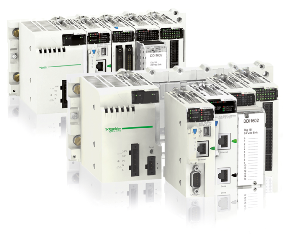

# Контролери та їх програмне забезпечення Модуль 2
Матеріали дисципліни "Контролери та їх програмне забезпечення" (Модуль 2 - Control Expert/Unity PRO)

На цій сторінці представлені матеріали другої частини курсу "Контролери та їх програмне забезпечення", який читається студентам 3-го курсу спеціальності "Автоматизація та комп'ютерно-інтегровані технології" [на кафедрі АКТСУ Національного університету харчових технологій](http://www.iasu-nuft.pp.ua/) 

- [**Лекції**](lec/README.md)
- [**Лабораторні роботи**](lab/README.md)
- [**Курсове проектування**](kurs/README.md)
  - [Методичні рекомендації до виконання курсового проекту (2017 рік)](kurs/metod2017/README.md)

[Сторінка курсу Модуля 2 (цей)](https://romamirkevich.github.io/PLCBeginner/)

[Сторінка курсу Модуля 1](https://romamirkevich.github.io/PLCBeginner/)

[Матеріали на GitHub](https://github.com/pupenasan/kpz2)

**Розробники:**

- Олександр Миколайович Пупена, 
- Олег Миколайович Клименко, 

**Лектори:** 

- Олег Миколайович Клименко

**Лабораторні та практичні заняття:**

- Дмитро Валерійович Мацебула
- Володимир Володимирович Полупан

