# ЛАБОРАТОРНА РОБОТА № 1 Конфігурування ПЛК М340. Робота зі змінними I/O

**Тривалість**: 2 акад. години (1 пара).

**Мета:** ознайомлення з середовищем UNITY PRO, принципами конфігурування ПЛК М340, принципами створення змінних та їх локалізацією. 

**Програмне забезпечення.** UNITY PRO V>=4.0.

**Загальна постановка задачі.**  Необхідно створити конфігурацію ПЛК М340 відповідно до поставленої задачі. 

## Послідовність виконання роботи

Перед виконанням лабораторної роботи ознайомтесь з додатком 1.

1) Ознайомитись з наявними в лабораторії М340. Особливу увагу звернути на конструктивні особливості М340 порівняно з TSX Micro та TSX Premium. 

2) Запустити на виконання UNITY PRO. Створити новий проект для М340 BMXP342000.

3) Створити конфігурацію ПЛК та його модулів, відповідно до рис.1.1 та таблиці 1.1.

4) Змінити конфігурацію процесорного модуля, відповідно до рис.Д1.5.  

5) Проконтролювати розподіл споживаної потужності для всіх модулів живлення. Зробити висновки про необхідність заміни модуля живлення.

 Створити локалізовані змінні, прив’язані до вхідних та вихідних каналів, відповідно до рис.1.2 ( Project Browser->Variables & FB instances-> Elementary Variables). Після створення, знайти кожну змінну у відповідних до каналів полях "Symbol" вікон конфігурації модулів.  

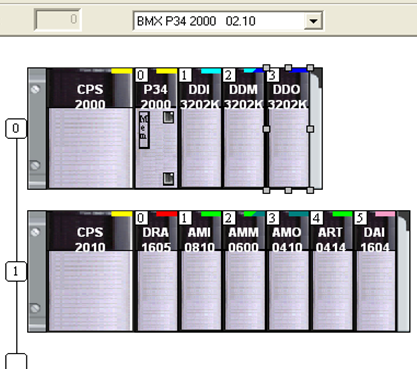

Рис.1.1. Компонування М340. 

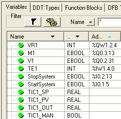

Рис.1.2. Створення локалізованих змінних I/O.

Таблиця 1.1.

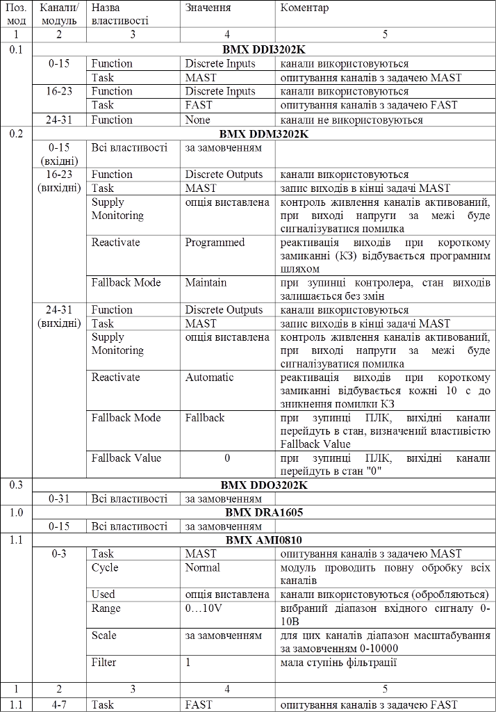

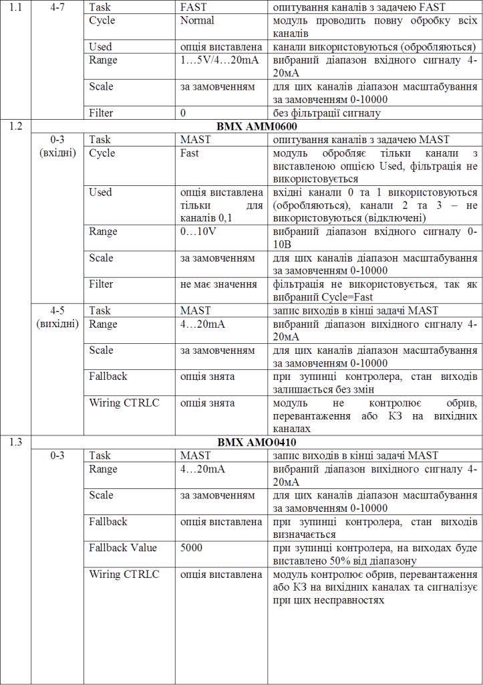

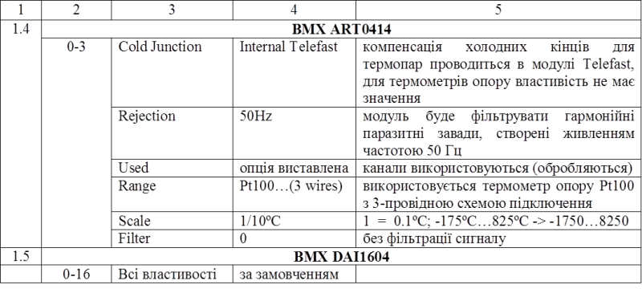

## Перевірка виконання роботи та питання до захисту

Викладачем перевіряється виконання поставленого завдання. Студент повинен пояснити призначення кожного пункту виконаного завдання.

1. З яких основних конструктивних елементів складається М340?

2. Яку максимальну кількість шасі підтримує М340? Яким чином об’єднуються між собою шасі М340, як адресуються шасі та модулі в ньому?

3. Які способи підключення до дискретних та аналогових модулів є в М340?

4. По яким характеристиками відрізняються між собою процесорні модулі М340?

5. Прокоментуйте призначення кожного розділу проекту в UNITY PRO. Де проводиться конфігурування апаратного забезпечення?     

6. Прокоментуйте настройки параметрів процесорного модуля на прикладі рис.Д1.5.

7. Прокоментуйте яким чином в середовищі UNITY PRO можна проконтролювати споживану потужність по кожному виходу модуля живлення.

8. Які задачі можуть функціонувати в М340? Як канали прив’язуються до конкретної задачі? Покажіть на прикладі.

9. Яким чином для аналогових модулів вказується діапазон сигналу та масштабування? Покажіть на прикладі одного вхідного та вихідного модуля. 

10. Яким чином для вихідних модулів вказується значення виходу при зупинці ПЛК? Покажіть на прикладі дискретного та аналогового вихідних модулів.

11. Яким чином функціонує захист при КЗ та перевантаженні для дискретних захищених вихідних модулів? Продемонструйте як конфігурується реактивація виходів.

12. Яким чином конфігуруєтья фільтрація для аналогових вхідних сигналів? 

13. Яким чином адресуються канали вводу/виводу? Прокоментуйте рис.1.2.   

##  ДОДАТОК 1. Робота в середовищі UNITY PRO

### Д1.1. Створення проекту та навігація в ньому 

При створенні нового проекту (File->New), середовище UNITY PRO пропонує вибрати тип ПЛК (M340/Premium/Quantum) та процесорний модуль. У вікні вибору (рис.Д1.1) доступні короткий опис модуля та версія операційної системи (***ОС***). Для доступу до вибору процесорних модулів з старшими ОС необхідно виставити опцію "Show all versions".  

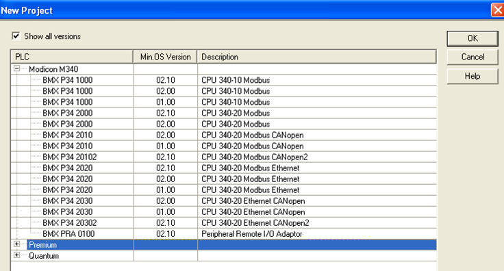

Рис.Д1.1. Вікно вибору типу ПЛК та процесорного модуля. 

Проект UNITY PRO включає: конфігурацію апаратного та програмного забезпечення ПЛК, програму користувача, всі похідні типи даних, анімаційні таблиці (для перегляду та зміни значень змінних в табличному вигляді) та анімаційні екрани (для перегляду та зміни значень змінних в графічному вигляді), документацію до проекту. 

Навігацію за проектом здійснюється з використанням ***Провідника Проекту*** - ***Project Browser*** (Tools->Project Drowser). На рис.Д1.2 показаний зовнішній вигляд Провідника Проекту в структурному вигляді.   

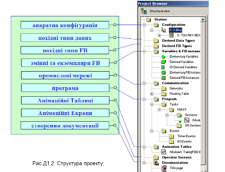

Рис.Д1.2. Структура проекту. 

### Д1.2. Апаратна конфігурація шасі 

Для створення апаратної конфігурації М340, необхідно вибрати подвійним кліком пункт PLCbus в розділі Configuration. При цьому відкриється вікно апаратної конфігурації (рис.Д1.3) та опціонально Hardware Catalog. Добавлення та видалення модулів може проводитися різними варіантами: через пункти контекстного меню позиції модуля, подвійним кліком по позиції модуля, або перетягуванням необхідного модуля в потрібну позицію із Hardware Catalog. 

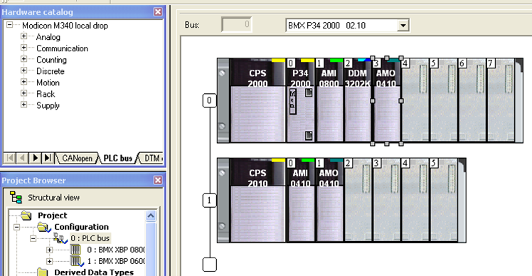

Рис.Д1.3. Вікно апаратної конфігурації. 

### Д1.3. Апаратна конфігурація модулів 

До вікна конфігурації модуля та його каналів можна доступитися шляхом подвійного кліка по самому модулю. Конфігурація самого модуля проводиться шляхом вибору назви модуля у вікні конфігурації (рис.Д1.4(а)), а каналів – шляхом вибору групи каналів (рис.Д1.4(б)). Зокрема для всіх модулів у вікні конфігурації доступна загальна інформація про модуль (вкладка Overview), а також перелік об’єктів вводу/виводу, які доступні в даному модулі (вкладка I/O Objects). 

Конфігураційні властивості каналів залежать від типу модуля, та вибраних в ньому каналів. На рис.Д1.4(б) показані вихідні канали, починаючи з 16-го, для змішаного дискретного модуля BMX DDM 32D2K. Для цих типів каналів вказується використовувана функція (Function), прив’язка опитування каналів до задачі (Task), необхідність контролю за живленням каналів (Supply Monitoring), спосіб реактивації виходів (Reactivate), режим виставлення виходів при зупинці ПЛК (Fallback Mode). Для інших типів каналів настройки будуть відрізнятися.

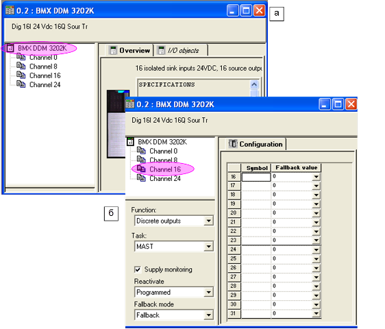

Рис.Д1.4. Вікно конфігурації модуля. 

### Д1.4. Апаратна конфігурація процесорного модуля 

Для процесорного модуля, крім вкладок Overview та I/O Objects доступні вкладки Animation та Configuration. Вкладка Animation використовується в онлайн режимі для можливості діагностування, зміни дати та часу годинника реального часу ПЛК, а також для його ідентифікації. На вкладці Configuration проводиться конфігурація операційного режиму (Operating Mode) процесорного модуля а також пам’яті, яка виділяються під локалізовані дані (%M, %MW, %KW). Для М340 доступні наступні настройки операційного режиму (рис.Д1.5):

- Run/Stop Input: при активації даної опції, ПЛК буде знаходитись в RUN, якщо вхідна змінна, яка вказана в полі адреси напроти опції, буде дорівнювати "1", в іншому випадку ПЛК буде в STOP;  
- Memory Protect: при активації опції, запис на карту пам’яті можливий тільки якщо вхідна змінна, яка вказана в полі адреси напроти опції, буде дорівнювати "1".  
- Automatic start in Run: при активації опції, ПЛК після вмикання живлення автоматично переводиться в режим RUN.
- Initialize %MWi on cold start: при активації опції змінні %MW будуть обнулятися при включенні ПЛК.

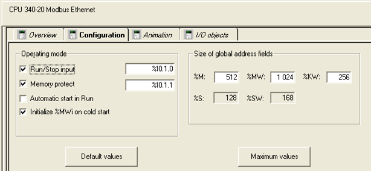

Рис.Д1.5. Вікно конфігурації процесорного модуля. 

### Д1.5. Розподіл споживаної потужності модулями живлення 

Для модуля живлення доступне вікно розподілу споживаної потужності по всім типам живлення: внутрішніх 24VR та 3,3 V, а також зовнішніх датчиків 24 V. Вікно доступне через контекстне меню модуля живлення, пункт "Power Supply and IO Budget" (рис.Д1.6). 

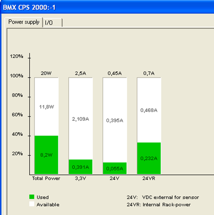

Рис.Д1.6. Вікно розподілу споживаної потужності. 

