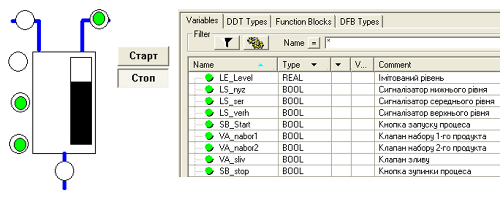
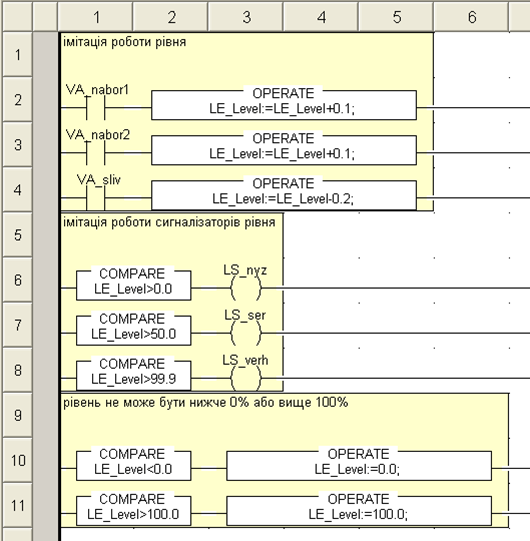
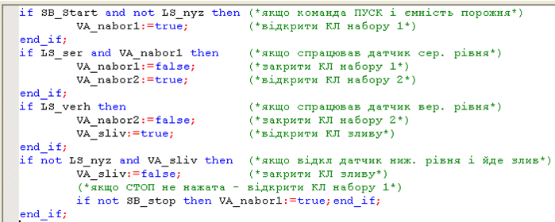
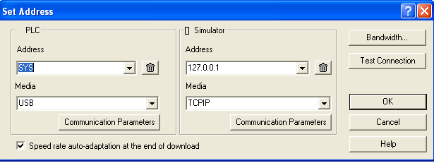
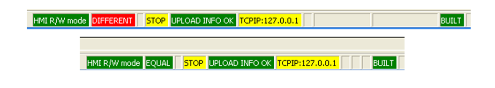
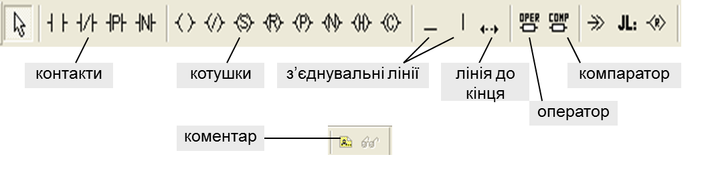
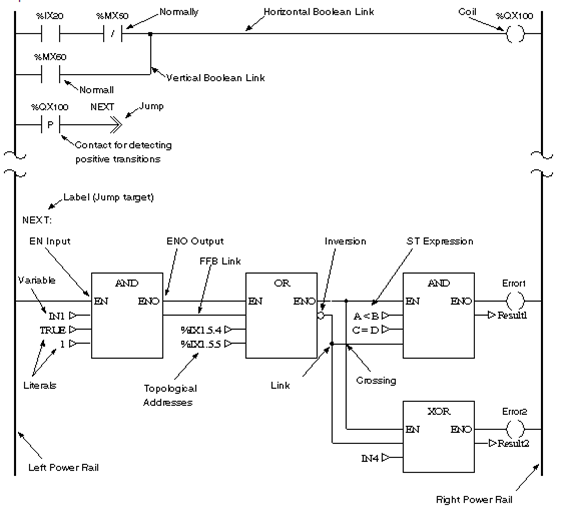
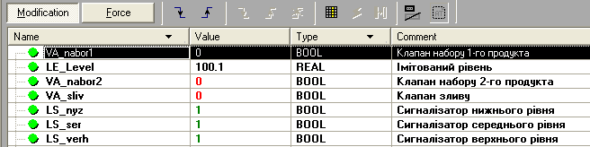

[До лабораторних робіт](README.md)

# ЛАБОРАТОРНА РОБОТА № 2. Основи програмування ПЛК М340

**Тривалість**: 2 акад. години (1 пара).

**Мета:** ознайомлення з принципами створення та налагодження програм користувача для ПЛК М340 в середовищі UNITY PRO на мовах ST та LD.

Перед виконанням лабораторної роботи ознайомтесь з додатком 2.

**Програмне забезпечення.** UNITY PRO V>=4.0.

**Загальна постановка задачі.**  Необхідно створити змінні та програму користувача для ПЛК М340 відповідно до наступної задачі (рис.2.1). При нажиманні кнопки ПУСК відкривається клапан набору першого продукту. Після досягнення середнього рівня клапан 1-го продукту закривається, відкривається клапан набору 2-го продукту. Після спрацювання сигналізатору верхнього рівня включається клапан зливу. Після відключення сигналізатору нижнього рівня, цикл повторюється у випадку якщо кнопка СТОП не нажата. Якщо СТОП нажата – клапан зливу закривається. 

Написати програму імітатору роботи рівня в окремій секції на мові LD. Логіку виконання програми реалізувати в окремій секції на мові ST. Програму перевірити та відлагодити з використанням таблиць анімацій та операторських екранів.  

Рис.2.1. Приклад операторського екрану (зліва), та змінні (зправа) до поставленої задачі

## Послідовність виконання роботи

1) Запустити на виконання UNITY PRO. Створити новий проект з ПЛК М340 будь-якої конфігурації.

2) В редакторі даних проекту створити нелокалізовані змінні, відповідно до задачі, як показано рис.2.1.

3) Створити секцію в задачі MAST на мові LD з назвою "ImitationL". Додаткові властивості для секції не вказувати. Створити в секції програму імітації рівня як на рис.2.2.

Рис.2.2. Секція імітації роботи рівня на мові LD. 

4) Викликати команду Analyze і перевірити проект на синтаксичні помилки. У випадку наявності помилок, виправити їх в проекті. При відсутності помилок зробити повну компіляцію проекту і в online режимі записати програму в Імітатор ПЛК. Під час процедури звернути увагу на стан індикаторів панелі статусу.  

5) Створити Анімаційну таблицю зі змінними. Перевірити роботу програму імітації шляхом зміни значень клапанів. Подивитися на роботу редактору LD в анімаційному режимі.  

6) Не виходячи з online режиму, створити секцію в задачі MAST на мові ST з назвою "ControlL". Додаткові властивості для секції не вказувати. Створити в секції програму логіки управління як на рис.2.3. 

7) Компілювати зміни в проекті. В анімаційній таблиці перевірити роботу програми. 

8. Створити операторський екран як на рис.2.1. Перевірити роботу програми з використанням операторського екрану. 

Рис.2.3. Секція логіки управління рівня на мові ST. 

## Перевірка виконання роботи та питання до захисту

Викладачем перевіряється виконання поставленого завдання. Студент повинен пояснити програму та призначення кожного пункту виконаного завдання.

1. В яких режимах по відношенню до ПЛК може знаходитись UNITY PRO?

2. Чим відрізняється повна компіляція проекту від часткової? В якому випадку можлива зміна проекту в ПЛК не зупиняючи його роботу?

3. Які задачі доступні в М340? Розкажіть про принципи функціонування цих задач та їх настройки: виклик задач, сторожовий таймер. Покажіть де в проекті створюються та конфігуруються параметри задач.

4. Яким чином в UNITY PRO створюються секції? В якій послідовності вони виконуються в межах однієї задачі? Чи може MAST задача складатися з секцій написаних на всіх 5-ти мовах LD, ST, IL, FBD та SFC?

5. Поясніть відмінність локалізованих від нелокалізованих даних в ПЛК з UNITY. 

6. Які зони локалізованої пам’яті даних Ви можете назвати?

7. Де в М340 зберігається програма користувача та дані?

8. Яким чином в UNITY PRO створюються змінні? Які типи змінних Ви знаєте?

9. Яким чином в UNITY PRO створюються локалізовані змінні? Чим локалізовані змінні відрізняються від нелокалізованих?

10. Які особливості Ви можете назвати при програмуванні секцій на мовах LD та ST в середовищі UNITY PRO порівняно з PL7 PRO?

## ДОДАТОК 2. Розробка та відладка програм в UNITY PRO

### Д2.1. Режими роботи

UNITY PRO по відношенню до ПЛК може знаходитись в 2-х режимах: 

- ***offline***: в цьому режимі відсутній зв’язок середовища UNITY PRO з ПЛК, всі зміни в проекті відображаються тільки в файлі проекту на ПК; 
- ***online***: в цьому режимі відбувається обмін між UNITY PRO та ПЛК. 

Перехід в режим online відбувається через команду в меню PLC->Connect. При цьому, UNITY PRO з’єднається з тим ПЛК, адреса якого прописана у вікні налаштування зв’язку UNITY PRO. Вікно налаштування адрес ПЛК та імітатора ПЛК викликається в меню PLC->Set Address… 

Рис.Д2.1. Вікно налаштування адреси ПЛК та імітатора. 

При необхідності роботи з імітатором ПЛК, перед з’єднанням необхідно вибрати пункт PLC->Simulation Mode, а для роботи з фізичним ПЛК – PLC->Standard Mode.

Якщо з’єднання відбулося, для можливості зміни програми в ПЛК (режим роботи Programming Mode) необхідно щоб проекти в ПЛК і в середовищі UNITY PRO були ідентичними. Ідентичність проекту сигналізується в панелі статусу зеленим індикатором ***EQUAL***, а якщо проекти відрізняються – червоним ***DIFFERENT*** (рис.Д2.2). Для переходу з режиму DIFFERENT в EQUAL необхідно зробити одну з двох операцій: завантажити проект з UNITY PRO в ПЛК (PLC->Transfer Project to PLC), або вивантажити проект з ПЛК в середовище UNITY PRO (PLC->Transfer Proect from PLC). 

Рис.Д2.2. Вигляд панелі статусу в режимі DIFFERENT (зверху) та EQUAL (знизу). 

Завантаження проекту в ПЛК можливе тільки у випадку, якщо він компільований і конфігурація апаратного забезпечення процесорного модуля відповідає дійсній. Можливі два варіанти компіляції:

- Build->***Build*** ***Changes***: ця команда приводить до компіляції тільки змінених частин проекту;

- Build->***Rebuild*** ***All*** ***Project***: ця команда приводить до повної перекомпіляції проекта.   

*Завантаження нового проекту в ПЛК приводить до його зупинки та ініціалізації*. По цій причині зміни в проекті намагаються проводити в режимі EQUAL, шляхом часткової компіляції. 

Часткова компіляція Build Changes дає можливість в режимі online EQUAL змінювати програму в ПЛК не зупиняючи його. Для цього, не виходячи з режиму online, користувач робить всі зміни в середовищі UNITY PRO, після чого викликає команду Build Changes, що приводить до часткової компіляції і зміни проекту в ПЛК. 

Результат компіляції висвічується у вікні "Output Window", яке знаходиться в нижній частині екрану. Якщо при компіляції є помилки, в даному вікні з’явиться їх перелік. Зробивши подвійний клік по повідомленню помилки, можна перейти на її джерело. Перевірити синтаксичні помилки в проекті можна також командою Build->***Analyze***.    

Для управління роботою ПЛК використовуються команди: PLC->RUN (запуск на виконання), PLC->STOP (зупинка), PLC->Init (ініціалізація ПЛК). 

### Д2.2. Конфігурування задач та створення секцій 

Режими, періодичність та сторожові таймери задач ПЛК клнфігуруються через їх контекстне меню в пункті Properties. Секції програми користувача створюються через команду контекстного меню Sections->New Section. Підрозділ Sections вибирається у відповідному розділі задач MAST, FAST або EVENTS. Для секції вказується ім’я, мова програмування а також, при необхідності, додаткові властивості захисту (Protection) та змінна яка буде управляти виконанням секції (Condition).  

### Д2.3. Робота з редакторами LD та ST 

В загальному, мова LD в UNITY PRO дуже схожа на мову LD в PL7 PRO. Всі доступні компоненти знаходяться на панелі інструментів, яка показана на рис. Д2.3. 

Рис.Д2.3. Палітра інструментів LD. 

Крім стандартних елементів в LD можна використовувати будь яку функцію або функціональний блок з бібліотеки UNITY PRO. Серед особливостей LD в UNITY PRO порівняно з PL7 можна виділити (рис.Д2.4):

- більша кількість комірок;

- можливість послідовного з’єднання котушок;

- можливість розміщення контактів з права від котушок;

- можливість використання в аргументах контактів ST вирази;

- змішувати LD з мовою FBD в одній секції; 

Мова ST в UNITY практично не відрізняється від реалізації в PL7. Серед особливостей можна назвати ряд інструкцій ST в PL7, які в UNITY доступні як функції (SET(), RESET(), RE(), FE()). Тому запис в змінну або по адресі логічної "1" в ST для UNITY буде виглядіти так:

%M20:=TRUE;

Рис.Д2.4. Загальне представлення LD. 

### Д2.4. Створення та редагування змінних

*Для створення та редагування змінних, екземплярів функціональних блоків, нових типів змінних та функціональних блоків в UNITY PRO використовується **редактор даних (Data Editor)***. Редактор даних викликається з Project Browser -> Variables @ FB Instances. Робота з даними детально описана в конспекті лекцій в підрозділі 2.4.2.

### Д2.5. Відлагодження програм 

Для перевірки роботи програми в середовищі UNITY PRO доступні засоби відображення та вводу даних а також засоби вділагодження(Debug). Засоби відображення та вводу даних можна умовно поділити на:

- анімаційні засоби програмних секцій (***Program Animation***);

- анімаційні таблиці (***Animation Tables***);

- ***операторські екрани*** (***Operator Screen***);

Компільовані секцій програм в режимі online по замовченню відображаються в анімаційному вигляді. Включення та виключення анімації проводиться через команди головного меню Services->Animation. В анімаційному режимі всі дискретні змінні підсвічуються зеленим в стані лог. "1" та червоним в стані лог. "0". Всі інші типи змінних підсвічуються жовтим кольором. В графічних мовах (LD, FBD, SFC) контакти та з’єднувальні лінії, по яким "проходить сигнал" підсвічуються зеленим, а по яким "не проходить" – червоним. Таким чином, наприклад в LD можна визначити де "обірвався" логічний ланцюжок. В секціях графічних мов програмування, показуються числові значення аргументів функцій та функціональних блоків. В текстових мовах (ST, IL) числові значення змінних підсвічуються при наведені мишкою. В анімаційному режимі, в контекстному меню блоків доступні додаткові команди, зокрема на зміну значення змінних. 

Анімаційні таблиці в UNITY PRO реалізовані аналогічно як в PL7 PRO. Їх можна створити в контекстному меню розділу Animation Tables в Project Browser, або в контекстному меню виділеної частини програми через команду Initialize Animation Tables. Для можливості зміни змінних в анімаційній таблиці, необхідно активувати режим Modification (рис.Д2.5) 

Рис.Д2.5. Анімаційна таблиця. 

Операторські екрани в UNITY PRO створюються екрани в розділі проекту Operaor Screens. Для можливості зміни значень в операторських екранах необхідно викликати команду Services -> Enable Variable Modification. 

Як працювати з операторськими екранами можна подивитися в цьому відео:

<iframe width="560" height="315" src="https://www.youtube.com/embed/421b-vTdXTo" title="YouTube video player" frameborder="0" allow="accelerometer; autoplay; clipboard-write; encrypted-media; gyroscope; picture-in-picture" allowfullscreen></iframe>