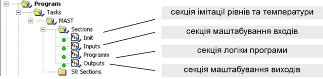

[До лабораторних робіт](README.md)

# ЛАБОРАТОРНА РОБОТА № 3. Основи програмування на мові FBD

 **Тривалість**: 2 акад. години (1 пара).

**Мета:** ознайомлення з принципами програмування на мові FBD, з принципами використання функцій та функціональних блоків стандартної бібліотеки типів.

**Програмне забезпечення.** UNITY PRO V>=4.0.

**Загальна постановка задачі.**  Необхідно створити змінні та програму користувача для ПЛК М340 відповідно до наступної задачі (рис.3.1). Після нажимання кнопки ПУСК відкривається клапан набору першого продукту. Після досягнення середнього рівня клапан 1-го продукту закривається, відкривається клапан набору 2-го продукту. Після спрацювання сигналізатору верхнього рівня закривається клапан набору 2-го продукту, відкривається клапан пари на 100% (діапазон виходу 0-100%). Після досягнення температури 95ºС (діапазон датчику 0-150ºС), клапан пари залишається відкритим на 20% ще протягом 10 с. Після закінчення витримки, рідина зливається з апарату. Після відключення сигналізатору нижнього рівня, цикл повторюється у випадку якщо кнопка СТОП не нажата. Якщо СТОП нажата – клапан зливу закривається. В ПЛК поступає сигнал від датчика рівня з діапазоном вимірювання 0-5 м.

Рис.3.1. Приклад операторського екрану до поставленої задачі. 

Написати секцію з програмою імітатору роботи датчика та сигналізаторів рівня і температури. В окремих секціях написати програму маштабування входів та виходу. Логіку виконання програми теж реалізувати в окремій секції. Програму перевірити та відлагодити з використанням таблиць анімацій або операторських екранів. Програми в усіх секціях створити на мові FBD. 

##  Послідовність виконання роботи

Перед виконанням лабораторної роботи ознайомтесь з додатком 3.

1) Запустити на виконання UNITY PRO. Створити новий проект з ПЛК М340. В конфігурації замовити модулі відповідно до рис.3.2.

Рис.3.2. Конфігурація ПЛК М340 до поставленої задачі. 

2) В редакторі даних проекту створити змінні, відповідно до задачі, як показано рис.3.3 (коментарі для змінних можна не вказувати).

Рис.3.3. Перелік змінних до проекту. 

3) В редакторі даних проекту створити екземпляри функціональних блоків, як показано на рис.3.4 (коментарі для екземплярів можна не вказувати).

Рис.3.4. Перелік екземплярів елементарних функціональних блоків. 

4) Створити секцію імітації рівнів та температури (див. рис.3.5 та рис.3.6). Зверніть увагу, що вхід IN1 блоку ".9" має від’ємне значення.

Рис.3.5. Структура програми проекту 

Рис.3.6. Секція імітації датчиків та сигналізаторів рівня і температури . 

5) За допомогою анімаційної таблиці або операторського екрану перевірити роботу програми імітації сигналів.

6) Створити всі інші секції (рис. 3.7, рис. 3.8, рис. 3.9). Секції в проекті повинні розміщуватись відповідно до рис.3.5. Вставку екземплярів функціональних блоків проводити через команду Data Selection. Коментарі в секціях можна не вказувати.

Рис.3.7. Секція Inputs

Рис.3.8. Секція Outputs. 

Рис.3.9. Секція Program. 

7. Перевірити роботу програми за допомогою анімаційної таблиці *або* операторського екрану. При необхідності – відлагодити її. **Проект зберегти на диску** так як він буде використаний в лаборатрній роботі №4.     

## Перевірка виконання роботи та питання до захисту

Викладачем перевіряється виконання поставленого завдання. Студент повинен пояснити програму та призначення кожного пункту виконаного завдання.

1. Поясніть в якій послідовності виконуються FFB в одній секції програми. Де це видно і чим це визначається? Яким чином можна змінити цю послідовність?

2. Які правила використання елементів для зв’язку "Link" Ви можете назвати? Яке призначення інверсії?

3. Розкажіть про призначення параметрів EN/ENO. Яким чином вони активуються для FFB в секції FBD? Де в лабораторній роботі використані EN/ENO, прокоментуйте роботу цих блоків. 

4. Поясніть чим відрізняються функції від функціональних блоків? Навіщо створювати екземпляри функціональних блоків, і яким чином це зробити в UNITY PRO?

5. Прокоментуйте роботу бібліотечних елементів FFB, які використані в програмі. 

6. Яким чином можна змінювати значення вхідних сигналів в імітаторі ПЛК?

7. Поясніть роботу секції імітатора об’єкта.

8. Поясніть роботу секцій масштабування.

9. Поясніть роботу секції основної програми.

## ДОДАТОК 3. Створення програм на мові FBD. Створення та використання функціональних блоків

### Д3.1. Редактор FBD

Вставка і з’єднання функцій та функціональних блоків (FFB) в UNITY PRO проводиться через панель палітри інструментів (рис.Д3.1). Вставка функцій проводиться через виклик помічника вставки нового FFB (FFB Input Assistant), шляхом вибору елемента з бібліотеки або ручного вводу назви. Кількість входів для деяких функцій (наприклад ADD) змінюється шляхом їх "розтягування" мишею, "заціпивши" мишкою за нижній край функції в редакторі FBD.   

Вставка екземплярів функціональних блоків може проводитись через вибір існуючого по команді Data Selection, або шляхом створення нового FFB Input Assistant. Ці операції можна також проводити за допомогою провідника бібліотеки типів.    

З’єднання FFB проводиться з використанням команди Link, при цьому з’єднуються входи з виходами. При необхідності відгалуження, починати його необхідно з виходу FFB. Інверсію можна проводити як для входів так і для виходів FFB. З’єднання можна показувати через розірване посилання, для чого в контекстному меню з’єднання вибирається команда "Show As Connector".

Рис.Д3.1. Палітра інструментів FBD. 

Коментар розміщується на задньому фоні елементів FFB. При необхідності багаторядкового вводу, в кінці рядку нажимають CTRL+ENTER. 

 Для активації/деактивації управляючих входів EN та контролюючого ENO, через контекстне меню FFB викликають вікно властивостей (Properties), в якому виставляють опцію "Show EN/ENO". 

### Д3.2. Імітація вхідних каналів в імітаторі ПЛК

Для зміни в імітаторі ПЛК значень дискретних та аналогових вхідних сигналів (%I, %IW) програмним шляхом використовуються функції відповідно WRITE_INPUT_EBOOL та WRITE_INPUT_INT. На входи цих функцій подаються необхідні значення, а на виходах вказуються адреси %I (для WRITE_INPUT_EBOOL) та %IW (для WRITE_INPUT_INT), або локалізовані змінні, які до цих адрес прив’язані. 

### Д3.3. Створення екземплярів функціональних блоків

Оскільки функціональні блоки потребують виділення області пам’яті, перед їх використанням створюють екземпляри FB. Створення екземплярів можливе двома шляхами: 

- через Data Editor (в провіднику проекту підрозділ Elementary FB Instances); 

- "на льоту", при вставці його в секцію програми з бібліотеки типів.

В будь якому випадку всі існуючі функціональні блоки (навіть якщо вони не використовуються ніде в програмі), доступні в розділі Variables & FB Instances.    