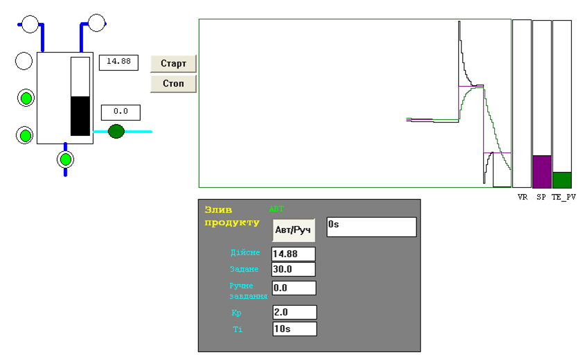
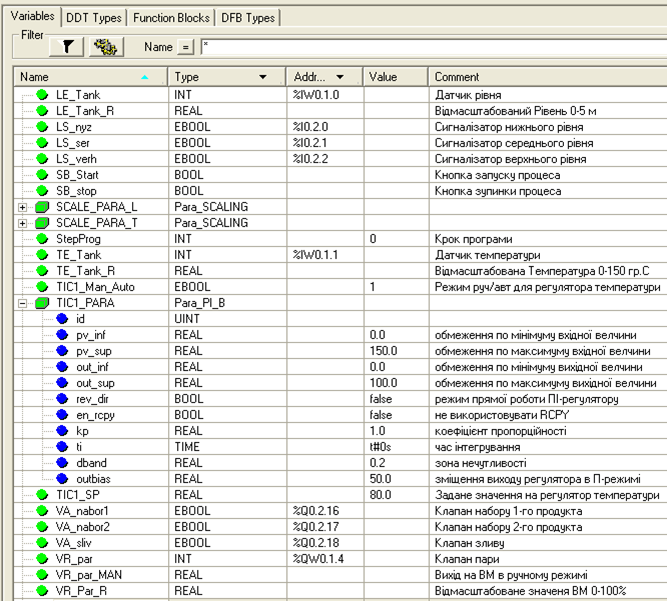
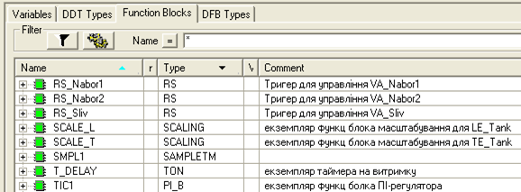
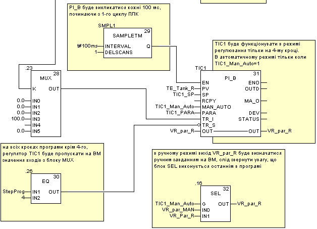

[До лабораторних робіт](README.md)

# ЛАБОРАТОРНА РОБОТА № 4. Бібліотека регулювання

**Тривалість**: 2 акад. години (1 пара).

**Мета:** ознайомлення з елементами бібліотеки управління Control Library, реалізація алгоритмів регулювання на базі ПІ-регулятора.

**Програмне забезпечення.** UNITY PRO V>=4.0.

**Загальна постановка задачі.**  Необхідно створити змінні та програму користувача для ПЛК М340 відповідно до наступної задачі (рис.4.1). Робота програми описується алгоритмом наведеним в лабораторній роботі №4 за винятком етапу витримки. Витримка повинна тривати 3 хвилини, в цей час регулятор повинен підтримувати температуру на заданому рівні. Задане значення температури визначає оператор. Програму перевірити та відлагодити з використанням операторських екранів.

Рис.4.1. Приклад операторського екрану до поставленої задачі. 

## Послідовність виконання роботи

1) Запустити на виконання UNITY PRO. Завантажити попередньо збережений проект для лабораторної роботи №3. 

2) Добавити змінні TIC1_Man_Auto, TIC1_PARA, TIC1_SP, VR_par_MAN до існуючих змінних в проекті (рис.4.2).

Рис.4.2. Перелік змінних. 

3. Добавити екземпляри функціональних блоків TIC1, SMPL1 до існуючих екземплярів в проекті (рис.4.3).

Рис.4.3. Перелік екземплярів функціональних блоків. 

4) Модифікувати секцію Programm: змінити час в блоці T_DELAY на 3 хвилини; доповнити програму починаючи з блоку ".23" (MUX) блоками, які вказані на рис.4.4.

Рис.4.4. Модифікована частина секції програми з рис.3.9. 

5. Перейти в режим offline, імпортувати операторський екран в проект (матеріали для лабораторних робіт доступні за  [цим посиланням](https://drive.google.com/file/d/0B2FfwwwweBSVWENJRHVYTWhVNUk/view?usp=sharing&resourcekey=0-ctC5c-_Ik4dx8Aho8uBocg)): в ProjectBrowser контекстне меню `OperatorScreens->Import-> папка розміщення\PID.XCR`.

6. Скомпілювати проект, завантажити в імітатор контролера, запустити на виконання. На операторському екрані нажати кнопку "Старт" для запуску програми на виконання.

7. На кроці "витримка" переключити контур в ручний режим і намагатися втримати завдання 85 ºС в ручному режимі протягом 3 хв. витримки. Після закінчення часу витримки переключити контур в режим "АВТ".

8. На наступному циклі роботи, на кроці "витримка" в автоматичному режимі виставити завдання(уставку)=75 ºС, Kp=1.0, Ti=0s (П-режим). Занотувати в чернетці значення яке видає ВМ, значення завдання (уставки), плинного значення та  розузгодження.

9. На наступному циклі роботи, на кроці "витримка" в автоматичному режимі виставити завдання(уставку)=75 ºС, Kp=1.0, Ti=30s (ПІ-режим). Змінюючи уставку з ряду (20,50,80,100) а також Kp, Ti, дочекавшись закінчення перехідного процесу досягнути найкращих результатів по динамічним характеристикам. Занотувати в чернетці значення Kp та Ti.   

## Перевірка виконання роботи та питання до захисту

Викладачем перевіряється виконання поставленого завдання. Студент повинен пояснити програму та призначення кожного пункту виконаного завдання.

1. Перерахуйте які Ви знаєте бібліотечні елементи UNITY, які реалізовують стандартні закони регулювання?

2. Прокоментуйте призначення блоків сімейства Controller бібліотеки UNITY.

3. Розкажіть про призначення та роботу функціонального блока SAMPLETM.

4. Прокоментуйте     функціональну структуру функціонального блока PI_B.
5. Яким чином     вказуються настройки регулятора для функціонального блока PI_B?     Прокоментуйте структуру Para_PI_B.
6. Як працює     ПІ-регулятор PI_B в ручному режимі? Яким чином задається цей режим?
7. Як працює     ПІ-регулятор PI_B в режимі П-регулювання? Прокоментуйте результати п.8.     лабораторної роботи.
8. Поясніть призначення     параметрів TR_I та TR_S. Поясніть як ці входи використані в програмі     користувача для даної лабораторної роботи.  