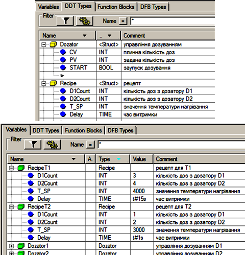
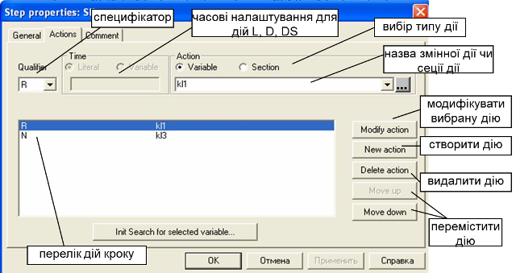

[До лабораторних робіт](README.md)

# ЛАБОРАТОРНА РОБОТА № 5. Програмування на мові SFC

**Тривалість**: 4 акад. години (2 пари).

**Мета:** ознайомлення з мовою програмування SFC в середовищі UNITY PRO. 

## Завдання для виконання роботи

**Загальна постановка завдання**  Необхідно створити проект в UNITY PRO для реалізації поставленої задачі з використанням мови SFC. Відлагодження проекту зробити з використанням готового програмного імітатору об’єкту та операторського екрану. 

**Опис об’єкту**. Технологічна установка складається з наступних елементів (рис.5.1):

- танки Т1 та Т2, в яких готовляться продукти за різними рецептами; танки обв’язані наступними засобами КВПіА:

- запірні клапани набору та зливу, кожний з датчиками кінцевого положення "закритий" та "відкритий";
- регулюючий клапан (0-100%) подачі теплоагента у теплообмінний кожух танку (далі по тексту клапан нагрівання);
- датчик рівня (0-100%) в танку;
- датчик температури в танку (0-100°С); 
- дозатори (мірні ємності) D1 та D2, які забезпечують подачу дози компоненту; дозатори обв’язані наступними засобами КВПіА:
- сигналізатор нижнього і верхнього рівнів;
- запірні клапани набору та зливу, кожний з датчиками кінцевого положення "закритий";

- 3-ходовий клапан перемикання трубопроводу подачі з дозаторів на танки T1 та T2; в нормальному стані положення "на Т1"; має датчики кінцевого положення "Т1" та "Т2".

Рис.5.1. Операторський екран для контролю та управління за процесом приготування продукту  

**Опис алгоритму задач управління установкою**. Управління дозаторами та танками повинно бути розв’язане одне від одного (але координоване), оскільки дозатори можуть бути використані в інших процесах. Дозатори в стані очікування завжди повинні бути наповнені. 

Управління процесом приготування повинно відбуватися за таким алгоритмом:

1) У початковому стані (старті ПЛК) клапани набору та зливу танків Т1 та Т2 повинні бути закритими. Закритість клапанів контролюється кінцевими датчиками положення. Після цього система управління приготуванням продукту переходить в стан готовності.

2) Оператор повинен задати рецепт продукту для приготування в Т1 та Т2. Рецепт включає наступні поля:

   a.   кількість доз компоненту з D1;

   b.   кількість доз компоненту з D2;

   c.   температуру попереднього нагрівання;

   d.   час витримки;

3) Після натискання оператором кнопки "Пуск" відкривається клапан набору танку Т1.

4) Після досягнення рівня 50% паралельно з набором включається дозування компонентів D1 та D2 відповідно до рецепту. 

5) При досягненні рівня 80%, відкривається клапан набору танку Т2.

6) Коли клапан набору Т2 повністю відкрився (по датчику положення "відкритий"), клапан набору Т1 закривається, і паралельно з приготуванням продукту в Т1 йде наповнення і приготування продукту в танку Т2.

7) При досягненні рівня 50% в Т2 паралельно з набором включається дозування компонентів D1 та D2 відповідно до рецепту. Якщо дозатор в цей час використовується при дозуванні Т1, необхідно дочекатися закінчення роботи дозаторів.

8) При досягненні рівня 80%, закривається клапан набору танку Т2.

9) Після закриття клапану набору в танку Т1 (в наступних пунктах для Т2 аналогічно) і закінченні дозування, відкривається повністю клапан подачі теплоагента; 

10) Рідина в танках повинна нагрітися до вказаного в рецепті значення, після чого клапан залишається відкритий на 10% протягом вказаного в рецепті часу;

11) Після витримки відкривається клапан зливу і рідина зливається з танку;

12) Через 5с після досягнення рівня менше 1% клапан зливу закривається;

13) Коли обидва танки Т1 та Т2 порожні, система переходить в початковий стан.

14) У будь який момент часу система повинна мати можливість переходу в початковий стан.    

## Лабораторна установка

Апаратне забезпечення: ПК. 

Програмне забезпечення: UNITY PRO V>=4.0.

## Порядок виконання роботи. Заходи безпеки

Необхідно дотримуватись стандартних заходів безпеки при роботі з ПК.  Перед виконанням лабораторної роботи ознайомтесь з додатками 4 та 5.

1) Запустити на виконання UNITY PRO. Створити новий проект з ПЛК М340.

2) Імпортувати файл апаратної конфігурації (матеріали для лабораторних робіт доступні за  [цим посиланням](https://drive.google.com/file/d/0B2FfwwwweBSVWENJRHVYTWhVNUk/view?usp=sharing&resourcekey=0-ctC5c-_Ik4dx8Aho8uBocg)):

`Project Browser  -> контекстне меню Configuration ->  Import -> розміщення файлу\ lab5_SFC.XHW`

3) Подивитися конфігурацію обладнання для даної задачі.

4) Імпортувати файл з секцією імітатора об’єкту управління: 

`Project Browser -> Program-> Tasks -> Mast -> контекстне меню Sections –> Import  розміщення файлу\LAB5_SFC_simul.XBD`

5) Імпортувати змінні: 

`Project Browser -> Variables & FB Instances ->  Import  розміщення файлу\lab5_SFC_vars.XSY`

6. Після імпорту змінних, ознайомтесь з їх призначенням (рисс.5.2 - 5.3). Змінні типу Recipe призначені для збереженні рецептів для продуктів в танках Т1 та Т2. Змінні типу D1 та D2 використовуються для управління дозаторами. 

Рис.5.2. Змінні проекту  

Рис.5.3. Структурні типи та змінні проекту.  

7. Імпортувати операторський екран: 

`Project Browser  ->  контекстне меню OperatorScreens-> Import-> lab4_SFC_Screen.XCR`

8. Після імпорту скомпілюйте проект, завантажте його в симулятор ПЛК і запустіть на виконання. Відкрийте операторський екран і поуправляйте процесом вручну (опосередковано), шляхом відкриття і закриття клапанів за допомогою кнопок біля них (рис.5.1): завантажте і вивантажте дозатори; відкрийте клапани наборів танків; відкрийте клапан нагрівання на 50% (5000). Спробуйте роботу кнопок "швидкість імітації" при наборі рівнів та нагріванні. 

9. Відключіться від симулятору ПЛК. Створіть програми для управління процесом з використанням мови SFC. Можна використати варіант запропонований в додатку 4 (рисс. Д4.1-Д4.6). Зверніть увагу, що секція "Simulation" повинна бути першою в розділі Sections. Секція D1 створюється аналогічно як D2. Секцію CTRL_SFC рекомендується робити в останню чергу. 

10. Скомпілюйте і завантажте проект в ПЛК, перевірте його роботу. Подивіться на роботу анімації редактору SFC в режимі онлайн. 

## Аналіз одержаних результатів

Викладачем перевіряється виконання поставленого завдання. Студент повинен пояснити виконання програми та призначення кожного пункту виконаного завдання. *Додатково оцінюється створення власного варіанту рішення задачі або модифікація існуючого.*  

## Запитання для самоперевірки

1. Які обмеження використання SFC в структурі проекту UNITY PRO.

2. Перерахуйте основні елементи які організовують мережу SFC та поясніть їх призначення.

3. Поясніть як ви розумієте що таке маркер (Token) і як він циркулює в мережі SFC. Що таке множинний і одиночний маркер? 

4. Які бувають кроки в SFC? Як в UNITY PRO створюються різні типи кроків?

5. Що таке дії (Action)? Чим визначається виконання дій?

6. Розкажіть які типи кваліфікаторів (специфікаторів) Ви знаєте і їх призначення. 

7. Що таке змінна дії (Action Variable) і секція дії (Action Section)? Які обмеження є в змінних дії?

8. Розкажіть про правила організації переходів. Що таке змінна переходу (Transition Variable) і секція переходу (Transition Section)? Які обмеження є в змінних переходу?

9. Розкажіть про типи і правила формування відгалужень.

10. Розкажіть про макрокроки і макросекції.

11. Розкажіть про часові налаштування та контроль за помилками виконанням кроків.

12. Розкажіть про призначення секції CTRL_SFC в запропонованій програмі.

##  ДОДАТОК 4. Опис роботи варіанту програми SFC для вирішення задачі в лабораторній роботі.

### Д4.1.Загальні принципи роботи програми

Для реалізації даної задачі використовуються 4-ри секції (рис.Д4.1): "D1" і "D2" (на мові SFC) для управління дозаторами, "Production" (на мові SFC) для управління приготуванням продукту, та "CTRL_SFC" (на мові LD) для ініціалізації мереж SFC в цих секціях (скидання кроків і перехід на початковий крок). Секція "Simulation" призначена тільки для імітації об’єкта.  

Рис.Д4.1. Структура задачі MAST та Секція "D1" для управління дозатором D1 

### Д4.2.Управління дозаторами

Дозатори управляються незалежними автоматами станів, які реалізовані через секції D1та D2. Вони ідентичні по своїй структурі і відрізняються тільки використовуваними змінними. Для формування завдання (кількість доз), його запуску та виконання використовуються структурні змінні *Dozator**1* та *Dozator**2* заздалегідь створеного типу *Dozator* (рис.5.3). 

При ініціалізації мережі SFC (рис.Д4.1) закривається клапан *VSliv_D1*, та на один цикл (специфікатор Р) запускається секція *Dinit1*, де обнулюються поля START та PV структури управління дозуванням. Коли клапан зливу закривається, що сигналізується його датчиком кінцевого положення, - відкривається клапан *VNabor_D1*. Клапан набору буде до тих пір відкритий, поки крок *D1_Nabor* активний (специфікатор N), тобто поки не спрацює сигналізатор верхнього рівня *LSH_D1*. Після спрацювання датчика кінцевого положення закриття клапану набору, програма переходить до кроку *D1Ready*. На цьому кроці програма очікує команду дозування *Dozator1.START*, яка повинна надійти (змінитися в TRUE) з іншої частини програми. 

Процес роботи дозування заключається у відпрацюванні заданої кількості вивантажень дози, що підраховується змінною-лічильником *Dozator1.CV*. Тому при *Dozator1.START=TRUE*, протягом одного циклу активності *D1Sliv* відбувається збільшення значення *Dozator1.CV* на 1. Крок буде активний а клапан *Vsliv_D1* буде відкритий до тих пір, поки не відключиться сигналізатор нижнього рівня, що сигналізує про порожність дозатору. 

Крок *D1VSlvCLS* буде активний до тих пір, поки  не спрацює датчик кінцевого положення закриття клапану зливу (*VSliv_D1_Cls)*. На останньому циклі активності кроку запускається секція *D1Count*, в якій при досягненні кількості доз рівній уставці, скидається команда *Dozator1.START* і обнулюється плинне значення лічильника.

Слід зазначити, що після останньої вивантаженої дози, дозатор все одно набирається. Це задовольняє умовам задачі.

### Д4.3.Управління приготуванням продукту 

Секція управління приготуванням продукту "Production" побудована з використанням макрокроків (рис.Д4.2). При ініціалізації мережі SFC проходить закривання всіх клапанів танків Т1 та Т2. Ініціалізація закінчується при спрацюванні датчиків положення "закрито" клапанів набору та зливу. 

Для одночасності процесів приготування продуктів в танках Т1 та Т2 використане паралельне відгалуження. Кожна з гілок після ініціалізації переходить в стан готовності (кроки *T1Ready* та *T2Ready*):

- для танку Т1 це очікування кнопки *Pusk*;
- для танку Т2 це закінчення набору *Т1*, що сигналізується активністю кроку *T1WaitT2* (*T1WaitT2.x=TRUE*).  

Кожна з паралельних гілок ідентичні одна одній, за винятком певних особливостей, що стосуються координації їх роботи. Тому розглянемо тільки гілку для управління танком Т1 і особливості гілки Т2. Гілка управління Т1 включає 3 макрокроки, які відповідають за певний етап роботи: *T1Nabor* – за набір і дозування, *T1Nagrev* – за нагрівання і витримку, *T1Sliv* – за вигрузку продукту. 

Рис.Д4.2. Секція "Production" для управління виробництвом продукції  

Макросекція кроку *T1Nabor* показана на рис. Д4.3. Вхідний крок макросекції активує відкриття клапану *VNabor_T1*, специфікатор *S* вказує на те, що після деактивації кроку, клапан повинен залишитись відкритим. Після наповнення 50% (умова в секції *MidleLT1: *LE_T1>=5000*) мережа SFC знову ділиться на 2 паралельні гілки: ліва гілка для повного наповнення танку, права – для дозування. Таке розгалуження дає можливість вчасно закрити клапан набору, навіть якщо дозування ще не закінчилось. 

Рис.Д4.3. Макросекція "T1Nabor"  

Після наповнення рівня до 80%, ліва гілка переходить до кроку *T1WaitT2*, активність якого (*T1WaitT2.x=TRUE*) сигналізує гілці управління танком Т2, що необхідно відкривати клапан набору танку Т2 (рис.Д4.2, перехід *T**1**WaitT**2.**x*). Після спрацювання датчика положення "відкрито" клапану набору танку Т2 *VNabor**_**T**2_**OPN*, закривається клапан набору Т1 (*R VNabor_T1*).

Перший крок правої гілки *T**1**VDtoT1* перемикає 3-х ходовий клапан в положення дозування в танк Т1 (*VDoz**_**T**1**toT**2=**FALSE*). Після спрацювання датчика положення запускається процес дозування шляхом задання кількості доз для D1 і D2 згідно рецепту, і запуску дозаторів шляхом подання команди START (див.Д.4.2).

Після початку дозування, якщо команда закриття на клапан набору відправлена, тобто коли активні кроки *T**1**VnbCls* і *T**1**Dozes*, йде вихід з макросекції.      

Умовою переходу до макрокроку *T**1**Nagrev* (Рис.Д4.2) є спрацювання датчика кінцевого положення "закрито" клапану набору Т1. 

Для Т2, макросекція набору має аналогічну структуру, за винятком відсутності кроку очікування відкриття сусіднього танку і присутності кроку очікування закінчення дозування (рис.Д4.4). Таким чином програма набору танку Т2 перед дозуванням буде чекати поки дозатор не відпрацює всі замовлені для нього дози, тобто поки *Dozator1.START* та *Dozator2.START* не стануть рівними *FALSE*.    

Рис.Д4.4. Макросекція "T2Nabor"  

Макросекція нагрівання починається з відкриття клапану нагрівання на 100%. Специфікатор Р1 вказує на те, що дія виконається один раз, при активації кроку. При досягненні заданої в рецепті температури, маркер отримує крок *T**1**Vytrym*. При активації кроку клапан нагрівання прикривається до 10%, при деактивації (специфікатор Р0), клапан закривається повністю. Сам крок залишається активним протягом заданого в рецепті часу, тобто поки не спрацює умова переходу задана в секції *DelCompleteT1*: *T**1**Vytrym**.**t**>=**RecipeT**1.**Delay*, де *t* – час активності кроку. Після виходу з макросекції нагрівання, маркер автоматично переходить до макрокроку вигрузки T1Sliv (див. рис.Д4.2), так як умова переходу завжди TRUE.

Рис.Д4.5. Макросекція "T1Nagrev" 

 Рис.Д4.6. Макросекція "T1Sliv" 

Макросекція *T**1**Sliv*,  починається з відкриття клапану зливу (рис.Д.4.6). При досягненні рівня в танку Т1 менше ніж 1% (100 в діапазоні 0-10000), активується крок витримки *PauseT1*, яка потрібна для повного випорожнення танку. Час затримки досягається за рахунок налаштування мінімального часу активності кроку *Delay*=T#5s. Умова переходу TRUE, відразу пропускає маркер на крок *T**1**VSlivClose* в якому відбувається закриття клапану зливу. Після спрацювання датчика "закритий" клапану зливу Т1, і активності останнього кроку в гілці управління Т2 маркер покидає макросекцію, з’єднується з маркером з паралельної гілки і переходить на крок ініціалізації (рис.Д4.2) . 

### Д4.4. Секція ініціалізації  мереж SFC 

Для запобігання "зависання" маркеру на певному кроці при нештатній ситуації, в програмі передбачена секція ініціалізації мереж SFC під назвою "CTRL_SFC". Секція написана на мові LD (рис. Д4.7) і виконується на кожному циклі задачі MAST, незалежно від активності кроків SFC. При спрацюванні змінної-команди *InitSFC*=*TRUE* (рис.5.1, кнопка "ІніціалізКроків") через виклики системної функції INITCHART ініціалізуються всі мережі SFC секцій Production, D1 та D2:

- при переході *InitSFC* з FALSE->TRUE скидає (деактивує) всі кроки;

- при переході *InitSFC* з TRUE -> FALSE ініціалізує мережі SFC, тобто активує початковий крок. 

 Слід зазаначити, що UNITY PRO має ряд функцій, які дають можливість ручного управління переходами та активації кроків.

Рис.Д4.7. Секція CTRL_SFC для ініціалізації SFC

## ДОДАТОК 5. Робота з SFC в середовищі UNITY PRO.

### Д5.1. Редактор SFC 

SFC секція окрім діаграми, що включає мережі SFC, включає в себе секції дій, секції переходів, всі включені та видалені макросекції (рис.Д.5.1). 

Рис.Д5.1. Структура секції SFC.

Редактор ***діаграми SFC*** (***Chart***) ділиться на комірки (200 рядків на 32 колонки), в яких розміщуються кроки, переходи та стрибки. Зв’язки, відгалуження та сходження не потребують окремих комірок. У кожній секції SFC може бути максимум 1024 кроки, включаючи всі кроки макросецій. 

Для створення мереж SFC використовується палітра інструментів (рис.Д.5.3). Серед всіх типів кроків в палітрі відсутні: початковий крок, так як він робиться зі звичайного кроку через його основні властивості; вхідні та вихідні кроки макросекцій, так як вони створюються автоматично з макросекцією.

Рис.Д5.3. Палітра інструментів SFC. 

Доступ до властивостей кроку проводиться через його контекстне меню. У основних властивостях (вкладка General, рис.Д.5.4) вказується ім’я кроку, часові налаштування кроку та чи буде даний крок початковим (Initial Step). Часові налаштування вказуються часовими літералами (Literals) або через змінну ('SFCSTEP_TIMES' variable). 

Рис.Д5.4. Вікно загальних властивостей кроку SFC. 

Дії для кожного кроку налаштовуються у вкладці Actions, що доступне у вікні властивостей кроку. Тип дії (змінна чи секція) вибирається відповідним перемикачем Variable/Section, під ним вказується назва змінної або секції. Кожна дія супроводжується вибраним специфікатором (Qualifier). Для дій з специфікаторами L, D, DS вказуються часові літерали або змінні для визначення затримок.  

Рис.Д5.5. Вікно налаштування дій для кроку SFC. 

Діаграму SFC можна відобразити в розширеному вигляді "View->Expanded Display", де з правого боку від кроків вказується список дій.

Для відгалужень і сходжень через вікно властивостей налаштовується кількість гілок і номер точки входу (для відгалужень) або виходу (для сходжень) основної гілки. 

### Д5.2. Дії та специфікатори (кваліфікатори) 

Таблиця Д5.1/ Типи специфікаторів.

| **Специфікатор** | **Призначення**                    | **Опис**                                                     |
| ---------------- | ---------------------------------- | ------------------------------------------------------------ |
| N/None           | без фіксації                       | дія активна тільки при активності кроку, крок активний –  дія TRUE, крок не  активний - FALSE |
| S                | Встановити з  фіксацією            | дія встановлюється в TRUE і залишається такою,  навіть при деактивації кроку; дія повинна скинутися в FALSE специфікатором  R в іншому кроці тієї  ж секції SFC |
| R                | Скинути                            | дія встановлюється в FALSE і залишається такою, навіть при деактивації кроку; |
| P                | Імпульс по  передньому фронту      | при активації кроку дія стає активною (встановлюється в TRUE) на один цикл задачі MAST |
| P1               | Імпульс по  передньому фронту      | аналогічно специфікатору P, однак дія виконується  завжди першою незалежно від розміщення в списку дій |
| P0               | Імпульс по задньому  фронту        | при деактивації крок  у дія стає активною  (встановлюється в TRUE)  на один цикл задачі MAST |
| L                | Обмеження по часу                  | дія активується (встановлюється  в TRUE) одночасно з  активацією кроку, деактивується (скидається в FALSE) при закінченні встановленого  часу (тривалість задається) або при деактивації кроку |
| D                | Затримка на  включення             | подібно до роботи таймеру TON; при активації кроку  запускається внутрішній таймер (тривалість задається), після спрацюванні  якого дія активується (встановлюється  в TRUE); дія  деактивується разом з деактивацією кроку |
| DS               | Затримка на  включення з фіксацією | подібно до дії визначеного специфікатором D, однак при деактивації  кроку дія залишається активною; дія повинна скинутися в FALSE специфікатором  R в іншому кроці тієї  ж секції SFC |

### Д5.3. Часові налаштування та контроль за виконанням кроків

Таблиця Д5.2. Поля змінної кроку типу SFCSTEP_STATE.

| **поле** | **Тип** | **Опис**                                                     |
| -------- | ------- | ------------------------------------------------------------ |
| t        | TIME    | час активності кроку; при  деактивації кроку даний час запам’ятовується, а при повторній активації  обнуляється |
| x        | BOOL    | активність кроку: TRUE - крок активний (має  маркер), FALSE-крок  неактивний |
| tminErr  | BOOL    | помилка мінімального контрольного часу; якщо час виконання  кроку менше ніж заданий в мінімальному контрольному часі tminErr=TRUE,  інакше FALSE; автоматично скидається в FALSE при повторній  активації кроку |
| tmaxErr  | BOOL    | помилка максимального контрольного часу; якщо час  виконання кроку більше ніж заданий в максимальному контрольному часі tmaxErr =TRUE, інакше FALSE; автоматично скидається  в FALSE  при повторній активації кроку |