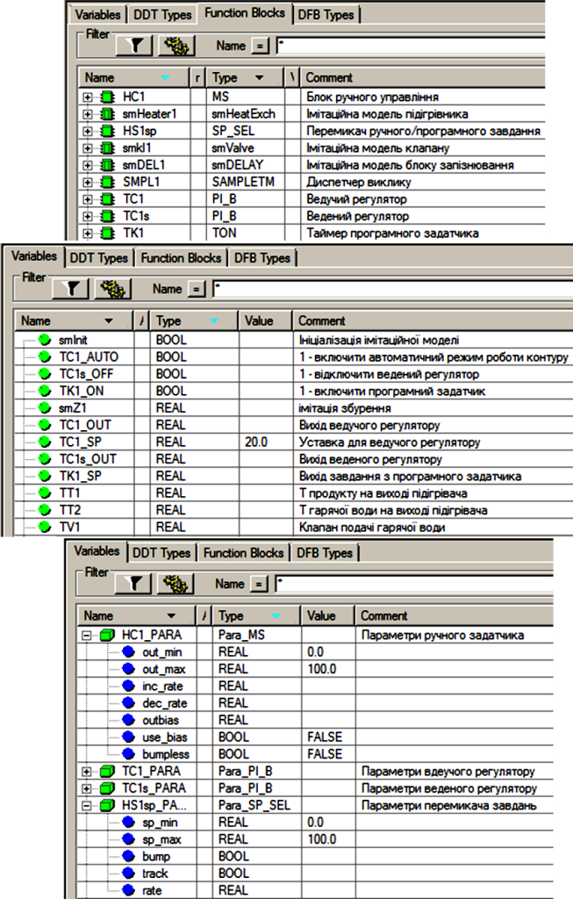
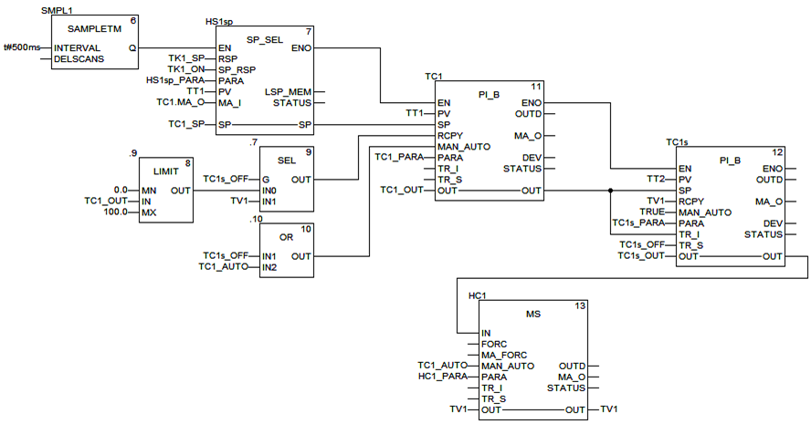

[До лабораторних робіт](README.md)

# ЛАБОРАТОРНА РОБОТА № 6. Реалізація контурів аналогового регулювання з каскадним управлінням та програмним задатчиком

**Тривалість**: 2 акад. години (1 пара).

**Мета:** ознайомитися з основами побудови контурів аналогового регулювання в середовищі UNITY PRO з використанням бібліотечних блоків сімейства ControlLIB (регуляторів, блоків ручного управління, блоків управління уставками та інш). 

## Завдання для виконання роботи

**Загальна постановка завдання.**  Необхідно створити проект в UNITY PRO для реалізації поставленої задачі (рис.6.1) з використанням FFB бібліотеки ControlLIB. Відлагодження проекту зробити з використанням готового програмного імітатору об’єкту та операторського екрану.

Рис.6.1. Операторський екран для контролю та управління процесом нагрівання  

**Опис об’єкту**. Технологічна установка являє собою теплообмінник для підігріву рідкого продукту (рис.6.1) за допомогою гарячої води. Температура продукту на виході вимірюється датчиком температури TT1 (0-100 °C, вхід  ПЛК %IW0.1.2) який вмонтований на трубопроводі на відстані кількох метрів від підігрівника, а регулюється витратою гарячої води регулюючим клапаном TV1на виході підігрівника (0-100% ХРО, вихід %QW0.2.0). Додатково вимірюється також температура води в трубопроводі безпосередньо на виході підігрівника за допомогою датчика ТТ2 (0-100 °C, вхід ПЛК %IW0.1.1). Інерційність об’єкту по каналу ТТ2 менша ніж по ТТ1. 

**Опис функцій**. Система управління повинна забезпечити регулювання температури ТТ1 з підтримкою наступних функцій:

1) стабілізація температури на виході підігрівника на заданому оператором або програмним задатчиком значені, з використанням каскадного регулятору, де:

   a.   ведучий регулятор (ПІ режим) стабілізує температуру ТТ1;

   b.   ведений регулятор (П режим) служить для швидкої реакції контуру регулювання на зміну малоінерційного ТТ2;

2) можливість настройки коефіцієнтів Kp та Ti з операторського екрану;

3) можливість ручного управління виконавчим механізмом TV1 з операторського екрану при переключенні в ручний режим з забезпеченням безударності переходу ;

4. можливість формування завдання програмним задатчиком в залежності від часу по наступній залежності:

Рис.6.2. Залежність завдання температури від часу 

5. можливість переключення з ручного завдання на програмне управління та навпаки в будь який момент часу з забезпеченням безударності переходу; 

6. можливість виключення веденого регулятору з каскаду (з забезпеченням безударності переходу), тобто переводу контуру в режим прямого ПІ-регулювання по температурі ТТ1;

7. при ручному управлінні виконавчим механізмом ведучий регулятор повинен фіксувати своє вихідне значення в останньому положенні.

## Лабораторна установка

Апаратне забезпечення: ПК. 

Програмне забезпечення: UNITY PRO V>=4.0.

## Порядок виконання роботи. Заходи безпеки

Необхідно дотримуватись стандартних заходів безпеки при роботі з ПК. 

Перед виконанням лабораторної роботи ознайомтесь з додатком 6.

1) Запустити на виконання UNITY PRO. Створити новий проект з ПЛК М340.

2) Імпортувати файл апаратної конфігурації (матеріали для лабораторних робіт доступні за  [цим посиланням](https://drive.google.com/file/d/0B2FfwwwweBSVWENJRHVYTWhVNUk/view?usp=sharing&resourcekey=0-ctC5c-_Ik4dx8Aho8uBocg)): 

`Project Browser  -> контекстне меню Configuration ->  Import "розміщеня файйлу\lab6_Cascad_HW.XHW`

3) Подивитися конфігурацію обладнання для даної задачі.

4) Імпортувати файл з секцією імітатора об’єкту управління: 

`Project Browser  -> Program-> Tasks -> Mast -> контекстне меню Sections –> Import  LAB6_Cascad_simul.XBD`

5) Імпортувати змінні (див. рис.6.3): 

`Project Browser  -> Variables & FB Instances ->  Import "розміщеня файйлу\lab6_Cascad_vars.XSY`

Рис.6.3. Змінні проекту  

Враховуючи що деякі змінні на момент імпорту в проекті вже існують, в діалоговому вікні (рис.6.4) виберіть "Replace All", після чого "Ok". 

Рис.6.4. Діалогове вікно вибору дії при імпорті.  

6. Після імпорту змінних, ознайомтесь з їх призначенням (рис.6.3). 

7. Імпортувати операторський екран: 

`Project Browser  ->  контекстне меню OperatorScreens-> Import-> "розміщеня файлу\ lab6_Cascad_Screen.XCR`

8. Активуйте можливість використання динамічних масивів

`Меню Tools->Project Settings-> Variabless->виставити опцію "Allow Dynamic Arrays"`

9. Перевірте проект на наявність помилок. Якщо помилки є повторіть пункти 1-8 знову.

10. Створіть програму для реалізації поставленої задачі. Можна використати варіант запропонований в додатку 6. 

**Увага! Використовуйте вже існуючі (імпортовані) змінні та екземпляри функціональних блоків, інакше операторські екрани не будуть функціонувати!**

11. Скомпілюйте проект і завантажте його в симулятор ПЛК.

12. У ручному режимі відкрийте виконавчий механізм на 50%. Дочекайтесь закінчення перехідного процесу. Зверніть увагу на інерційність каналу температури ТТ1 (синій колір на тренді) порівняно з каналом ТТ2 (червоний колір на тренді).

13. Задайте завдання рівним 40°С, переключіть контур в автоматичний режим каскадного управління. Зверніть увагу на безударність переходу. Дочекайтесь закінчення перехідного процесу.

14. Повторіть пункт 13 для 50°С, потім знов для 40°С. Оцініть приблизний час перехідних процесів.

15. Виведіть ведений регулятор з каскаду (виключити TC1s_OFF). Змініть завдання на 50°С, після закінчення перехідного процесу знов на 40°С. Оцініть приблизний час перехідних процесів.

16. Включіть каскадне управління. Включіть програмний задатчик. При програмному управлінні змінюйте збурення на ±2°С.  

## Аналіз одержаних результатів

Викладачем перевіряється виконання поставленого завдання. Студент повинен пояснити виконання програми та призначення кожного пункту виконаного завдання. *Додатково оцінюється створення власного варіанту рішення задачі або модифікація існуючого.*  

## Запитання для самоперевірки

1. Поясніть функціональну схему з рис.6.1. Що таке каскадне управління?

2. Наведіть перелік FFB та їх призначення, які використані для реалізації контуру регулювання в даній лабораторній роботі.

3. Поясніть принцип роботи блоків типу SP_SEL з використанням їх функціональної схеми.

4. Поясніть принцип роботи блоків типу PI_B з використанням їх функціональної схеми.

5. Поясніть принцип роботи блоків типу MS з використанням їх функціональної схеми.

6. Поясніть принцип роботи процедури LOOKUP_TABLE1.

7. Поясніть яким чином забезпечується переключення контуру регулювання в ручний режим в даній лабораторній роботі. Як при цьому ведуть себе всі регулятори і чому? Чи залежить їх поведінка від включення/виключення веденого регулятора з каскаду?

8. Поясніть яким чином формуються завдання для контуру регулювання в даній лабораторній роботі.  

9. Поясніть яким чином забезпечується відключення веденого регулятору з каскаду в даній лабораторній роботі. 

10. Поясніть яким чином забезпечується ручне управління в даній лабораторній роботі.

## ДОДАТОК 6. Опис варіанту функціональної схеми контуру регулювання та програми для його реалізації в UNITY PRO.

### Д6.1.Загальні принципи роботи контуру 

Функціональна схема контуру регулювання температури продукту показана на операторському екрані (рис.6.1). 

Контур включає:

- канали вимірювання (ТТ1, ТТ2);

- канал формування завдання, який складається з ручного задатчика, програмного задатчика TK1_sp (формування програмного управління по часу), перемикача ручного/програмного завдання HS1sp (включена кнопка – запуск програмного задатчика) ;

- ведучого регулятору TC1 (ПІ закон), який на основі сформованого завдання (вхід SP) та вимірювального значення (TT1 на вхід PV), формує сигнал управління (вихід OUT), який подається на ведений регулятор ТС1s; для регулятору налаштовуються Kp та Ti; 

- веденого регулятору TC1s (П закон), який на основі сформованого завдання (TC1.OUT на вхід SP) та вимірювального значення (TT2 на вхід PV), формує сигнал управління (вихід OUT), який подається на виконавчий механізм TV1 через перемикач TC1s_OFF; перемикач TC1s_OFF дозволяє переключити TV1 на вихід ведучого регулятору TC1.OUT, тим самим відключивши ведений регулятор з контуру управління; для регулятору налаштовується Kp а також Ti, ненульове значення якого дозволяє перевести регулятор в ПІ-режим;

- блок ручного управління HC1, який дає можливість переключитися в режим ручного управління виконавчим механізмом TV1 з операторського екрану; кнопка АВТ для переключення режиму (нажата - автоматичний режим);  

- канал управління (TV1);

### Д6.2.Загальні принципи роботи програми

Для реалізації даної задачі використовуються 4-ри секції (рис.Д6.1): 

- Секція "INPUTS" – для обробки вхідних каналів вимірювання (датчики температури); секція "OUTPUTS" – для обробки вихідного каналу правління; секція "CTRL1" – для реалізації контуру регулювання;   
- Секція "Simulation" призначена тільки для імітації об’єкта.
- У секції "INPUTS" оцифровані значення аналогових входів масштабуються шляхом множення на коефіцієнт (діапазон 0-10000 в 0-100°C). У секції "OTPUTS" аналогічним чином проводиться масштабування для значення виконавчого механізму TV1, тільки в зворотному напрямку (діапазон 0-100%ХРО в 0-10000).

Рис.Д.6.1. Структура задачі MAST 

### Д6.3. Реалізація програмного задатчика

Для реалізації програмного задатчика у секції "CTRL1" перед викликом контуру регулювання використана процедура LOOKUP_TABLE1, яка реалізовує кусочно-лінійну інтерполяцію за заданими вузловими точками. Вузлові точки задаються парами значень XiYi, перше з яких – час в секундах, друга – задане значення температури в цій точці. Таким чином на вході *X* процедура буде отримувати значення часу роботи програмного задатчика в форматі REAL, в залежності від якого а на виході *Y* буде формувати задане значення (уставку для регулятору) *TK1_SP*.    

Рис.Д.6.2. Реалізація програмного задатчика

Для формування часу роботи задатчика використовується таймер *TK1*, який стартує командою запуску задатчика *TK1_ON*, та налаштований на повний час його роботи 240с. Спрацювання виходу *TK1.Q*, тобто по закінченню роботи програмного задатчика, приводить до скидання команди *TK1_ON*. У зв’язку з тим, що вихід таймеру *TK1.ET* видає значення типу TIME, воно перетворюється в тип REAL, а отримані мілісекунди шляхом ділення на 1000 переводяться в секунди. 

### Д6.4. Загальні принципи реалізації контуру регулювання 

Фрагмент програми реалізації контуру регулювання показана на рис.Д.6.3. Старіші версії UNITY PRO (<6.0) не підтримують можливість безпосереднього з’єднання в FBD виходів типу INOUT та IN (або OUT). Тому для цих версій UNITY PRO наведений фрагмент треба виконати як на рис.Д.6.4. 

Використовуючи SMPL1 та входи EN функціональних блоків, блоки HS1sp(перемикача завдань), TC1(ведучий регулятор) та TC1s(ведений регулятор) викликаються періодично з часом 500 мс, послідовно один за одним. Це дає змогу зменшити навантаження на ресурси ПЛК та виконавчих механізмів в автоматичному режимі. Однак для ручного режиму необхідна швидка реакція системи на дії оператору, тому блок ручного завдання викликається з кожним циклом (вхід EN не задіяний). 

Рис.Д.6.3. Фрагмент секції з реалізацією контуру регулювання (для UNITY PRO ≥6.0) 

Рис.Д.6.4. Фрагмент секції з реалізацією контуру регулювання  (для UNITY PRO ≥4.0) 

### Д6.5. Реалізація каналу формування завдання

Вихід блоку *HS1sp.SP* через змінну *TC1_SP* формує завдання для блоку *TC1*, вихід якого в свою чергу формує задвання *TC1s*. Таким чином формується каскадне регулювання. 

Блок перемикання завдання *HS1sp.SP* на вході RSP (дистанційне завдання) отримує значення в змінній *TK1_SP* з програмного задатчика (див.Д.6.3). При активації оператором програмного управління (*TK1_ON=TRUE*), через вхід *SP_RSP* блок *HS1sp* переключається в дистанційний режим, при якому *HS1sp.SP=* *HS1sp.TK1_SP* . Це ж значення копіюється в змінну *TC1_SP*, так як вона прив’язана до входу/виходу SP. У локальному режимі (*TK1_ON=FALSE*) оператор може змінювати уставку безпосередньо змінюючи TIC1.     

### Д6.6. Реалізація каскадного регулятору 

Ведучий регулятор *TC1* реалізований через функціональний блок типу *PI_B*. Його задача забезпечити значення температури *TT1* на рівні заданому *TC1_SP*. 

Ведений регулятор *TC1s* теж реалізований через функціональний блок типу *PI_B*, однак по замовченню він працює в П-режимі, так як інтегральна складова відключена (*Ti=0*). Його задача швидко зреагувати на зміну менш інерційної змінної процесу *TT2*. Таким чином велику частину збурень швидко компенсує ведений регулятор, а ведучий регулятор забезпечить точність регулювання.  

Враховуючи вимоги до функцій контуру регулювання, ведучий регулятор повинен мати можливість працювати в каскаді з веденим регулятором (*TC1s*), або самостійно без нього. У каскадному режимі вихід регулятору підключається до *TC1s.SP* через змінну *TC1_OUT*, тим самим формуючи завдання веденому регулятору. Виведення з каскаду веденого регулятору проводиться шляхом переключення *TC1s* в режим слідкування (Tracking), подавши на його вхід *TR_s* змінну *TC1s_OFF* (*TC1s.TR_s=TC1s_OFF*). Тобто в режимі слідкування на вихід *TC1s.OUT* буде подаватися значення *TC1s.TR_I=TC1_OUT* 

Враховуючи вимоги до безударності переходів та різні режими роботи контуру регулювання, обидва регулятори *TC1* та *TC1s* працюють в режимі використання входу RCPY (*en_rcpy**=TRUE*). Це значить, що нове значення виходу OUT регулятори будуть розраховувати на базі значення входу *RCPY*.  Для веденого регулятору *TC1s* на вхід RCPY завжди подається значення яке йде на виконавчий механізм *TV1*. Тобто, якщо ведений регулятор виведений з каскаду, він все одно буде формувати нове значення виходу внутрішнього регулятору на базі плинного *TV1*, що забезпечить безударний перехід при повторному вводі його в каскад.   Для ведучого регулятору значення *RCPY* залежить від того, чи включений в контур управління ведений регулятор *TC1s*. Якщо ведений регулятор виведений із каскаду, то *RCPY**=**TV1*, так як *TC1* безпосередньо управляє виконавчим механізмом, отже нове розраховане значення базується на значенні *TV1*. Якщо ведений регулятор в складі контуру, то  *RCPY**=**LIMIT(TC1_OUT).* Функція обмеження використовується тому, що в режимі (*en_rcpy=TRUE*) обмеження на вихід блоку *PI_B* не діють. 

### Д6.7. Реалізація ручного управління 

Ручне управління контуру реалізоване через блок ручного управління *HC1* та відповідних режимів роботи регуляторів *TC1* та *TC1s*. Значення виходу *HC1.OUT* зв’язане зі змінною *TV1*. У автоматичному режимі роботи контуру (*TC1_AUTO=TRUE*) вихід *HC1.OUT=TC1s_OUT*.  У ручному режимі вихід *HC1.OUT* може бути змінений оператором. При цьому, враховуючи що значення *TV1* повторюється на входах *RCPY* блоків регулювання забезпечується безударний перехід.

Ведений регулятор завжди знаходиться в автоматичному режимі, так як для ручного режиму передбачений блок *HC1*. Ведучий регулятор, якщо він знаходиться в режимі каскаду з веденим, в ручному режимі повинен фіксувати своє вихідне значення в останньому положенні. Це забезпечується шляхом переключення його в ручний режим. Таким чином ведучий регулятор працює в автоматичному режимі, коли працює в автоматичному режимі весь контур, або коли ведений регулятор виведений з каскаду.