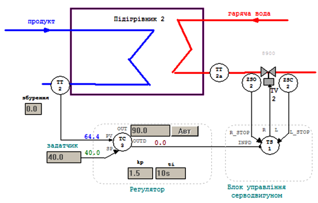

[До лабораторних робіт](README.md)

# ЛАБОРАТОРНА РОБОТА № 7. Реалізація контурів регулювання з використанням виконавчих механізмів типу МЕО

**Тривалість**: 2 акад. години (1 пара).

**Мета:** ознайомитися з основами побудови контурів регулювання з використанням виконавчих механізмів типу серводвигун, на базі бібліотечних блоків сімейства ControlLIB (регуляторів та блоку SERVO). 

## Завдання для виконання роботи

**Загальна постановка завдання.**  Необхідно створити проект в UNITY PRO для реалізації поставленої задачі (рис.7.1 та рис.7.2) з використанням FFB бібліотеки ControlLIB. Відлагодження проекту зробити з використанням готового програмного імітатору об’єкту та операторського екрану. 

**Опис об’єкту** **1**. Технологічна установка являє собою теплообмінник для підігріву рідкого продукту (рис.7.1) за допомогою гарячої води. Температура продукту на виході вимірюється датчиком температури TT1 (0-100 °C, вхід ПЛК %IW0.1.2) який вмонтований на трубопроводі на відстані кількох метрів від підігрівника, а регулюється витратою гарячої води на виході підігрівника з використанням клапану TV1 і приводом типу МЕО (вихід ПЛК %Q0.3.16 – "більше", %Q0.3.17 – "менше"). Додатково вимірюється також температура води в трубопроводі безпосередньо на виході підігрівника за допомогою датчика ТТ1а (0-100 °C, вхід ПЛК %IW0.1.3). 

Виконавчий механізм TV1 має показчик положення регулюючого органу (0-100%, вхід ПЛК %IW0.1.4). Час повного відкриття клапану – 10с, мінімальний імпульс – 250 мс. 

Рис.7.1. Операторський екран для контролю та управління процесом нагрівання в підігрівнику 1  

**Опис об’єкту** **2**. Аналогічно як до першого об’єкту, технологічна установка являє собою теплообмінник для підігріву рідкого продукту (рис.7.2) за допомогою гарячої води. Температура продукту на виході вимірюється датчиком температури TT2 (0-100 °C, вхід ПЛК %IW0.1.6), а регулюється витратою гарячої води на виході підігрівника з використанням клапану TV2 з приводом типу МЕО (вихід ПЛК %Q0.3.18 – "більше", %Q0.3.19 – "менше"). Додатково вимірюється також температура води в трубопроводі безпосередньо на виході підігрівника за допомогою датчика ТТ2а (0-100 °C, вхід ПЛК %IW0.1.7). 

Виконавчий механізм TV2 має датчики кінцевого положення регулюючого органу: "повністю відкритий" - вхід ПЛК %I0.3.0, "повністю закритий" - вхід ПЛК %I0.3.1. Час повного відкриття клапану – 10с, мінімальний імпульс – 250 мс.

Рис.7.2. Операторський екран для контролю та управління процесом нагрівання в підігрівнику 2  

**Опис функцій**. Система управління повинна забезпечити регулювання температури ТТ1 та ТТ2 з підтримкою наступних функцій:

1) стабілізація температур на виходах підігрівників на заданому оператором значені, з використанням ПІ регуляторів та блоків управління серводвигунами;

2) можливість настройки коефіцієнтів Kp та Ti з операторського екрану;

3) можливість ручного управління виконавчими механізмами TV1 та TV2 з операторського екрану при переключенні в ручний режим з забезпеченням безударності переходу.

## Лабораторна установка

Апаратне забезпечення: ПК. 

Програмне забезпечення: UNITY PRO V>=4.0.

## Порядок виконання роботи. Заходи безпеки

Необхідно дотримуватись стандартних заходів безпеки при роботі з ПК. 

Перед виконанням лабораторної роботи ознайомтесь з додатком 7.

1) Запустити на виконання UNITY PRO. Створити новий проект з ПЛК М340.

2) Імпортувати файл апаратної конфігурації (матеріали для лабораторних робіт доступні за  [цим посиланням](https://drive.google.com/file/d/0B2FfwwwweBSVWENJRHVYTWhVNUk/view?usp=sharing&resourcekey=0-ctC5c-_Ik4dx8Aho8uBocg)): 

`Project Browser  -> контекстне меню Configuration ->  Import "розміщеня файлу\lab7_Servo_HW.XHW"`.

3) Подивитися конфігурацію обладнання для даної задачі.

4) Імпортувати файл з секцією імітатора об’єкту управління: 

`Project Browser  -> Program-> Tasks -> Mast -> контекстне меню Sections –> Import  "LAB7_Servo_simul.XBD"`

5) Імпортувати змінні: 

`Project Browser  -> Variables & FB Instances ->  Import  "розміщеня файлу\lab7_Servo_vars.XSY"`

Враховуючи що деякі змінні на момент імпорту в проекті вже існують, в діалоговому вікні виберіть "Replace All", після чого "Ok". 

6) Після імпорту змінних, ознайомтесь з їх призначенням (рис.7.3). 

Рис.7.3. Змінні проекту  

7) Імпортувати операторські екрани: 

`Project Browser  ->  контекстне меню OperatorScreens-> Import-> "розміщеня файлу\ lab7_Servo_Screen.XCR"`.

8) Активуйте можливість використання динамічних масивів

`Меню Tools->Project Settings-> Variabless->виставити опцію "Allow Dynamic Arrays"`

9) Перевірте проект на наявність помилок. Якщо помилки є повторіть пункти 1-9 знову.

10) Створіть DFB тип aligRCPY відповідно до рис.Д.7.5.

У редакторі даних Data Editor-> DFB Types

Після створення інтерфейсу та програми перевірте правильність: меню Build->Analyze

11) Створіть екземпляр з іменем "TY1_RCPY" типу *aligRCPY* 

12) Створіть програму для реалізації обробки входів та виходів. Можна використати варіант секцій "INPUTS" та "OUTPUTS" запропонований в додатку 7. 

**Увага! Використовуйте вже існуючі (імпортовані) змінні та екземпляри функціональних блоків, інакше операторські екрани не будуть функціонувати!**

13) Створіть програму для реалізації управління першим підігрівником. Можна використати варіант секції CTRL1 запропонований в додатку 7. 

14) Скомпілюйте проект і завантажте його в симулятор ПЛК.

15. Змініть завдання до значення 40%, переключіть регулятор в автоматичний режим. Зверніть увагу на входи та виходи регулятору та блоку управління серводвигуном. Намагайтеся визначити причину такої поведінки. Зверніть увагу на тренди: нижні два показують активність виходів "більше" (зелений) та "менше"(жовтий). Дочекайтесь закінчення перехідного процесу.

16. Переведіть регулятор в ручний режим. Виставте значення на виконавчий механізм рівним 50%. Зверніть увагу на входи та виходи блоку управління серводвигуном. Дочекайтесь поки виконавчий механізм дійде до усталеного значення. 

17. Повторіть пункт 16 для уставки 100%, після чого переведіть регулятор в автоматичний режим.

18. Створіть програму для реалізації управління другим підігрівником. Можна використати варіант секції CTRL2 запропонований в додатку 7. 

19. Скомпілюйте проект і завантажте його в симулятор ПЛК.

20. Змініть завдання до значення 40%, переключіть регулятор в автоматичний режим. Зверніть увагу на входи та виходи регулятору та блоку управління серводвигуном. Намагайтеся визначити причину такої поведінки. Дочекайтесь закінчення перехідного процесу.

21. Переведіть регулятор в ручний режим. Виставте значення на виконавчий механізм рівним 50%. Зверніть увагу на входи та виходи блоку управління серводвигуном. Дочекайтесь поки виконавчий механізм дійде до усталеного значення. 

22. Повторіть пункт 21 для уставки 100%, після чого переведіть регулятор в автоматичний режим.

## Аналіз одержаних результатів

Викладачем перевіряється виконання поставленого завдання. Студент повинен пояснити виконання програми та призначення кожного пункту виконаного завдання. *Додатково оцінюється створення власного варіанту рішення задачі або модифікація існуючого.*  

## Запитання для самоперевірки

1. Розкажіть про призначення блоку управління серводвигунами SERVO. 

2. Чим відрізняються принципи управління серводвигунами для першого та другого підігрівника?

3. Яким чином  блоки управління серводвигунами можуть визначати положення регулюючого органу?

4. Як контролюється блоком управління серводвигунами досягнення регулюючим органом крайніх положень? Як при цьому веде себе блок?

5. Які особливості обробки серводвигунів в автоматичному та ручному режимах? Розкажіть про призначення входу SEN.

6. Розкажіть про роботу блоку управління серводвигуном в режимі активації RCPY? Як при цьому правильно з’єднувати SERVO та регулятор? Що необхідно передбачити в програмі в ручному режимі?

7. Розкажіть про роботу блоку управління серводвигуном в режимі без RCPY? Як при цьому правильно з’єднувати SERVO та регулятор? Що необхідно передбачити в програмі в ручному режимі?

8. Навіщо задаються в блоці управління серводвигунами параметри *t_motor* та  *t_mini*?

## ДОДАТОК 7. Опис варіантів функціональних схем контурів регулювання та програми для їх реалізації в UNITY PRO.

### Д7.1.Загальні принципи роботи контуру управління температурю в підігрівнику 1

Функціональна схема контуру регулювання температури продукту показана на операторському екрані (рис.7.1). 

Рис.Д.7.1. Структура задачі MAST 

Контур включає:

- канали вимірювання (*ТТ1*, *ТТ1а*);

- регулятор *TC1* (ПІ закон), який на основі сформованого завдання (вхід *SP*) та вимірювального значення (*TT1* на вхід *PV*), формує сигнал управління (вихід *OUT*), що  подається на блок управління серводвигуном *TS1*; на вхід *RCPY* регулятору заводиться сигнал зворотного зв’язку по положенню регулюючого органу *ZS1*; для регулятору налаштовуються *Kp* та *Ti*; регулятор може працювати в автоматичному або ручному режимі (вмикається/вимикається кнопка "АВТ"); в ручному режимі вихід *OUT* задається безпосередньо оператором;

- блок управління серводвигуном *TS1*, який перетворює числовий сигнал що поступає на вхід *IN* в діапазоні 0-100% у дискретні сигнали відповідної тривалості типу "більше" (вихід R) та "менше" (вихід L); на вхід *RCPY* блоку заводиться сигнал зворотного зв’язку по положенню регулюючого органу *ZS1*; 

- канал управління, який окрім клапану з виконавчим механізмом TV1 включає показчик положення регулюючого органу (*ZS1*);

### Д7.2. Структура програми 

Для реалізації даної задачі використовуються 5-ть секцій (див. рис.Д7.1): секція "INPUTS" – для обробки вхідних каналів вимірювання; секція "OUTPUTS" – для обробки вихідних каналів правління; секція "CTRL1" та "CTRL2" – для реалізації контурів управління температурою відповідно в підігрівнику 1 та підігрівнику 2. Секція "Simulation" призначена тільки для імітації об’єкта.

У секції "INPUTS" (рис.Д.7.2) оцифровані значення аналогових входів масштабуються шляхом множення на коефіцієнт (діапазон 0-10000 в 0-100°C). До входів контуру з підігрівачем 1 належить також показчик положення *ZS1* (діапазон 0-10000 в 0-100 %ХРО). До входів контуру з підігрівачем 2 належать також датчики кінцевого положення типу "відкрито" - *ZSO2*, та "закрито" - *ZSC2*. 

Рис.Д.7.2. Секція обробки входів 

У секції "OTPUTS" (рис.Д.7.3) для кожного виконавчого механізму на виходи ПЛК подаються сигнали "більше" (TV1_OPN, TV2_OPN ) та "менше" (TV1_CLS, TV2_CLS). 

Рис.Д.7.3. Секція обробки виходів 

### Д7.3.Опис роботи програми реалізації контуру управління температурою в підігрівнику 1

Програма секції "CTRL1" наведена на рис.Д.7.4. Для UNITY PRO V<6.0 вхід/вихід *TC1.OUT* треба розірвати від *TS1* та *SERVO*, а зв’язок реалізувати через змінну *TC1_OUT*. 

Рис.Д.7.4. Секція CTRL1 

Основу контуру складає ПІ-регулятор *TC1*, який на основі плинної температури *TT1* та завдання *TC1_SP* формує на виході *OUT* (прив’язаний до *TC1_OUT*) числове значення, яке подається на блок управління серводвигуном *TS1* для формування імпульсів "більше" та "менше". Регулятор TC1 працює в режимі використання входу *RCPY* (*TC1_PARA*.*en_rcpy=TRUE*). Це значить, що нове значення виходу *OUT* регулятор буде розраховувати на базі значення входу *RCPY**,* на який подається значення покажчика положення *ZS1*. 

 Блок управління серводвигуном *TS1* теж працює в режимі використання входу *RCPY* (*TS1_PARA*.*en_rcpy=TRUE*). Це значить, що він буде перетворювати значення різниці *IN-RCPY* у дискретний сигнал *RAISE* або *LOWER* відповідної тривалості. Значення параметрів блоку дорівнюють *TS1_PARA*.*t_motor=t#10s* та *TS1_PARA*.*t_mini=t#250ms* відповідно до умов задачі.   

Алгоритм роботи блоку *SERVO* працює таким чином, що у ручному режимі він буде видавати сигнали "більше" та "менше" до тих пір, поки *IN* та *RCPY* не будуть рівними. Для того, щоб блок управління серводвигуном в ручному режимі припиняв управління в зоні наближеній до положення *RCPY,* можна створити та використати блок вирівнювання (рис.Д.7.5). Принцип роботи алгоритму заключається в прирівнюванні виходу *RCPY_OUT=IN* в тому випадку, коли в ручному режимі (*MA_I=TRUE*) вхід *IN* буде в зоні наближення до *RCPY*. Величина зони наближення визначається параметром *deadb*, збільшення значення якого зменшує кількість рухів однак збільшує похибку позиціонування.  

Рис.Д.7.5. Структура і програма DFB типу aligRCPY. 

Блок вирівнювання *TY1_RCPY* включається в схему між *TC1.OUT* та  *SERVO.RCPY**.* Тобто, коли *ZS1* знаходиться в зоні *TC1_OUT*, на вхід *TS1.RCPY* буде подаватися значення *TC1_OUT* а не *ZS1*, що приведе до відключення виходів LOWER та RAISE.  

### Д7.4.Опис роботи програми реалізації контуру управління температурою в підігрівнику 2.

Програма секції "CTRL2" наведена на рис.Д.7.6.

Рис.Д.7.6. Секція CTRL2 

Основу контуру складає ПІ-регулятор *TC**2*, який на основі плинної температури *TT**2* та завдання *TC**2**_SP* формує на інкрементальному виході *OUTD* (прив’язаний до *TC2_OUTD*) числове значення, яке подається на блок управління серводвигуном *TS2* для формування імпульсів "більше" та "менше". Регулятор *TC2* працює в режимі без використання входу *RCPY* (*TC1_PARA*.*en_rcpy**=FALSE*), саме тому використовується зв’язка інкрементального виходу *TC2.OUTD* та *TS2.INPD* . Це значить, що на кожному циклі блок *TC2* буде розраховувати нове інкрементальне значення виходу *OUTD*, а абсолютне значення *OUT* використовуватися не буде. 

Блок управління серводвигуном *TS**2* теж працює в режимі без використання входу *RCPY* (*TS1_PARA*.*en_rcpy**=FALSE*). Це значить, що він буде перетворювати значення входу *INPD* у дискретний сигнал *RAISE* або *LOWER* відповідної тривалості. Значення параметрів блоку дорівнюють *TS1_PARA*.*t_motor=t#10s* та *TS1_PARA*.*t_mini=t#250ms* відповідно до умов задачі. 

Алгоритм роботи блоку *SERVO* працює таким чином, що у ручному режимі він буде видавати сигнали "більше" та "менше" відповідно до значення входу *INPD* на кожному циклу. Враховуючи що змінна *TC2_OUTD* обновлюється з періодичністю виклику *TC2* (500 мс), а блок *TS2* з кожним циклом, протягом 500 мс блок *TS2* буде формувати нові імпульси. Для того щоб уникнути цього ефекту, в ручному режимі (*TC2_AUTO=FALSE*) змінна *TC2_OUTD* обнуляється після обробки контуру.