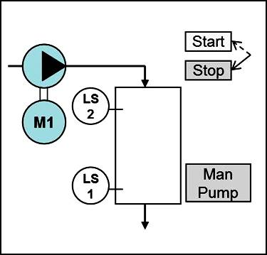
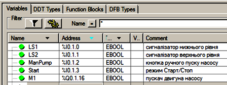

# 1.  Основи роботи з UNITY PRO

## 1.1. Загальні поняття

Програмно-технічні засоби, які входять до складу автоматизованих систем управління технологічними процесами, можна віднести до однієї з груп (рис.1.1):

- технічні засоби польового рівня (датчики, виконавчі механізми, вторинні перетворювачі);
- промислові контролери та регулятори;
- засоби розподіленої периферії (винесені за межі контролерів засоби вводу/виводу);
- засоби SCADA/HMI (комп’ютери з програмним забезпеченням супервізорного управління та збору даних (SCADA), операторські панелі (HMI));
- інструментальні засоби розробки та налагодження виконавчих програм (програматори та спеціалізоване програмне забезпечення для створення, конфігурування та діагностики).

UNITY PRO - це програмне середовище конфігурування, програмування, налагодження та діагностики промислових контролерів Schneider Electric: Modicon M340, TSX Premium (включно Atrium) та Quantum. Місце UNITY PRO в структурі АСУТП (рис.1.1).

Рис.1.1.Середовище UNITY PRO в структурі АСУТП

UNITY PRO є результатом розвитку та інтегрування двох програмних продуктів: 

-     PL7 PRO - середовище програмування контролерів TSX Micro і TSX Premium; 

-     Concept - середовище програмування контролерів Modicon Momentum та Modicon Quantum. 

Середовище UNITY PRO може бути використане тільки для роботи з ПЛК, в яких функціонує операційна система UNITY (OS UNITY). Тобто TSX Premium з операційною системою PL7 або Quantum з операційною системою Concept запрограмувати з використанням UNITY PRO неможливо. Винятком можуть бути деякі з цих ПЛК, в які попередньо треба завантажити OS UNITY (для цих цілей використовується OS Loader).  

Слід розділяти поняття "середовище розробки UNITY PRO" та "Середовище виконання UNITY" (рис.1.2). Середовище виконання UNITY – це програмне забезпечення, яке виконується в контролері. Середовище виконання базується на операційній системі UNITY(OS UNITY), яка вже знаходиться ("прошита") в загружчику ПЛК, і приймає участь в усіх операціях контролера. Тому навіть якщо ПЛК не запрограмований або знаходиться в режимі Stop (зупинка), операційна система UNITY функціонує, і забезпечує діагностику ПЛК та діалог з ним через комунікаційні порти вводу/виводу. У режимі RUN (робота) середовище виконує програму користувача (ПРК), яка є частиною виконавчого проекту, і створюється в середовищі UNITY PRO. Іншими словами основна задача UNITY PRO - розробка виконавчого проекту, який виконується у контролері.  

Рис.1.2. Середовище UNITY PRO та середовище виконання UNITY

Слід також розуміти, що середовище UNITY PRO не приймає участь в управлінні, тому підключається до системи тільки при необхідності використання однієї з його функцій: 

-     конфігурування апаратної частини виконавчого проекту ПЛК;

-     конфігурування апаратної частини розподіленої периферії, які є функціональною частиною ПЛК (тільки для певних засобів розподіленої периферії Schneider Electric); 

-     створення виконавчих програм користувача (ПРК);

-     завантаження проекту в ПЛК;

-     вивантаження/завантаження проектних даних (Upload Information);

-     управління операційним режимом ПЛК: старт, стоп, ініціалізація;

-     налагодження програми в ПЛК: перегляд та зміна змінних, зміна частини програми в режимі онлайн та ін.;

-     діагностика роботи ПЛК;

-     імітація роботи ПЛК для забезпечення можливості налагодження виконавчого проекту без наявного апаратного забезпечення.

Можливості середовища UNITY PRO та зовнішній вигляд його інтерфейсу описані в главі 3.1. 

## 1.2. Функціональна структура ПЛК

ПЛК забезпечує обробку вхідної інформації з об’єкту управління (вхідних змінних процесу) та формування управляючих дій (вихідних змінних процесу) відповідно до програми користувача, яку створює розробник системи управління (див. рис.1.3). 

Рис.1.3.Функціональна структура ПЛК з операційною системою UNITY

Програма користувача оперує змінними ПЛК (Variables). Вхідні та вихідні змінні містять значення змінних процесу. Внутрішні змінні використовуються для збереження проміжних результатів обробки інформації або обміну з іншими засобами через комунікаційні канали. Системні змінні  служать для спілкування з операційною системою ПЛК. Операційна система UNITY забезпечує взаємозв’язок всіх складових та порядок їх взаємодії. 

Алгоритм роботи середовища виконання залежить від операційного режиму роботи ПЛК та настройок виконавчого проекту. 

## 1.3. Операційні режими роботи ПЛК

Програма користувача в ПЛК повинна функціонувати в реальному часі. Враховуючи що стан об’єкту управління (змінні процесу) постійно змінюється, операційна система забезпечує циклічне виконання наступних дій (рис.1.4):

-     опитування вхідних каналів ПЛК та оновлення вхідних змінних;

-     виконання програми користувача, яка в залежності від стану вхідних та внутрішніх змінних, у відповідності з прикладною програмою формує значення вихідних змінних;

-     запис значень вихідних змінних у вихідні канали ПЛК. 

На початку циклу формується так званий образ процесу - це значення всіх вхідних каналів, які відображають стан об’єкту управління в даний момент.

У режимі RUN програма користувача, на основі образу процесу та проміжних результатів роботи на попередніх циклах, змінює значення вихідних змінних. Слід зазначити, що в момент зміни вихідних змінних, запис на вихідні канали не проводиться. Це робиться в кінці циклу для всіх вихідних змінних. Додатково операційна система займається внутрішньою обробкою, до якої входять діагностика, робота з комунікаційними каналами, зміна програми при налагодженні, тощо. Слід звернути увагу на те, що циклічність забезпечує сама операційна система, а тривалість циклу становить від кількох мілісекунд до кількох десятків мілісекунд, в залежності від програми користувача. 

У режимі STOP контролер не виконує програму користувача і не оновлює виходи. Значення вихідних каналів в цьому режимі залежить від їх конфігурації.  

У програмі користувача, поряд з основною Задачею MAST можливо виконання декількох типів Задач (FAST,Event,Timer,Aux). Задача – це окрема частина програми, яка запускається операційною системою по певній події.

Наведений алгоритм справедливий для циклічного режиму виконання основної Задачі MAST, при якому наступний цикл її виконання запускається відразу по закінченню її виконання в попередньому циклі. Можливий також періодичний режим виконання Задачі MAST при якому Задача запускається по внутрішньому системному таймеру з часом, який вказується для цієї Задачі.

Детальніше про Задачі можна ознайомитись в главі 3.3. а про їх операційні режими - в главі 4.1.

Рис.1.4. Робочий цикл функціонування ПЛК

## 1.4. Області пам’яті ПЛК та адресація каналів вводу/виводу

Вище зазначено, що операційна система ПЛК на початку Задачі автоматично оновлює вхідні змінні, а в кінці – автоматично оновлює виходи значеннями вихідних змінних. У залежності від призначення, дані для змінних можуть бути розміщені в декількох областях (див. рис.1.3):

-   %I, %IW  - область даних вхідних каналів;

-   %Q, %QW – область даних вихідних каналів;

-   %M – область даних для внутрішніх булевих (Boolean) змінних;

-   %MW – область даних для внутрішніх числових змінних;

-   %S – область даних для системних булевих змінних;

-   %SW – область даних для системних числових змінних;

-   %KW – область констант. 

-   Unlocated - область нелокалізованих даних 

Комірки пам’яті в кожній області адресуються різним чином. У області %M та %MW кожна комірка має свій номер. Наприклад %M0 – нульова комірка в області %M, %MW100 – сота комірка в області %MW. Ці комірки можуть використовуватись для збереження проміжних результатів.

У областях %I (дискретні входи), %IW(аналогові входи), %Q (дискретні виходи) та %QW (аналогові виходи) кожна комірка відповідає за конкретний канал ПЛК, тому адресація комірки співпадає з адресою каналу. Адреса каналів в ПЛК повністю залежить від його розміщення в шасі і складається з послідовності "N.M.C", де: 

N - номер шасі;

M - номер місця в шасі, в якому розміщений модуль;

C - номер каналу в модулі.

Наприклад, комірки з адресами:

-   %I1.4.6 буде отримувати значення з 6-го дискретного входу, модуля на 4-й позиції в шасі №1;

-   %IW0.5.0 буде отримувати значення з 0-го аналогового входу, модуля на 5-й позиції в шасі №0;

-   записавши логічну одиницю в комірку %Q3.1.2, включиться 2-й дискретний вихід на модулі в 1-му посадочному місці, 3-го шасі;

-   записавши 5000 в комірку %QW0.1.2, значення 2-го аналогового виходу модуля, на 1-му посадочному місці, 0-го шасі, виставиться рівним 50% від діапазону вихідного сигналу.  

При цьому значення для аналогових входів та виходів по замовченню масштабуються в діапазоні 0-10000, при значенні аналогового сигналу 0-100%. 

У областях %S (системні біти) та %SW (системні слова) знаходиться інформація про стан контролера. Наприклад, біт %S0 сигналізує про виконання першого циклу після включення ПЛК, а значення в слові %SW49 вказує на поточний день місяця.  

Розробник програми користувача може вказати для змінної адресу комірки пам’яті, де будуть розміщуватись її дані (тобто прив’язати до адреси). Якщо ця комірка буде частиною області входів, то змінна буде вхідною, і отримуватиме вхідне значення автоматично. Якщо для змінної буде вказана комірка з області виходів – то вона буде вихідною. Якщо записати значення у вихідну змінну, то по закінченню Задачі, воно буде автоматично записано на вихідний канал ПЛК. Якщо змінну прив’язати до комірки %M чи %MW – вона буде внутрішньою. 

Визначення адреси для змінної вказується в середовищі UNITY PRO. Всі змінні, які будуть прив’язані до конкретної комірки називаються локалізованими змінними, так як їх розміщення відоме. У програмі користувача дозволяється прямий доступ до комірок пам’яті за адресою, тому значення локалізованої змінної можна змінити шляхом зміни значення в комірці пам’яті, на яку вона посилається.

Однією зі зручних особливостей UNITY PRO – є необов’язкове визначення адреси для змінної. У випадку незаповненої властивості "Address",  UNITY PRO при компіляції розмістить цю змінну в області нелокалізованих даних (див. рис.1.3). Такі змінні називаються нелокалізованими. При цьому адреса комірки, в якій буде розміщення даних, буде невідомою розробнику і може змінюватися при компіляції. 

 Більш детально про роботу з даними можна прочитати в главі 3.4.

## 1.5. Розробка, компіляція та завантаження проекту UNITY PRO

Проект UNITY PRO – це база даних певного формату, яка вміщує всю конфігураційну інформацію для ПЛК та деяку інформацію для його розподіленої периферії. Проект зберігається на комп’ютері у вигляді одного файлу формату .STU. Файли формату .STU несумісні в різних версіях (навіть від старшої до молодшої), тому при перенесенні проекту необхідно зберегти його в архівному форматі .STA, який сумісний у більшості версій. 

Навігація по проекту проводиться через єдиний провідник проекту (Project Browser (рис.1.5)). Детальніше про настройки проекту можна прочитати в главі 3.2. 

Рис.1.5.Структура проекту UNITY PRO та призначення розділів

Нагадаємо, що ПЛК працює з виконавчим проектом, тобто скомпільованим кодом. Тому для завантаження виконавчого проекту в ПЛК, спочатку його треба створити. Створюється виконавчий проект шляхом компіляції (Build-> Rebuild All Project). Слід зазначити, що виконавчий проект зберігається на диску разом з файлом проекту UNITY PRO. 

Для завантаження виконавчого проекту, спочатку встановлюється з’єднання UNITY PRO з ПЛК (команда PLC->Connect), тобто перехід в режим онлайн (online), а потім пересилка проекту в ПЛК (PLC->Transfer Project to PLC). З’єднання можна встановити з реальним ПЛК (PLC->Standard Mode) або з імітатором ПЛК (PLC->Simulation Mode). Налаштування адреси ПЛК/імітатора проводиться у спеціальному вікні, яке викликається в меню PLC->Set Address. Після завантаження виконавчого проекту, ПЛК можна перевести в режим RUN (PLC->RUN)  

Важливою особливістю ПЛК з OS UNITY є можливість зміни виконавчого проекту в режимі онлайн без зупинки ПЛК. Для цього в режимі онлайн, після внесених змін, запускається команда часткової компіляції (Build->Build Changes). Після компіляції в ПЛК автоматично завантажиться вся змінена частина.

Необхідно звернути увагу на те, що компільований виконавчий проект не можна вивантажити з ПЛК в середовище UNITY PRO. Для можливості вивантаження частин вихідного проекту  (команда Upload Project), ця частина повинна бути включена в Upload Information (настроюється в PLC->Project Setting->PLC embedded data). Виключення опції Upload Information означає відмова від  завантаження в ПЛК вихідного коду програми, а отже і вивантаження його звідти. 

Деталі про роботу в онлайн режимі можна почитати в главі 4.2. 

Розробка проекту UNITY PRO може проводитись в різній послідовності, і має ітераційний характер. Один із можливих варіантів послідовності розробки та налагодження проекту складається з наступних етапів:

1.конфігурування апаратної частини ПЛК та розподіленої периферії;

2.створення змінних, екземплярів функціональних блоків, похідних типів даних, похідних функціональних блоків;

3.створення програми користувача;

4.налагодження програми користувача на ПЛК або імітаторі ПЛК;

5.прив’язка змінних до вхідних/вихідних каналів ПЛК, налагодження програми користувача на реальному ПЛК в складі системи управління;

Конфігурування апаратної частини може бути проведене після попереднього налагодження програми, наприклад на 5-му етапі, оскільки UNITY PRO має вбудований імітатор ПЛК. 

Для  розробки кожної частини проекту використовується свій редактор, який викликається через відповідний розділ провідника проекту (рис.1.5).

## 1.6. Конфігурування апаратної частини ПЛК

Конфігурування апаратної частини виконується за кілька етапів. При створенні проекту вибирається тип ПЛК (M340/Premium/Quantum) та тип процесорного модулю. Пізніше, на будь якій стадії створення проекту, можна буде змінити модель процесорного модуля. Далі, у розділі проекту "Configuration", використовуючи графічний редактор апаратної конфігурації, вказується розташування модулів на шасі контролера (рис.1.6). 

На другому етапі виконується конфігурування окремих модулів і, в залежності від типу модуля, задаються їх параметри. 

Рис.1.6.Редактор апаратної конфігурації

Для процесорного модуля задаються ряд функцій: поведінка ПЛК при його запуску і зупинці, параметри захисту карти пам’яті, виділення локалізованих областей пам’яті, тощо (рис.1.7).

Рис.1.7. Приклад конфігурації процесорного модуля

 При конфігуруванні модулів входів або виходів визначаються властивості окремих каналів, такі як прив’язка до Задач, настройка діапазонів, тощо. Крім того:

- для модулів дискретних входів можна виставити ступінь фільтрації сигналу, подія для виклику Задачі Event (обробка події), активація діагностики виходу живлення за діапазон, полярність сигналів, тощо;

-   для модулів дискретних виходів можна вказати стан каналів при зупинці ПЛК, порядок реактивації захищених виходів, тощо;

-   для модулів аналогових входів можна вказати діапазон сигналу, параметри масштабування, фільтрація, тощо;

-   для модулів аналогових виходів можна вказати стан виходів при зупинці ПЛК.  

У вікні конфігурації шасі доступна функція перегляду споживаної потужності модулів у відповідності з встановленим модулем живлення. Апаратну конфігурацію можна імпортувати/експортувати.  

Рис.1.8.Приклад конфігурації каналів 

Детальніше про апаратне забезпечення ПЛК M340 та Premium ви можете прочитати в 2-му розділі даного посібника. 

## 1.7. Створення змінних та екземплярів функціональних блоків.

Розпочати розробку програми користувача можна з визначення змінних в редакторі даних (Data Editor) (рис.1.10). Створення змінних також можливе з редакторів мов програмування (LD, FBD, ST, IL, SFC), що створює додаткові зручності при програмуванні. Для кожної змінної вказується: ім’я змінної (Name); тип змінної (Type); значення, яке буде приймати змінна при ініціалізації ПЛК (Value); адреса комірки пам’яті (Address) де буде зберігатись значення змінної; коментар (Comment). Додаткові властивості змінних доступні через вікно властивостей, яке викликається через контекстне меню змінної.

Рис.1.9.Конфігурування даних

Рис.1.10. Приклад створених змінних в редакторі даних.

При роботі з зовнішніми змінними проявляється особливість UNITY PRO порівняно з PL7 PRO. У середовищі PL7 PRO, у програмі користувача безпосередньо використовувались зовнішні змінні з адресами %I, %IW, %Q, %QW, що потребувало попереднього конфігурування ПЛК. У середовищі UNITY PRO спочатку створюється змінна, а пізніше може бути вказана її прив’язка до зовнішньої адреси. Це створює можливість розробки програми користувача без її прив’язки до конкретної апаратної конфігурації ПЛК.

Крім елементарних типів даних, середовище UNITY PRO підтримує похідні типи даних (Derived Data Types), які створюються на базі елементарних. Похідні типи даних представлені структурними типами та масивами. Крім бібліотечних структурних типів даних, розробник може створити типи даних користувача (див. тип "Bunker" на рис.1.9) 

Середовище UNITY PRO крім наявних функцій та процедур, має функціональні блоки. Функціональний блок (Function Block) можна представити як єдину структурну одиницю, яка складається з програмної процедури і структурованих даних. Структура і програма описана типом функціонального блоку (Function Block Types). Таким чином, функціональний блок зберігає проміжні значення у своєму тілі. Тому для кожного функціонального блоку створюється свій екземпляр функціонального блоку (FB Instance). При використанні функціонального блоку певного типу спочатку створюють екземпляр, с унікальним в межах проекту ім’ям, а потім в програмі користувача викликають екземпляр по імені. З цієї точки зору екземпляр функціонального блоку це особлива змінна, а тип FB – це особливий тип змінної. Механізм використання функціональних блоків дуже схожий на використання об’єктів в об’єктно-орієнтованому програмуванні. Крім бібліотечних елементарних функціональних блоків (Elementary Function Block) в UNITY PRO можна розробити типи функціональних блоків користувача (Derived FB Type).  

Всі змінні та екземпляри функціональних блоків є глобальними, тобто доступними в усіх програмних частинах проекту і на всіх мовах програмування. 

Більш детально про змінні, функції та функціональні блоки можна прочитати в главах 3.4 - 3.6 даного посібника. 

## 1.8. Створення програми користувача.

Програма користувача може бути однозадачною (тільки MAST) або багатозадачною. Налаштування параметрів Задач проводиться через їх контекстне меню (рис.1.12). 

Програма користувача складається з секцій (Section), кожна з яких може бути написана на будь-якій з мов МЕК 61131-3: IL, LD, ST, FBD чи SFC (SFC тільки для MAST). Секції в межах Задачі виконуються одна за одною, в порядку їх розміщення в підрозділі Sections (на рис.1.11 спочатку виконується програма в секції "Dozators", а потім в "DozatorsDFB"). При створенні секції (контекстне меню Sections->New Section), для неї вказується ім’я та вибрана мова програмування. 

Рис.1.11. Створення програми користувача

Рис.1.12. Налаштування Задачі MAST

## 1.9. Мови програмування.

При розробці програми користувача можуть використовуватись п’ять мов програмування, які відповідають стандарту МЕК 61131-3: IL, LD, ST, FBD чи SFC.

Мова IL (Instruction List), являє собою спиcок інструкцій, які виконуються послідовно, подібно до мови Асемблера (рис.1.13). 

Рис.1.13. Фрагмент програми на мові IL

Мова LD (Ladder Diagram) це графічна мова програмування, яка представляє собою діаграму релейно-контактної логіки (рис.1.14). Це одна з мов програмування контролерів, які вперше були використані для заміни релейно-контактних схем управління. У вітчизняній техніці мова LD має назву “Мова релейно-контактних схем” (РКС).  Детальніше LD розглянута в главі 3.8, а приклад розробки стартового проекту з використанням мови LD наведений в главі 1.11. 

Рис.1.14. Фрагмент програми на мові LD

Мова FBD (Function Block Diagram) - графічна мова програмування, яка дозволяє створювати програми у вигляді взаємопов’язаних інформаційними зв’язками функцій, процедур та функціональних блоків (рис.1.15). Детальніше FBD розглянута в главі 3.7, а приклад розробки стартового проекту з використанням мови FBD наведений в главі 1.12.

Рис.1.15. Фрагмент програми на мові FBD

Мова ST (Structured Text, структурований текст) – це текстова мова, яка подібна до PASCAL, C, BASIC і т.п (рис.1.16). Детальніше ST розглянута в главі 3.9. Приклад використання мови ST наведений в главі 1.13.

Рис.1.16. Фрагмент програми на мові ST

Мова SFC (Sequential Function Charts) – графічна мова програмування, в якій поведінка системи задається послідовністю кроків, де вказуються необхідні дії, та переходів між кроками, які задаються умовами. У середовищі PL7 використовується подібна до неї мова з назвою Grafcet. Основою для розробки SFC є мережі Петрі – математичний апарат для моделювання поведінки динамічних систем. 

Рис.1.17. Фрагмент програми на мові SFC

Детальніше SFC розглянута в главі 3.10. Приклад використання мови SFC наведений в главі 1.14.

## 1.10. Налагодження програми користувача.

У середовищі UNITY PRO для перевірки роботи програми користувача доступні засоби відображення та вводу даних, а також засоби налагодження (Debug).

Засоби відображення та вводу даних можна умовно поділити на:

-     анімаційні засоби редакторів програм користувача в онлайн режимі (Program Animation);

-     анімаційні таблиці (Animation Tables);

-     операторські екрани (Operator Screens);

За допомогою анімаційних засобів редакторів програм користувача можна у режимі online спостерігати за значенням змінних, проходження сигналу, тощо.

Анімаційні таблиці у табличній формі, а операторські екрани – у графічному вигляді, дозволяють спостерігати та змінювати значення змінних при виконанні програми користувача. 

Анімаційні таблиці (див. рис.1.19) можна створювати самостійно, шляхом вводу потрібних змінних, або автоматично – шляхом виклику відповідного пункту контекстного меню для виділених змінних або частини коду. Їх можна зберігати в проекті для подальшого використання (наприклад "Vars_Outputs" та "Vars_Inputs" на рис.1.18). Анімаційні таблиці дають можливість представляти дані в різному форматі, а також форсувати значення, змінювати одночасно та інш. 

Рис.1.18. Анімаційні таблиці та операторські екрани

Рис.1.19. Приклад анімаційної таблиці

Для створення операторських екранів використовується спеціальний графічний редактор. Операторські екрани мають багато можливостей: відображення значення змінних у вигляді числа, стовпчикової діаграми, самописця (тренду), тощо. Для зміни числової змінної можна використовувати зображення у  вигляді повзунка, а для вводу булевої змінної – кнопку, і т.ін.  Приклад операторського екрану показаний на рис.1.20. 

Детальніше принципи роботи з засобами налагодження висвітлені в главі 4.3. 

Рис.1.20. Приклад операторського екрану

Засоби налагодження Debug дають можливість вказати точки зупинки виконання програми користувача (BreakPoint) та покрокового виконання її секцій. 

 Важливою особливістю UNITY PRO є можливість використання імітатора ПЛК (Simulator), що дозволяє налагодити роботу програми користувача без наявного апаратного забезпечення. Імітатор ПЛК працює як звичайний контролер (за винятком певних обмежень), використовуючи ресурси комп'ютера та операційної системи Windows. 

Імітатор ПЛК надає доступ до своїх даних, використовуючи протокол Modbus/TCP. Це дає можливість використати його не тільки для налагодження програми UNITY PRO, а і проекту SCADA-програми (якщо вона підтримує Modbus/TCP Client). 

Використовуючи спеціальні бібліотечні функції UNITY PRO можна змінювати значення %I та %IW програмним шляхом. Це можна використати в програмних імітаторах об’єктів управління. У главі 4.4 даного посібника показані принципи розробки програмних імітаторів для різних об’єктів управління.

## 1.11. Приклад створення проекту з використанням ПЛК М340 та мови LD.

Постановка задачі.

Розглянемо приклад створення та налагодження проекту UNITY PRO для управління об’єктом у відповідності з наступним алгоритмом управління (рис.1.21).

При вибраному режимі Start напірний бак заповнюється рідиною автоматично: при відключенні сигналізатору рівня LS1, включається двигун М1 насосу; при спрацюванні LS2 двигун насосу відключається. 

При вибраному режимі Stop двигун насосу включається кнопкою ManPump, відключається насос автоматично через 5 с. 

Рис.1.21.До постановки задачі.  

Етап 1 - створення проекту та апаратної конфігурації.

Для вирішення даної задачі можна вибрати ПЛК M340 з процесорним модулем BMX P34 1000.  Необхідно також 4 дискретні входи (перемикач Start/Stop, сигналізатори рівня LS1 та LS2, кнопка ManPump) та 1 дискретний вихід (пускач двигуна насосу M1). Для цього можна вибрати модуль дискретних входів/виходів BMX DDM 16025.  

Рис.1.22.Апаратна конфігурація.  

1.  Створити проект (File->New).

2.  Вибрати модуль BMX P34 1000.

3.  Показати вікно провідника проекту (виставити опцію Tools->Project Browser)

4.  Відкрити вікно конфігурації PLC BUS (у Project Browser->0:PLC BUS);

5.  Змінити основне шасі на BMX XBP 0400 (у вікні PLC BUS -> контекстне меню шасі-> Replace Rack);

6.  На першому посадочному місці (див.рис.1.22) вибрати модуль BMX DDM 16025 (подвійний клік по 1-му посадочному місці);

7.  Записати проект на диск з назвою "LD_EXMPL" (File -> Save)

Етап 2 - створення змінних та екземплярів функціональних блоків.

Для сигналізаторів LS1 та LS2 та перемикача "Start/Stop" необхідно створити вхідні змінні типу EBOOL, а для пускача – вихідну змінну М1. Однак для зручності налагодження є сенс спочатку створити їх нелокалізованими, тобто не прив’язаними до адрес входів та виходів. 

У програмі буде використовуватися таймер з затримкою на відключення. Для цього в UNITY PRO можна використати бібліотечний функціональний блок типу TOF. Для функціонального блоку треба створити екземпляр. 

1.  У проекті "LD_EXMPL" створити змінні відповідно до рис.1.23 (Project Browser-> Variables & FB instances ->Elementary Variables).

2.  Cтворити екземпляр функціонального блоку типу TOF з назвою Timer1 відповідно до рис.1.24 (Project Browser-> Variables & FB instances ->Elementary FB instances).

Рис.1.23. Змінні в редакторі даних.  

Рис.1.24. Екземпляр таймеру TOF в редакторі даних.  

Етап 3 - створення програми користувача на мові LD.

Спочатку розглянемо рішення задачі на релейно-контактній схемі (рис.1.25). Перемикач SA1 з двома позиціями "Start"/"Stop" використовується для вибору режиму роботи установки. Кнопка SB2 с написом "ManPump" використовується для ручного включення насосу. Використовуються дві групи нормально-замкнутих контактів реле сигналізаторів рівня LS1 та LS2, які розмикаються при досягнені рідиною певного рівня. Контактор К1 використовується для запуску двигуна М1 приводу насосу води, використовуються також додаткові контакти контактора. Для реалізації задачі також потрібне реле часу KT1 з затримкою на відключення.

Рис.1.25.Приклад рішення задачі з використанням мови LD.  

При положенні перемикача SA1 в позиції "Start", а також замкнутими LS1 і LS2 (напірний бак порожній), струм потече через котушку контактора К1, яка замкне ланцюг живлення двигуна М1 приводу насосу (на схемі силовий ланцюг двигуна не показаний). Одночасно з ним замкнуться додаткові контакти контактору К1, що забезпечить підхват ланцюга управління двигуном, навіть якщо LS1 розімкнеться. При досягненні верхнього рівня відключаться контакти LS2, що приведе до розімкненню електричного ланцюга контактора К1, тобто зупинки двигуна насосу. Коли рівень в бачку впаде нижче верхньої межі, LS2 знову замкнеться, але ланцюг котушки контактору буде розімкнутий: LS1 розімкнутий так як рівень вище сигналізатору, додаткові контакти К1 розімкнуті, так як не спрацювала його котушка. Таким чином,  двигун включиться тільки при повторному замиканні LS1, що відбудеться при падінні рівня нижче нижньої межі. При положенні перемикача SA1 в позиції "Stop", ланцюг котушки контактора К1 замикається тільки через контакти реле часу КТ1. Контакти реле замикаються відразу, при проходженні через нього струму, тобто після замикання кнопки SB2 ("ManPump"). Після відпускання кнопки, вона розімкне ланцюг з КТ1, а через заданий час розмикаються і контакти цього реле. 

На мові LD програма має вигляд дуже схожий на релейно-контактну схему. Стан нормально розімкнутих контактів "-| |-" та нормально замкнутих контактів "-|/|-" керуються змінними типу EBOOL, які можуть приймати значення TRUE(логічна 1) або FALSE (логічний 0). Тобто, якщо на нормально-розімкнутий контакт "-| |-" діє змінна ManPump, то цей контакт замикається при ManPump=TRUE і розмикається при ManPump=FALSE. А якщо на нормально замкнутий контакт "-|/|-" діє змінна LS1, то цей контакт замикається при LS1=FALSE і розмикається при LS1=TRUE. З’єднані контакти організують ланцюги, які з’єднують умовну фазу з умовним нулем через виконавчі елементи. У якості виконавчих елементів можуть використовуватися різного роду котушки або блоки (функціональні блок,  функції та ін.). У наведеній програмі використовується нормально розімкнута котушка "-( )-", яка діє на змінну М1. Якщо через ланцюг котушки проходить умовний струм, то змінна M1=TRUE, інакше (якщо струм не проходить) - M1=FALSE.

У якості виконавчого елементу в програмі також використовується функціональний блок таймеру "Timer1" типу TOF (таймер з затримкою на відключення). Вихід таймеру Timer1.Q – використовується як нормально розімкнутий контакт в ланцюгу котушки М1. Таймер налаштований на 5 секунд шляхом задавання на вході PT=t#5s, де "t#" вказує на те, що використовується часова константа. 

Для виконання програми будемо використовувати тільки основну Задачу MAST.

1.  У проекті "LD_EXMPL", в Задачі MAST створити секцію з назвою "Intro_LD" на мові LD: в Project Browser -> Program->Tasks->MAST->контекстне меню Sections -> New Section; Name="Intro_LD"; Language="LD";

2.  У секції набрати програму відповідно до рис.1.25: контакти та котушки знаходяться на панелі інструментів; для контактів і котушок вибір змінних проводиться через подвійний клік; вставка екземпляру Timer1 проводиться командою з панелі інструментів або з меню Edit->Data Selection; 

3.  Перевірити правильність набору програми (Build->Analyze, після чого перевірити повідомлення в Output Window);

4.  Якщо програма має помилки - виправити їх і повторити пп.12-13 (подвійний клік по помилці в Output Window переводить курсор в місце помилки). 

Етап 3 – альтернативний варіант рішення задачі.

Одну і ту ж програму можна реалізувати різними способами. На рис.1.26 показаний варіант програми на LD, яка реалізована через котушки -(S)- і -(R)- а також таймер з затримкою на включення TON. Котушка -(S)- має особливість фіксувати свій включений стан. Тобто після проходу струму через ланцюг котушки, прив’язаній до неї змінній присвоюється значення TRUE. Якщо після цього в ланцюзі котушки не буде "струму", змінна залишиться в TRUE. Для того, щоб обнулити змінну, потрібно використовувати котушку -(R)-, яка прив’язана до тієї ж змінної. Таким чином, в більшості коректно написаних програм разом з котушкою -(S)- з такою ж змінною повинна бути і котушка -(R)-. 

Рис.1.26. Альтернативний варіант рішення задачі.  

Етап 4 - налагодження програми користувача.

Налагодження програми користувача будемо проводити на імітаторі ПЛК. У будь якому випадку, перед завантаженням необхідно зробити компіляцію.  

1.  Вибрати режим з’єднання з імітатором ПЛК (меню PLC->Simulation Mode).

2.  Скомпілювати проект (Build->Rebuild All Project).

3.  З’єднатися (перейти в режим онлайн) з імітатором ПЛК (PLC->Connect).

4.  Завантажити виконавчий проект в імітатор ПЛК (PLC->Transfer Project to PLC, потім підтвердити кнопкою Transfer).

5.  Запустити ПЛК в режим RUN (PLC->RUN). 

Для налагодження програми користувача можна скористатися анімаційною таблицею. Змінюючи значення в анімаційній таблиці, можна перевірити коректність роботи програми користувача. У таблиці 1.1 наведена послідовність дій та очікувана реакція на них програми користувача. 

Таблиця 1.1.

1.  У редакторі LD виділити всі елементи програми користувача (меню Edit->Select All).

2.  Створити анімаційну таблицю по виділеним даним (меню Services->Initialize Animation Table).

3.  Активувати в анімаційній таблиці режим модифікації (кнопка Modification).

4.  Відповідно до таблиці 1.1 змінювати значення датчиків та перевіряти поведінку системи (значення змінних змінюються у полі Value). 

Етап 5 – прив’язка змінних до вхідних/вихідних каналів ПЛК.

Вхідні та вихідні змінні необхідно прив’язати до вхідних та вихідних каналів. Вибраний модуль дискретних входів/виходів BMX DDM 16025 знаходиться на 1-му посадочному місці в 0-му шасі (див. рис.1.22). По правилам адресації каналів в модулях М340, перші 16 каналів (0-15) змішаних дискретних модулів будуть вхідними, а інші – вихідними. Навіть якщо кількість вхідних каналів менше ніж 16-ть, номер першого вихідного каналу буде починатися все одно з 16. 

Таким чином, змінні можуть бути прив’язані до каналів так, як показано на рис.1.27. 

Рис.1.27. Вхідні/вихідні змінні в редакторі даних.  

1.  Від’єднатися від імітатору ПЛК (PLC->Disconnect).

2.  У проекті змінити значення поля Address в змінних відповідно до рис.1.27 (Project Browser-> Variables & FB instances ->Elementary Variables).

3.  Перевірити правильність зроблених змін (Build->Analyze, після чого перевірити повідомлення в Output Window);

4. Якщо є помилки - виправити їх і повторити п.25.

Враховуючи, що програма користувача виконується в Задачі MAST, оновлення вхідних змінних повинно проводитись на початку саме цієї Задачі. По тій же причині оновлення виходів значеннями вихідних змінних повинно проводитись в кінці Задачі MAST. Для цього канали модуля BMX DDM 16025 в апаратній конфігурації ПЛК налаштовуються на Задачу MAST (рис.1.28).  

Рис.1.28. Конфігурація вхідних та вихідних каналів дискретного модуля: з правого боку – входи, з лівого - виходи.  

Згідно умов безпеки вихідний канал 0.1.16, який відповідає за пуск насосу, при зупинці ПЛК повинен бути в значенні FALSE. Тому для даного каналу в апаратній конфігурації необхідно виставити режим Fallback Mode = Fallback (при зупинці ПЛК виходи виставити в значення Fallback Value), а Fallback Value = 0.

Для контролю за живленням каналів модуля необхідно виставити опцію Supply Monitoring. При такій конфігурації, вихід значення напруги живлення датчиків за діапазон буде сигналізуватися індикаторами модуля (індикатор "I/O") та спеціальними діагностичними змінними. 

1.  Відкрити вікно конфігурування каналів модуля BMX DDM 16025 (подвійний клік у Project Browser->0:PLC BUS->0:BMX MBP 0400 -> 1:BMX DDM 16025);

2.  Провести конфігурування каналів відповідно до рис.1.28 (клік по "Channel 0" – для входів, клік по "Channel 16" - для виходів; зміни підтверджуються командою меню Edit->Validate)

3.  При необхідності з’єднання з реальним ПЛК, виставити стандартний режим з’єднання (меню PLC -> Standard Mode);

4.  При необхідності з’єднання з реальним ПЛК М340 через порт USB, налаштувати адресу та перевірити з’єднання як на рис.1.29 (меню PLC->Set Address, перевірка з’єднання – кнопка "Test Connection");

5.  Скомпілювати проект (Build->Rebuild All Project).

6.  З’єднатися (перейти в режим онлайн) з ПЛК (PLC->Connect).

7.  Завантажити виконавчий проект в реальний ПЛК (PLC->Transfer Project to PLC, потім підтвердити кнопкою Transfer).

8.  Запустити ПЛК в режим RUN (PLC->RUN). 

Рис.1.29. Налаштування з’єднання з реальним ПЛК через USB.  

## 1.12. Приклад створення проекту з використанням ПЛК TSX Premium та мови FBD.

Постановка задачі.

Розглянемо приклад створення та налагодження проекту UNITY PRO для контуру стабілізації температури (рис.1.30) охолоджуючої води на виході теплообмінника.

 Програма в ПЛК повинна забезпечити функціонування контуру стабілізації температури охолоджуючої води на виході теплообмінника при наступних вимогах:

- система управління включає в себе датчик температури ТТ-1а, клапан з пневмоприводом TV-1b, ПЛК TSX Premium, операторську панель (HMI);  

- датчик температури води має вбудований перетворювач 4-20 мА та налаштований на діапазон 0-150°С;

- пневмопривод регулюючого клапану має вбудований позиціонер і управляється сигналом 4-20 мА;

- регулятор повинен реалізовувати ПІ-закон регулювання, і налаштовуватися засобами HMI;

- завдання регулятору (SP) повинен формувати оператор засобами HMI (H-1);

- зі сторони HMI регулятор повинен мати можливість переводу в ручний режим, з можливістю зміни оператором положення клапана (HC-1) 

Рис.1.30.До постановки задачі.  

Етап 1 - створення проекту та апаратної конфігурації.

Для вирішення даної задачі можна вибрати ПЛК TSX Premium з процесорним модулем TSX P57 104M. Необхідно також один аналоговий вхід (датчик температури) та один аналоговий вихід (клапан). Для цього можна вибрати аналоговий вхідний модуль TSX AEY 414 (4 канали) та аналоговий вихідний модуль TSX ASY 410 (4 канали), які підтримують роботу с сигналами 4-20 мА.

Рис.1.31.Апаратна конфігурація.  

1.  Створити проект (File->New).

2.  Вибрати процесорний модуль TSX P57 104M.

3.  Показати вікно провідника проекту (виставити опцію Tools->Project Browser)

4.  Відкрити вікно конфігурації X BUS (у Project Browser->0:X BUS);

5.  Змінити основне шасі на TSX RKY 6 (у вікні X BUS -> контекстне меню шасі-> Replace Rack);

6.  На першому посадочному місці вибрати модуль TSX AEY 414 (подвійний клік по 1-му посадочному місці);

7.  На другому посадочному місці вибрати модуль TSX ASY 410 (подвійний клік по 2-му посадочному місці);

8.  Записати проект на диск з назвою "FBD_EXMPL" (File -> Save)

Етап 2 - створення змінних та екземплярів функціональних блоків.

За вхідні та вихідні аналогові канали відповідають комірки пам’яті з області даних відповідно %IW та %QW, значення в яких зберігається в форматі INT, в діапазоні від 0 до 10000. Тобто для значень температури та клапану необхідно створити змінні типу INT. Однак для реалізації ПІ-регулятору буде використовуватися бібліотечний функціональний блок типу PI_B, який працює з реальними масштабованими змінними типу REAL. Тому необхідно створити 4-ри змінні: TT1a та TT1a_R (масштабоване) - для датчика температури, TV1b та TV1b_R (масштабоване) – для клапану (рис.1.32). Необхідно також створити змінні: TC1_SP – для формування завдання регулятору, та TC1_AUTO - для управління режимом регулятору. 

Для зручності налагодження програми користувача усі змінні створимо нелокалізованими, тобто не прив’язаними до адрес. 

1.  У проекті "FBD_EXMPL" створити змінні відповідно до рис.1.32 (Project Browser-> Variables & FB instances ->Elementary Variables).

Рис.1.32. Змінні в редакторі даних.  

Для вирішення задачі зручно скористатися бібліотечними функціональними блоками типу PI_B (ПІ-регулятор) та SCALING (масштабування). Для масштабування вхідного значення температури створимо екземпляр TY1a, для вихідного значення клапану - екземпляр TY1b, для ПІ-регулятору температури – екземпляр TC1 (рис.1.33).  

1) Cтворити екземпляри функціональних блоків відповідно до рис.1.33 (Project Browser-> Variables & FB instances ->Elementary FB instances.

Рис.1.33. Екземпляри функціональних блоків в редакторі даних.  

Для настройки блоків регулятору та масштабування використовуються входи PARA: для PI_B – типу Para_PI_B, для SCALING – типу Para_SCALING. Таким чином необхідно створити ще три змінні (рис.1.34). Деталі використання даних типів змінних розглянуті в інших розділах посібника.  

2) Створити змінні похідних типів даних відповідно до рис.1.34 (Project Browser-> Variables & FB instances -> Derived Variables).

Рис.1.34. Змінні похідних типів даних (DDT) в редакторі даних.  

Етап 3 - створення програми користувача на мові FBD.

Програму для контуру регулювання можна реалізувати одним FBD ланцюгом (рис.1.35). У центрі контуру знаходиться ПІ-регулятор (TC1 типу PI_B), завдання для якого (SP) формується змінною TC1_SP, а плинне значення (PV) формується виходом блока масштабування температури (TY1a). Значення виходу регулятору через блок масштабування TY1b подається на клапан TV1b. До входу/виходу OUT блоку TC1 прив’язана змінна TV1b_R, що дає змогу відслідковувати та управляти виходом регулятору в ручному режимі засобами HMI. Переключення режиму регулятору відбувається через вхід блоку MAN_AUTO, до якого прив’язана змінна TC1_AUTO. Для настройки ПІ-регулятору, до його входу PARA підключається змінна TC1_PARA.    

Масштабування значень температури та клапану, крім блоків типу SCALING, в параметрах яких (PARA) задаються вхідні та вихідні діапазони, включає також функції перетворення типів значень INT в REAL та навпаки. 

Рис.1.35. Приклад рішення задачі з використанням мови FBD.  

3) У проекті "FBD_EXMPL", в Задачі MAST створити секцію з назвою "Intro_FBD" на мові FBD: в Project Browser -> Program->Tasks->MAST->контекстне меню Sections -> New Section; Name="Intro_FBD"; Language="FBD".

4) У секції набрати програму відповідно до рис.1.35: вибір функцій (INT_TO_REAL та REAL_TO_INT) проводиться командою з панелі інструментів, або з меню Edit->FFB Input Assistant; вставка екземплярів функціональних блоків (TY1a,TY1b, TC1) проводиться командою з панелі інструментів або з меню Edit->Data Selection; з’єднання блоків проводиться з використанням елементу Link(F6);

5) Перевірити правильність набору програми (Build->Analyze, після чого перевірити повідомлення в Output Window);

6) Якщо програма має помилки - виправити їх і повторити пп.12-13 (подвійний клік по помилці в Output Window переводить курсор в місце помилки  

Етап 4 - налагодження програми користувача.

Налагодження програми користувача будемо проводити на імітаторі ПЛК. У будь якому випадку, перед завантаженням необхідно зробити компіляцію. 

7) Вибрати режим з’єднання з імітатором ПЛК (меню PLC->Simulation Mode).

8) Скомпілювати проект (Build->Rebuild All Project).

9) З’єднатися (перейти в режим онлайн) з імітатором ПЛК (PLC->Connect).

10) Завантажити виконавчий проект в імітатор ПЛК (PLC->Transfer Project to PLC, потім підтвердити кнопкою Transfer).

Запустити ПЛК в режим RUN (PLC->RUN).

Перевірка роботи даної програми користувача зводиться до перевірки роботи блоків ПІ-регулятору та масштабування. У ручному режимі ПІ-регулятору (TC1_AUTO=0) вихід регулятору (OUT) не змінюється, а отже не змінюється і значення змінної TV1b_R, так як зв’язок для цього типу параметра функціонального блоку є двох стороннім.  Таким чином, в ручному режимі наладчик може змінювати значення виходу регулятору, змінюючи  TV1b_R. Після блоків масштабування реальне значення TV1b_R в діапазоні 0-100% повинно перетворитися у відповідне ціло чисельне значення TV1b в діапазоні 0-10000. Змінюючи значення ціло чисельної змінної TT1a (0-10000) можна перевірити правильність роботи блоків масштабування, які повинні перетворити його у відповідне значення TT1a_R (0-150°С).

У автоматичному режимі (TC1_AUTO=1), вихід регулятору OUT почне змінювати своє значення відповідно до настройок (задаються в TC1_PARA). Враховуючи обернений режим регулятору (TC1_PARA.rev_dir=1) при SP>PV (переохолодження), вихід OUT повинен зменшуватися. 

11) У редакторі FBD виділити всі елементи програми користувача (при відкритому редакторі FBD, меню Edit->Select All).

12) Створити анімаційну таблицю по виділеним даним (меню Services->Initialize Animation Table).

13) Активувати в анімаційній таблиці режим модифікації (кнопка Modification).

14) Для змінних у полі Value виставити значення: TC1_AUTO=0, TT1a=5000, TV1b_R=50.0; при цьому значення інших змінних повинні бути рівними: TT1a_R=75.0, TV1b=5000;

15) Для змінних у полі Value виставити значення: TT1a=5000, TC1_SP=80, TC1_AUTO=1; при цьому значення інших змінних повинні бути: TT1a_R=75.0, TV1b_R – зменшується, TV1b=TV1b_R100;  

Етап 5 – прив’язка змінних до вхідних/вихідних каналів ПЛК.

Вхідні та вихідні змінні необхідно прив’язати до вхідних та вихідних каналів. Крім того ряд змінних, які приймають участь в обміні з засобами HMI необхідно прив’язати до комірок області пам’яті %MW (у випадку використання операторських панелей Magelis Schneider Electric це робити не обов’язково).

Вибраний модуль аналогових входів TSX AEY 414 знаходиться на 1-му посадочному місці в 0-му шасі (див. рис.1.31), модуль аналогових виходів TSX ASY 410 – на 2-му посадочному місці. Якщо задіяти 0-ві канали, то змінна TT1a буде прив’язана до комірки %IW0.1.0, а TV1b - до %QW0.2.0 (рис.1.36). 

Масштабовані значення (TT1a_R, TV1b_R), уставку (TC1_SP), режим регулятору (TC1_AUTO) та параметри блоків необхідно прив’язувати до комірок області внутрішніх даних %MW. При цьому змінні INT займають одну комірку, REAL – дві комірки, BOOL – один біт комірки, а для структур DDT (типів Para_PI_B та Para_SCALING) вказується тільки початкова комірка. 

Рис.1.36. Локалізовані змінні в редакторі даних.

16) Від’єднатися від імітатору ПЛК (PLC->Disconnect).

17) У проекті змінити значення поля Address в змінних відповідно до рис.1.36 (Project Browser-> Variables & FB instances).

18) Перевірити правильність змін (Build->Analyze, після чого перевірити повідомлення в Output Window);

19) Якщо є помилки - виправити їх і повторити п.28.

Враховуючи, що програма користувача виконується в Задачі MAST, оновлення вхідних змінних повинно проводитись на початку саме цієї Задачі. Так само оновлення виходів значеннями вихідних змінних повинно проводитись в кінці Задачі MAST. Для цього канали модулів TSX AEY 414 та TSX ASY 410 в апаратній конфігурації ПЛК налаштовуються на Задачу MAST (рис.1.37).

Рис.1.37. Конфігурація каналів модулів: зверху – вхідного модуля TSX AEY 414, знизу – вихідного TSX ASY 410.

Для вхідного аналогового каналу 0.1.0 вказується діапазон (Range=1..5V/4-20mA) а також ступінь фільтрації (Filter=2). Опція Terminal block detection вказує на те, що відсутність клемної колодки на модулі буде сигналізуватися індикаторами модуля (індикатор "I/O") та спеціальними діагностичними змінними. 

Для вихідного аналогового каналу 0.2.0 вказується діапазон (Range=4-20mA). Режим Maintain (опція Fallback Mode не виставлена) вказує на те, що при зупинці ПЛК вихід модуля залишиться без змін (заморозиться). 

20) Відкрити вікно конфігурування каналів модуля TSX AEY 414 (подвійний клік у Project Browser->0:X BUS->0:TSX RKY6 -> 1: TSX AEY 414); провести конфігурування каналів відповідно до рис.1.37 (зверху); зміни підтверджуються командою меню Edit->Validate.

21) Відкрити вікно конфігурування каналів модуля TSX ASY 410 (подвійний клік у Project Browser->0:X BUS->0:TSX RKY6 -> 2:TSX ASY 410); провести конфігурування каналів відповідно до рис.1.37(знизу); зміни підтверджуються командою меню Edit->Validate;

22) При необхідності з’єднання з реальним ПЛК, виставити стандартний режим з’єднання (меню PLC -> Standard Mode;

При необхідності з’єднання з реальним ПЛК TSX Premium через порт TER, виставити на кабелі-адаптері режим "TER DIRECT";

23) При необхідності з’єднання з реальним ПЛК TSX Premium через порт TER, налаштувати адресу та перевірити з’єднання як на рис.1.38 (меню PLC->Set Address, перевірка з’єднання – кнопка "Test Connection")

24) Скомпілювати проект (Build->Rebuild All Project).

25) З’єднатися (перейти в режим онлайн) з ПЛК (PLC->Connect)

26) Завантажити виконавчий проект ПЛК (PLC->Transfer Project to PLC, потім підтвердити кнопкою Transfer)

27) Запустити ПЛК в режим RUN (PLC->RUN)

Рис.1.38. Налаштування з’єднання з реальним ПЛК через порт TER.  

## 1.13. Приклад використання мови ST.

Варіанти вирішення задачі з глави 1.11.

Порівняємо різні варіанти вирішення задач з глави 1.11 на мовах LD, FBD та аналогічно їм варіанти на мові ST. Два варіанти рішення на LD продемонстровані в главі 1.11, аналогічний код в ST представлений на рис.1.39-1.40. 

Рис.1.39. Перший варіант реалізації задачі: на LD та ST.  

Рис.1.40. Другий варіант реалізації задачі: на LD та ST.  

На рис.1.41 представлені варіанти рішення на FBD та ST з використанням RS-тригеру та блоку вибору SEL. У програмі використовуються 3 елементи: Timer1 (таймер з затримкою на відключення), RS Trigger RS_0 (тригер ВКЛ/ОТКЛ), SEL (керований перемикач). Для вибору режиму управління двигуном (Start/Stop) котушка реле пускача M1 підключається до виходу елементу з функціями перемикача (SEL). Станом перемикача керує вхід G. Якщо на вході G=0, перемикач знаходиться в нормальному стані, тобто його вихід з’єднується з входом IN0, якщо G=1,  то вихід перемикається на вхід IN1. Таким чином в режимі Stop (Start=0) двигун буде управлятися таймером, який буде реалізовувати затримку на виключення 5 с. 

У режимі Start двигуном буде управляти RS Trigger. Вихід тригера керується двома входами: S – встановити і запам’ятати на виході логічну "1"; R1 – скинути і запам’ятати на виході логічний "0". Символ 1 після R ("R1") означає, що R має пріоритет над S. Кружечок на з’єднанні S – це знак інверсії, тобто при LS1=TRUE на вході S=FALSE, а при LS1=FALSE на вході S=TRUE. Таким чином, при відключенні сигналізатору LS1 ( напірний бак порожній) на вході тригеру з’явиться логічна "1", що приведе до запуску двигуна, а при замиканні LS2 (напірний бак повний) на виході появиться логічний 0 – тобто зупинка двигуна. Якщо по технічним несправностям сигналізатор нижнього рівня буде розімкнутий, а верхній замкнутий, то двигун все одно відключиться, так як вхід має вищий пріоритет ніж S. 

Рис.1.41. Третій варіант реалізації задачі: на FBD та ST.

Звичайно це не всі варіанти вирішення поставленої задачі, однак можна зробити певні висновки про гнучкість і компактність мови ST. Тим не менше, в наглядності мова ST може поступатися графічним мовам.

Варіант вирішення задачі з глави 1.12.

Програма для рішення задачі з глави 1.12 на мові ST може мати вигляд як на рис.1.42. 

Рис.1.42. Варіант реалізації задачі з глави 1.12 на ST.  

1) Зробити пункти 1-11 з глави 1.12.

2) У Задачі MAST створити секцію з назвою "Intro_ST" на мові ST: в Project Browser  -> Program->Tasks->MAST->контекстне меню Sections -> New Section; Name="Intro_ST"; Language="ST"

3) У секції набрати програму відповідно до рис.1.42: назва функцій (INT_TO_REAL та REAL_TO_INT) набираються з клавіатури, або вибираються командою з панелі інструментів, або вибираються з меню Edit->FFB Input Assistant; назва екземплярів функціональних блоків (TY1a, TY1b,TC1) набирається з клавіатури або вставляється командою з панелі інструментів, або вставляється з меню Edit-> Data Selection;

4) Зробити пункти 14-38 з глави 1.12.

## 1.14. Приклад використання мови SFC.

Розглянемо приклад програми на мові SFC для вирішення задачі, що описується наступним алгоритмом (рис.1.43). 

Після натискання кнопки START, клапан kl1 відкривається і апарат заповнюється рідиною до спрацювання LS2. Після цього включається мішалка, і відкривається клапан kl2 для подачі ферментів. Після спрацювання датчика LS3, клапани та мішалка відключаються, відкривається клапан kl3, і продукт зливається з апарату.

Коли апарат порожній (LS1 відключений) клапан kl3 закривається, і система переходить в початковий стан.

Рис.1.43.До постановки задачі.  

Опишемо поведінку системи через механізм мережі Петрі (рис.1.44). Система може перебувати в 4-х станах (кроках): очікування старту (початковий стан), наповнення рідиною, добавлення ферментів, злив продукту. Під час кожного стану положення виконавчих механізмів чітко визначено: наприклад при наповненні рідиною kl1 повинен відкритися. Перехід зі стану в стан відбувається по певним умовам: наприклад система переходить в стан "наповнення рідиною" тільки після стану "очікування старту" та умови переходу "якщо нажата Start". Таким чином стани являються в мережі Петрі позиціями, а умови – переходами. Коли активується певний крок, він отримує маркер від кроку що деактивується. На рис.1.44 маркер знаходиться у кроку "Наповнення рідиною". Порівняйте програму управління написану на мові SFC з моделлю системи на базі мережі Петрі. 

Рис.1.44.Приклад рішення задачі з використанням мереж Петрі та SFC 

## Питання до розділу

1.Яке призначення середовища UNITY PRO? Яке місце воно займає в структурі АСУТП?

2.Які програмні продукти передували появі UNITY PRO? 

3.Які засоби програмуються з використанням UNITY PRO? Чи можливо використовувати пакет UNITY PRO для програмування ПЛК з операційними системами PL7 та Concept?

4.Поясніть відмінність понять "Середовище розробки" та "Середовище виконання".

5.Поясніть структуру середовища виконання UNITY. 

6.Які основні функції середовища UNITY PRO?

7.Поясніть функціональну структуру ПЛК з OS UNITY.

8.Поясніть діаграму функціонування ПЛК в часі.

9.Поясніть що таке Задача? Яка основна Задача виконується в ПЛК Modicon? 

10.         У яких режимах можуть виконуватися Задачі?

11.         Які області даних доступні в ПЛК Modicon? Яке їх призначення?

12.         Яким чином задається адреса комірок в різних областях даних?

13.         Чим відрізняються локалізовані від нелокалізованих змінних?

14.         Розкажіть про призначення кожного розділу структури проекту UNITY PRO.

15.         Яким чином створюється виконавчий проект?

16.         Яким чином проводиться перехід в режим онлайн?

17.         Яким чином завантажується проект в ПЛК?

18.         Яким чином можна змінити виконавчий проект в ПЛК, не зупиняючи його роботу?

19.         При яких умовах можливе вивантаження вихідного проекту з ПЛК?

20.         Яка послідовність створення та налагодження проекту UNITY PRO?

21.         У якому розділі проекту створюється апаратна конфігурація для ПЛК?

22.         Які настройки модулів можна змінити при конфігуруванні?

23.         У якому розділі проекту створюються змінні та екземпляри функціональних блоків? 

24.         Які основні властивості задаються при створенні змінних?

25.         У якому розділі проекту створюється програма користувача?

26.         З яких складових складається програма користувача?

27.         Які графічні мови програмування МЕК 61131 доступні в UNITY PRO?

28.         Які текстові мови програмування МЕК 61131 доступні в UNITY PRO?

29.         Які засоби UNITY PRO доступні для налагодження програми користувача?

30.         Яке призначення імітатора ПЛК?

 