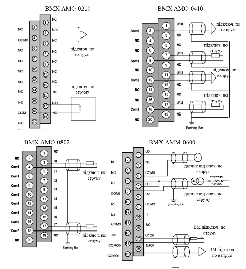

# 2. Апаратне забезпечення контролерів Modicon

## 2.1. Апаратне забезпечення контролерів Modicon M340

### 2.1.1. Фізична структура Modicon М340

Modicon M340 – контролер модульного типу. Модулі кріпляться на шасі, яке виконує механічну та електричну функції. Така конструкція дає можливість гарячої заміни модулів без зупинки контролера. М340 може включати від 1-го до 4-х шасі  з різною кількістю місць (від 4-х до 12-ти) для встановлення модулів, об’єднаних між собою BusX шиною, загальною довжиною до 30 м. Фізична структура М340 показана на рис.2.1. 

Рис.2.1. Фізична структура  Modicon М340:

1 - шасі, на яких кріпляться модулі; 2 - модуль живлення, який обов’язково повинен бути присутнім в кожному шасі; 3 - модуль розширення для систем побудованих на базі декількох шасі; 4 - кабелі розширення BusX, що з’єднують модулі розширення на суміжних шасі; 5- резистори-термінатори в кінцевих модулях розширення архітектури М340; 6 - процесорний модуль, який обов’язково розміщується в посадочному місці з номером 00 в 0-му шасі; 7 - інші модулі вводу/виводу та спеціального призначення, які розміщуються в будь якому посадочному місці (окрім PS та XBE).

Основою конструкції М340 є шасі (рис.2.2). Шасі використовується як монтажна рама, на якій розміщуються й закріплюються окремі модулі контролера. Всередині шасі проходить загальна шина BusX, по якій відбувається живлення модулів, установлених в шасі, і обмін сигналами та даними між окремими модулями контролера. Шасі може кріпитися як на стандартну DIN-рейку так і з допомогою гвинтів. 

Рис.2.2. Шасі Modicon М340

1 - металева рама; 2 - клема заземлення; 3 - отвори для кріплення шасі; 4 - кріплення для заземлення екранів кабелів; 5 - різьбові отвори під гвинт кожного модуля; 6 - рознім для модуля розширення (маркований як *XBE*); 7 - розніми для процесорного модуля, модулів вводу/виводу, комунікаційних модулів та модулів спеціального призначення; 8 - розніми для модуля живлення (маркований як *CPS*); 9 - отвори для установочних штирів модулів. 

За кількістю посадочних місць шасі можуть бути на 4 (BMX XBP 0400), 6 (BMX XBP 0600), 8 (BMX XBP 0800) та 12 (BMX XBP 1200) позицій. При необхідності побудови системи з декількома шасі (див. рис.2.1), в розніми XBE кожного шасі вставляється модуль розширення XBE 1000, які з‘єднуються між собою кабелем BusX різної довжини:

- BMX XBC 008K - 0.8 м 

- BMX XBC 015K - 1.5 м 

- BMX XBC 030K - 3 м 

- BMX XBC 050K - 5 м 

- BMX XBC 120K - 12 м

Рис.2.3. Модуль розширення XBE 1000 

Кожен модуль розширення має перемикач, яким виставляється адреса шасі в діапазоні 0…3. Послідовність адресації шасі може не співпадати з їх взаємним фізичним розміщенням в ланцюгу підключень, однак процесорний модуль завжди повинен знаходитись в шасі з номером 0. У кінцевих модулях розширення встановлюють термінатори шини TSX TLY EX типу А та В: для першого модуля – у вхідний рознім, для останнього – у вихідний (див. рис.2.1).  

Всі модулі шасі, включаючи процесорний, живляться по внутрішній шині від модуля живлення BMX CPS••• (рис.2.4). Модуль живлення підбирається по типу живлення та споживаної потужності і вставляється в кожне шасі в розніми з маркуванням CPS (див. рис.2.2). Розрахунок споживаної потужності модулями на кожному шасі наведена в параграфі 2.1.6. Споживану потужність також можна визначити в середовищі UNITY PRO при конфігуруванні апаратної частини ПЛК. 

Рис.2.4. Модуль живлення BMX CPS••• 

Всі модулі живлення М340 мають аварійне реле. Реле модуля живлення на шасі з номером 0 (процесорне) буде замкнене в тому випадку, коли ПЛК знаходиться в режимі RUN, а розмикається при зупинці контролера або однієї з його Задач, некоректній напрузі, або відмові модуля. У інших шасі аварійне реле сигналізує нормальну роботу модуля живлення, і розмикається тільки при некоректній напрузі, або відмові модуля.  

### 2.1.2.  Процесорні модулі.

Процесорні модулі (CPU\) М340 відрізняються між собою функціональними можливостями, швидкістю обробки інструкцій, кількістю підтримуваних входів/виходів, спеціальних каналів, об’ємом доступної оперативної пам’яті та вбудованими в модуль CPU комунікаціями. 

 Таблиця 2.1. 

Загальні характеристики процесорних модулів

| Характеристика                   | BMX P34 1000               | BMX P34 2000 | BMX P34 2010 | BMX P34 2020 | BMX P34   2030 |      |
| -------------------------------- | -------------------------- | ------------ | ------------ | ------------ | -------------- | ---- |
| Максимальна  кількість           | шасі                       | 2            | 4            |              |                |      |
| дискретних входів+виходів        | 512                        | 1024         |              |              |                |      |
| аналогових входів+виходів        | 128                        | 256          |              |              |                |      |
| лічильних каналів                | 20                         | 36           |              |              |                |      |
| Об’єм RAM                        | загальний розмір           | 2048 Кб      | 4096 Кб      |              |                |      |
| для програм, констант,  символів | 1792 Кб                    | 3584         |              |              |                |      |
| для даних                        | 128 Кб                     | 256 Кб       |              |              |                |      |
| Максимальна кількість  об’єктів  | внутрішні біти %Mі         | 16250        | 32464        |              |                |      |
| внутрішні слова %MWі             | 32464                      |              |              |              |                |      |
| нелокалізовані  внутрішні дані   | 128 Кб                     | 256 Кб       |              |              |                |      |
| Вбудовані комунікації            | послідовний RS-485/RS-232C | +            | +            | +            | +              | -    |
| Ethernet TCP/IP                  | -                          | -            | -            | +            | +              |      |
| CANOpen                          | -                          | -            | +            | -            | +              |      |

У кожному процесорному модулі М340 є вбудований USB-інтерфейс (рис.2.5, поз.3), який призначений для підключення терміналу програмування (комп’ютер зі встановленим UNITY PRO), а також для з’єднання зі SCADA/HMI і операторськими панелями. Для підключення до USB можна використати спеціальний екранований кабель, або стандартний USB кабель з рознімом типу mini B. У будь якому випадку довжина кабелю не перевищує 5 м.

Рис.2.5. Процесорні модулі Modicon М340:

1- гвинт для закріплення модуля на шасі; 2 - блок індикації; 3 - рознім USB *mini B* для підключення терміналу програмування, або засобів SCADA/HMI; 4 - відсік для карти пам’яті; 5 - рознім RJ45 для підключення кабелю до послідовного інтерфейсу RS-485 та RS-232C (маркування чорним кольором); 6 - рознім для підключення кабелю Ethernet 10BASE-T/100BASE-TX (маркування зеленим кольором); 7 - контактний SUB-D рознім для підключення шини CANOpen. 

Кожний процесорний модуль може вміщувати один або два вбудованих комунікаційних канали з комбінації (див. рис 2.5 та таб.2.1): послідовний Modbus Serial RS-232/RS-485, Ethernet TCP/IP та CANOpen. Крім функцій обміну з іншими пристроями системи, канали Modbus RTU (Serial) та Modbus TCP/IP (Ethernet) надають доступ до ПЛК з терміналу програмування UNITY PRO. 

Дисплейний блок модуля призначений для діагностики стану всього ПЛК та вбудованих каналів в процесорний модуль (див. параграф 4.5.2).

Конфігурування процесорного модуля включає налаштування операційного режиму ПЛК (Operating Mode) а також виділення пам’яті під локалізовані дані (%M, %MW, %KW). Для М340 доступні наступні настройки операційного режиму (рис.2.6):

-           Run/Stop Input: при активації даної опції, ПЛК буде знаходитись в RUN, якщо значення дискретного входу, адреса якого вказана в полі напроти опції, буде дорівнювати "1", в іншому випадку ПЛК буде в STOP; 

-           Memory Protect: при активації опції запис програми користувача в оперативну пам’ять або на карту пам’яті можливий тільки якщо значення дискретного входу, адреса якого вказана в полі напроти опції, буде дорівнювати "1".  

-           Automatic start in Run: при активації опції, ПЛК після вмикання живлення автоматично переводиться в режим RUN.

-           Initialize %MWi on cold start: при активації опції змінні %MW будуть обнулюватися при холодному старті ПЛК.

Рис.2.6. Вікно конфігурування процесорного модуля ПЛК М340. 

### 2.1.3.  Структура пам’яті 

У Modicon М340 при увімкненому контролері всі дані та програма користувача розміщуються в оперативній пам’яті ROM процесорного модуля. Для збереження програми користувача та констант при вимкненому живленні контролера використовується карта пам’яті типу SD, яка розташовується у спеціальному слоті (рис.2.5, поз 4). При завантаженні або зміні прикладної програми в контролері, вона автоматично зберігається на карті пам‘яті SD, а при увімкнені контролера – зчитується з неї. 

На карті пам’яті, що входить в комплект стандартної поставки М340 (об’ємом 8 Мбайт), зберігається розроблений проект, вбудовані діагностичні Веб-сторінки, а також, при необхідності, Upload Information (вихідний код проекту, константи та діалогові таблиці). Альтернативний варіант – використання карти обсягом 128 Мб, з підтримкою збереження даних користувача з прикладної програми а також файлових операцій через FTP Сервер. Структура оперативної пам’яті М340 та карти SD показана на рис.2.7.  

Для М340 доступні два типи карт пам’яті: 

1) application(MP\) – цей тип карти пам’яті вміщує прикладну програму, WEB-сторінки та константи; 

2) application+file storage (MPF\) - цей тип карти пам’яті вміщує прикладну програму, WEB-сторінки, константи та файли даних, які можна записувати/зчитувати з прикладної програми UNITY. 

На момент написання посібника доступні такі SD карти пам’яті для M340: 

- BMX RMS 008MP: тип "application" на 8 Мбайт пам’яті

- BMX RMS 008MPF: тип "application+file storage" на 8 Мбайт пам’яті

- BMX RMS 128MPF: тип "application+file storage" на 128 Мбайт пам’яті  

Для збереження значень локалізованих та нелокалізованих змінних при вимкненому живленні, використовується внутрішня флеш пам’ять процесорного модуля. Запис даних на флеш-пам’ять проходить автоматично, а визначення областей даних які треба зберігати проводиться в проекті UNITY PRO.

Розподіл пам’яті можна подивитися в режимі онлайн через меню PLC->Memory Consumption.  

Рис.2.7. Структура пам’яті М340  

### 2.1.4.  Модулі дискретних входів/виходів

Модулі дискретних входів/виходів М340 відрізняються за: 

-     типом каналів (вхідні, вихідні, змішані); 

-     кількістю каналів; 

-     типом вхідних та вихідних каналів; 

-     способом підключення. 

Їх можна вставляти в будь-яке посадочне місце шасі, окрім місця для живлення (PS) та місця, на якому передбачається встановлення процесорного модуля. Дозволяється гаряча заміна модулів при включеному живленні. 

Модулі можуть мати входи/виходи постійного струму (DC) на 24 VDC та 48 VDC з позитивною (sink) або негативною (source) логікою підключення, або змінного струму (AC) на 100-240 VAC. Доступні модулі дискретних виходів з транзисторними або релейними виходами. 

Дискретні виходи можуть бути захищені від короткого замикання або перевантаження. У цьому випадку при виявленні такого типу несправності, модуль дезактивує\ (розмикає) захищений вихід. Повторна активація (реактивація\) виходу проводиться автоматично через кожні 10 с, або з використанням спеціальних функцій, в залежності від конфігурації модуля.

Всі дискретні входи та виходи ізольовані від внутрішньої шини. У таблиці 2.2 наведені основні технічні характеристики дискретних модулів. 

Таблиця 2.2.

Основні технічні характеристики дискретних модулів.

| Позначення  модуля                             | Кількість  каналів                         | Характеристики каналів                     | Підключення               |
| ---------------------------------------------- | ------------------------------------------ | ------------------------------------------ | ------------------------- |
| Модулі  дискретних входів                      |                                            |                                            |                           |
| BMX DDI1602                                    | 16                                         | 24 VDC, позитивна логіка                   | 20-конт. знімна  колодка  |
| BMX DDI1603                                    | 16                                         | 48 VDC, позитивна логіка                   | 20-конт. знімна колодка   |
| BMX DAI1602                                    | 16                                         | 24 VDC негативна логіка або 24  VAC        | 20-конт. знімна колодка   |
| BMX DAI1603                                    | 16                                         | 48 VАC                                     | 20-конт. знімна колодка   |
| BMX DAI1604                                    | 16                                         | 100..120 VАC                               | 20-конт. знімна колодка   |
| BMX DDI3202K                                   | 32                                         | 24 VDC, позитивна логіка                   | 40-конт. рознім           |
| BMX DDI6402K                                   | 64                                         | 24 VDC, позитивна логіка                   | два 40-конт.  розніми     |
| Модулі  дискретних входів та виходів (змішані) |                                            |                                            |                           |
| BMX DDM16022                                   | 8 вх                                       | 24 VDC, позитивна логіка                   | 20-конт. знімна  колодка. |
| 8 вих                                          | 24 VDC, захищені, позитивна  логіка, 0.5 А |                                            |                           |
| BMX DDM16025                                   | 8 вх                                       | 24 VDC, позитивна логіка                   | 20-конт. знімна  колодка  |
| 8 вих                                          | релейні VDC/VAC,  незахищені, 2 А          |                                            |                           |
| BMX DDM3202K                                   | 16 вх                                      | 24 VDC, позитивна логіка                   | 40-конт. рознім           |
| 16 вих                                         | 24 VDC, захищені, позитивна  логіка, 0.1 А |                                            |                           |
| Модулі  дискретних виходів                     |                                            |                                            |                           |
| BMX DDO3202K                                   | 32                                         | 24 VDC, захищені, позитивна  логіка, 0.1 А | 40-конт. рознім           |
| BMX DDO6402K                                   | 64                                         | 24 VDC, захищені, позитивна  логіка, 0.1 А | два  40-конт. розніми     |
| BMX DDO1602                                    | 16                                         | 24 VDC, захищені, позитивна  логіка, 0.5 А | 20-конт.  знімна колодка  |
| BMX DDO1612                                    | 16                                         | 24 VDC, захищені, негативна  логіка, 0.1 А | 20-конт.  знімна колодка  |
| BMX DAO1605                                    | 16                                         | тиристорні  100…240VAC, незахищені, 0.6 А  | 20-конт.  знімна колодка  |
| BMX DRA0805                                    | 8                                          | релейні VDC/VAC,  незахищені, 3 А          | 20-конт.  знімна колодка  |
| BMX DRA1605                                    | 16                                         | релейні VDC/VAC,  незахищені, 2 А          | 20-конт.  знімна колодка  |

Всі модулі дискретних входів/виходів мають вбудований дисплейний блок, який призначений для діагностики роботи модуля та індикації станів каналів. Більш детально діагностика розглянута в главі 4.5.

За способом підключення зовнішніх сигналів дискретні модулі бувають з 20-контактною знімною клемною колодкою (рис.2.8 варіант А) або з 40-контактними з’єднувальними рознімами (рис.2.8 варіант Б). 

Рис.2.8. Зовнішній вигляд дискретних модулів з різними варіантами підключення: 1- корпус; 2- маркування модуля; 3- панель індикації станів каналів; 4 – рознім для підключення знімної клемної колодки (варіант А) або виносної клемної колодки (варіант Б) 

* Для модулів варіанту А додатково замовляється 20-контактна знімна клемна колодка BMX FTB 20•0, або готовий кабель зі знімною клемною колодкою та вільними провідниками на іншому кінці (з розпушеним кінцем і з кольоровим маркуванням провідників, див. рис.2.10.а). Існують три види 20-контактних клемних колодок:

-  гвинтова клемна колодка BMX FTB 2000;

-  колодка з гвинтовими зажимами BMX FTB 2010;

-  пружинна клемна колодка BMX FTB 2020;  

Знімні клемні колодки поставляються з аксесуарами для кодування, що дає можливість забезпечити унікальний механічний ключ для кожної пари: модуль – клемна колодка (рис.2.9). Кодування виключає можливість підключення клемної колодки до іншого модуля.

Рис.2.9. Механічне кодування модулів  

Модулі варіанту Б на 32 канали мають один 40-контактний рознім, на 64 канали – два розніми. До таких модулів додатково замовляються спеціальні кабелі з 40-контактним з’єднувачем в одному з двох варіантів:

-     FCW••3, які з іншого боку мають розпушений кінець з кольоровим маркуванням провідників (рис.2.10. б);

-     FCC••3, які з іншого боку мають два з’єднувачі НЕ10 для підключення до виносних клемних колодок типу Telefast ABE (рис.2.10.в).   

Підключення з використанням кабелів з розпушеним кінцем проводиться через додаткову клемну колодку будь-якого виробника.

Підключення модулів через кабелі з НЕ10 з’єднувачами проводиться тільки з використання спеціальних виносних блоків з клемними колодками системи швидкого монтажу Telefast\ ABE\. Schneider Electric пропонує велику гаму блоків Telefast для дискретних модулів, які відрізняються:

-     кількістю та типом каналів, які обслуговує даний блок;

-     типом клем (гвинтові, пружинні); 

-     наявністю розподілення живлення;

-     наявністю гальванічних розв’язок між каналами, між блоком та дискретним модулем; 

-     вбудованими додатковими функціями перетворення сигналу (вбудовані або знімні твердотільні або електромеханічні реле на різні потужності)

-     наявністю додаткових функцій захисту;

-     наявністю світлових індикаторів;

-     наявністю можливості ручного включення/відключення сигналу;

-     іншими додатковими опціями.  

Усі блоки Telefast мають змінний плавкий запобіжник, який захищає входи/виходи модуля від перевантаження. 

Одним із універсальних блоків Telefast для дискретних входів/виходів є ABE7H16R21, який може підключатися до будь яких модулів з 40-контакним з’єднувачем з використанням кабелю FCC••3 (•• - залежить від довжини кабелю). Він використовується для підключення 16 дискретних входів або 16 дискретних виходів окремими парами гвинтових клем.

Рис.2.10. Способи підключення зовнішніх сигналів до модулів дискретних входів-виходів: 1- Дискретний модуль; 2 - 40-контактний рознім; 3 – кабель FC•••3; 4 – розпушений кінець кабелю; 5 – з’єднувачі типу НЕ10 для підключення до виносних клемних колодок типу Telefast; 6 – виносна клемна колодка типу Telefast; 7 – рознім типу НЕ10; 8 – клеми для підключення зовнішніх сигналів;  

Перелік необхідних аксесуарів для дискретних модулів зведений в табл. 2.3. У таблиці не наведений перелік аксесуарів для способів підключення кабелів з розпушеним кінцем та клемних колодок з підключенням до Telefast. У якості блоку Telefast для прикладу показаний тільки варіант ABE 7H16R21.  

Таблиця 2.3.

Монтажні аксесуари для підключення дискретних модулів.

| Позначення модуля                             | Тип  підключення        | Спосіб підключення                                           |
| --------------------------------------------- | ----------------------- | ------------------------------------------------------------ |
| Модулі дискретних входів                      |                         |                                                              |
| BMX DDI1602                                   | 20-конт. знімна колодка | знімна клемна колодка BMX FTB 20•0                           |
| BMX DDI1603                                   | 20-конт. знімна колодка | знімна клемна колодка BMX FTB 20•0                           |
| BMX DAI1602                                   | 20-конт. знімна колодка | знімна клемна колодка BMX FTB 20•0                           |
| BMX DAI1603                                   | 20-конт. знімна колодка | знімна клемна колодка BMX FTB 20•0                           |
| BMX DAI1604                                   | 20-конт. знімна колодка | знімна клемна колодка BMX FTB 20•0                           |
| BMX DDI3202K                                  | 40-конт. рознім         | кабель FCC••3 (від 0.5 до 10 м) +  Telefast ABE  7H16R21 – 2 шт. |
| BMX DDI6402K                                  | два 40-конт. розніми    | (кабель  FCC••3 (від  0.5 до 10 м)  +  Telefast ABE 7H16R21 –  2 шт.) – 2 комплекти |
| Модулі дискретних входів та виходів (змішані) |                         |                                                              |
| BMX DDM16022                                  | 20-конт. знімна колодка | знімна клемна колодка BMX FTB 20•0                           |
| BMX DDM16025                                  | 20-конт. знімна колодка | знімна клемна колодка BMX FTB 20•0                           |
| BMX DDM3202K                                  | 40-конт. рознім         | кабель FCC••3 (від 0.5 до 10 м) +  Telefast ABE  7H16R21 – 2 шт. |
| Модулі дискретних виходів                     |                         |                                                              |
| BMX DDO3202K                                  | 40-конт. рознім         | кабель FCC••3 (від 0.5 до 10 м) +  Telefast ABE  7H16R21 – 2 шт. |
| BMX DDO6402K                                  | два 40-конт. розніми    | (кабель  FCC••3 (від  0.5 до 10 м)  +  Telefast ABE 7H16R21 –  2 шт.) – 2 комплекти |
| BMX DDO1602                                   | 20-конт. знімна колодка | знімна клемна колодка BMX FTB 20•0                           |
| BMX DDO1612                                   | 20-конт. знімна колодка | знімна клемна колодка BMX FTB 20•0                           |
| BMX DAO1605                                   | 20-конт. знімна колодка | знімна клемна колодка BMX FTB 20•0                           |
| BMX DRA0805                                   | 20-конт. знімна колодка | знімна клемна колодка BMX FTB 20•0                           |
| BMX DRA1605                                   | 20-конт. знімна колодка | знімна клемна колодка BMX FTB 20•0                           |

На рисс.2.11 – 2.13 показані схеми підключення дискретних датчиків та виконавчих механізмів до деяких модулів зі знімною клемною колодкою. В більшості випадків правильне підключення передбачає наявність обох полюсів живлення на клемах модуля для можливості контролю за його діапазоном.  

Рис.2.11. Підключення модулів дискретних входів зі знімними колодками.

   Рис.2.12. Підключення модулів дискретних виходів зі знімними колодками.

 На рис.2.14 показана схема підключення до модулів з 40-контактним рознімом, на прикладі модуля змішаного типу BMX DDM3202К та блоку Telefast ABE 7H16R21.  

  Рис.2.13. Підключення змішаних дискретних модулів зі знімними колодками

Рис.2.14. Схема підключення датчиків та виконавчих механізмів до Telefast ABE 7H16R21 на прикладі з модулем BMX DDM3202К.

Конфігурування дискретних вхідних каналів модуля може включати наступні операції (рис.2.15, зліва):

-     відключення при необхідності незадіяних каналів (Function=None);

-     визначення Задачі (Task=MAST/FAST), на початку якої CPU буде зчитувати з модуля значення входів;

-     визначення необхідності діагностики живлення дискретних датчиків: якщо виставлена опція Supply Monitoring, модуль при некоректному живленні підключених датчиків буде сигналізувати несправність каналів I/O (див. також главу 4.5);    

Рис.2.15. Вікна конфігурування дискретних каналів модулів: зліва – дискретні вхідні канали, праворуч – дискретні вихідні канали .

Конфігурування дискретних вихідних каналів модуля може включати наступні операції (рис.2.15, праворуч):

-     відключення при необхідності незадіяних каналів (Function=None);

-     визначення Задачі (Task=MAST/FAST), в кінці якої CPU буде записувати в модуль значення виходів;

-     визначення необхідності діагностики живлення дискретних виконавчих механізмів: якщо виставлена опція Supply Monitoring, модуль при некоректному живленні підключених виконавчих механізмів буде сигналізувати несправність каналів I/O (див. також главу 4.5);

-     визначення способу реактивації захищених виходів: Reactivate=Programmed – реактивація проводиться шляхом виклику спеціальної функції; Reactivate=Automatic – реактивація проводиться кожні 10 секунд з моменту дезактивації каналу;

-     визначення значення виходів при зупинці ПЛК: при Fallback Mode=Fallback – значення виходів кожного каналу буде визначатися полем Fallback value; Fallback Mode=Maintain – виходи залишаться у тому ж значенні що були в момент зупинки ПЛК. 

### 2.1.5.  Модулі аналогових входів/виходів.

Модулі аналогових входів/виходів М340 відрізняються: 

-     за типом каналів (вхідні, вихідні, змішані); 

-     за кількістю каналів; 

-     за характеристикою і діапазоном сигналів (напруга, струм, термометри опору, тощо); 

-     наявністю гальванічного розподілення; 

-     за способом підключення. 

Їх можна вставляти в будь-яке посадочне місце шасі, окрім місця для живлення (PS) та місця 00 на процесорному шасі (зарезервовано для процесорного модуля). Дозволяється гаряча заміна модулів при включеному живленні. 

Перелік всіх типів аналогових модулів М340 наведений в табл.2.4. 

Модулі аналогових входів М340 виконують функції:

-     сканування вхідних каналів різного діапазону за допомогою безконтактного мультиплексування;

-     аналогово-цифрове перетворення;

-     фільтрацію сигналів;

-     діагностику модуля: тестування ланок перетворення, вхідний контроль перевищення рівня сигналу, тест наявності клемної колодки;

Модулі аналогових виходів виконують функції:

-     цифро-аналогове перетворення;

-     захист каналів модулів від перевантаження;

-     діагностику модуля: тест перетворення, тест виходу за межі, тест наявності клемної колодки.

Таблиця 2.4. 

Основні технічні характеристики аналогових модулів.

| Позначення модуля                             | Кіль-кість каналів  | Діапазон сигналу                                 | Характеристики каналів                                       | Підклю-чення             |
| --------------------------------------------- | ------------------- | ------------------------------------------------ | ------------------------------------------------------------ | ------------------------ |
| Модулі аналогових входів                      |                     |                                                  |                                                              |                          |
| BMX ART 0414                                  | 4                   | мВ, термометри опору,  термопари                 | 16-бітні, ізоляція між  каналами, опитування 400 мс на модуль | 40-конт. рознім          |
| BMX ART 0814                                  | 8                   | мВ, термометри опору,  термопари                 | 16-бітні, ізоляція між  каналами, опитування 400 мс на модуль | 40-конт. рознім          |
| BMX AMI 0410                                  | 4                   | ±10В,0…10В,0…5В,  0…20мА,4…20 мА                 | 16-бітні, ізоляція між  каналами, опитування 5 мс на модуль  | 20-конт. знімна колодка  |
| BMX AMI 800                                   | 8                   | ±10В,0…10В,0…5В,  0…20мА,4…20 мА                 | 16-бітні, загальна  точка, опитування 9 мс на модуль         | 28-конт. знімна колодка. |
| BMX AMI 810                                   | 8                   | ±10В,0…10В,0…5В,  0…20мА,4…20 мА                 | 16-бітні, ізоляція між  каналами, опитування 9 мс на модуль  | 28-конт. знімна колодка  |
| Модулі аналогових входів та виходів (змішані) |                     |                                                  |                                                              |                          |
| BMX AMM 0600                                  | 4 вх                | ±10В,0…10В,0…5В,  0…20мА,4…20 мА                 | 14-бітні для U, 12-бітні  для I,  загальна точка, опитування 5 мс на модуль | 20-конт. знімна колодка  |
| 2 вих                                         | ±10В,0…20мА,4…20 мА | 12-бітні для U, 11-бітні  для I,  загальна точка |                                                              |                          |
| Модулі аналогових виходів                     |                     |                                                  |                                                              |                          |
| BMX AMO 0210                                  | 2                   | ±10В,0…20мА, 4…20 мА                             | 16-бітні, ізоляція між  каналами                             | 20-конт. знімна колодка  |
| BMX AMO 410                                   | 4                   | ±10В,0…20мА, 4…20 мА                             | 16-бітні, ізоляція між  каналами                             | 20-конт. знімна колодка  |
| BMX AMO 802                                   | 8                   | 0…20мА,4…20 мА                                   | 16-бітні, загальна  точка                                    | 20-конт. знімна колодка  |

Всі модулі аналогових входів/виходів мають вбудований дисплейний блок, який призначений для діагностики роботи модуля (див. главу 4.5).

За способом підключення зовнішніх сигналів, аналогові модулі можуть бути з 20-контактною знімною клемною колодкою, з 28-контактною клемною колодкою, або з 40-контактними з’єднувальними рознімами. Так само, як для дискретних модулів, знімні клемні колодки поставляються з аксесуарами для кодування, що дає можливість забезпечити унікальний механічний ключ для кожної пари: модуль – клемна колодка.

Для модулів, які підключаються через знімну клемну колодку, остання замовляється окремо як у звичайному варіанті, так і з підключеним кабелем розпушеним в кінці. 20-контактні клемні колодки для аналогових модулів такі самі як для дискретних (BMX FTB 2000/2010/2020). Для модулів BMX AMI 800/810 замовляється 28-контактна клемна колодка BMX FTB 2820 з пружинними зажимами.

Підключення модулів BMX ART 0414/0814 з 40-контактними роз’ємами можна проводити з використання блоків Telefast ABE 7CPA412 та кабелю BMX FCA ••2, (де •• залежить від довжини). Такий спосіб підключення схематично зображений на рис.2.16.

Перелік необхідних аксесуарів для аналогових модулів зведений в таблицю 2.5. У таблиці не наведений перелік аксесуарів для способів підключення кабелів з розпушеним кінцем, та клемних колодок з підключенням до Telefast.

Рис.2.16. Підключення Telefast ABE 7CPA412 до модуля BMX ART 0814.

Таблиця 2.5. 

Монтажні аксесуари для підключення аналогових модулів.

| Позначення модуля                             | Тип  підключення        | спосіб підключення                                           |
| --------------------------------------------- | ----------------------- | ------------------------------------------------------------ |
| Модулі аналогових входів                      |                         |                                                              |
| BMX ART 0414                                  | 40-конт. рознім         | кабель BMX FCA ••2 (1.5, 2 або 5 м)  +   Telefast ABE 7CPA412 |
| BMX ART 0814                                  | два 40-конт. розніми    | (BMX FCA ••2(1.5, 2 або 5 м)  +   Telefast ABE 7CPA412) –  2 комплекти |
| BMX AMI 0410                                  | 20-конт. знімна колодка | знімна клемна колодка BMX FTB 20•0                           |
| BMX AMI 800                                   | 28-конт. знімна колодка | знімна клемна колодка BMX FTB 2820                           |
| BMX AMI 810                                   | 28-конт. знімна колодка | знімна клемна колодка BMX FTB 2820                           |
| Модулі аналогових входів та виходів (змішані) |                         |                                                              |
| BMX AMM 0600                                  | 20-конт. знімна колодка | знімна клемна колодка BMX FTB 20•0                           |
| Модулі аналогових виходів                     |                         |                                                              |
| BMX AMO 0210                                  | 20-конт. знімна колодка | знімна клемна колодка BMX FTB 20•0                           |
| BMX AMO 410                                   | 20-конт. знімна колодка | знімна клемна колодка BMX FTB 20•0                           |
| BMX AMO 802                                   | 20-конт. знімна колодка | знімна клемна колодка BMX FTB 20•0                           |

На рис.2.17 показані схеми підключення аналогових датчиків з уніфікованим сигналом до модулів зі знімною клемною колодкою. Всі канали можуть підтримувати як підключення за струмом так і за напругою. На рис.2.17 показаний приклад для обох випадків. Схема підключення аналогових датчиків до змішаного модуля BMX AMM 0600 показана на рис.2.19.    

Рис.2.17. Схема підключення датчиків до аналогових вхідних модулів BMX AMI.

На рис.2.18 показані схеми безпосереднього підключення датчиків температури, таких як термометри опору та термопари, до модулів BMX ART 0414/0814. Всі канали підтримують можливість підключення термопар, термометрів опору по 2-х, 3-х та 4-х провідних схемах. Для реалізації підключення, як правило використовується Telefast ABE 7CPA412 (див. таб.2.5), призначення клем якого відповідно до контактів роз’єму теж вказані на рис.2.18.

Рис.2.18. Схема підключення датчиків до аналогових вхідних модулів BMX ART 0414/0814: ліворуч – призначення контактів розніму модуля, праворуч – відповідне призначення контактів для Telefast ABE 7CPA412.  

Схеми підключення виконавчих механізмів до аналогових модулів BMX AMO 0210/0410/0802 а також до аналогового змішаного модуля BMX AMM 0600 показані на рис.2.19. Всі вхідні канали BMX AMO 0210/0410 та BMX AMM 0600 рівнозначні і можуть підключатися як по напрузі так і по струму. На рис.2.19 показані приклади для обох способів. 

Рис.2.19. Схема підключення виконавчих механізмів до аналогових вихідних модулів BMX AMO BMX та схема підключення датчиків та виконавчих механізмів до змішаного аналогового модуля AMM.

Конфігурування аналогових вхідних каналів модуля може включати наступні операції (рис.2.20):

-     відключення при необхідності незадіяних каналів (опція Used знята);

-     визначення Задачі (Task=MAST/FAST), на початку якої CPU буде зчитувати з модуля значення входів;

-     визначення циклу опитування каналів: Cycle=Normal – скануються всі аналогові входи і використовується фільтрація; Cycle=Fast – скануються тільки задіяні входи (у яких виставлена опція Used) за рахунок чого зменшується цикл опитування;

-     визначення діапазону вхідного сигналу (Range);

-     визначення діапазону масштабування для комірок %IW (Scale) та контролю переповнення (виходу за діапазон) значення (Scale->Overflow);

-     визначення ступені фільтрації сигналу (Filter);

-     визначення типу компенсації холодних кінців (для модулів BMX ART);

Рис.2.20. Вікна конфігурування аналогових вхідних каналів модулів.

 Конфігурування аналогових вихідних каналів модуля може включати наступні операції (рис.2.21):

-     визначення Задачі (Task=MAST/FAST), в кінці якої CPU буде записувати в модуль значення виходів;

-     визначення діапазону вихідного сигналу (Range);

-     визначення діапазону масштабування для комірок %QW (Scale) та контролю переповнення (виходу за діапазон) значення (Scale->Overflow);

-     визначення значення виходів при зупинці ПЛК: при виставленій опції Fallback  – значення виходів кожного каналу буде визначатися полем Fallback value; при знятій опції Fallback – виходи залишаться у тому ж значенні що були в момент зупинки ПЛК. 

-     визначення необхідності контролю за підключенням виходу: якщо виставлена опція WiringCTRL – модуль при обриві проводу, перевантаженні або короткому замиканні буде сигналізувати несправність каналу I/O.

Рис.2.21. Вікно конфігурування аналогових вихідних каналів модуля.

### 2.1.6.  Вибір модулів живлення.

Споживана потужність, яка необхідна для модулів, встановлених на монтажному шасі, залежить від типу модулів. Для того, щоб вірно вибрати модуль живлення, необхідно робити розрахунок енергоспоживання.

Живлення модулів по шасі проводиться через два виходи модуля живлення 24 В (24V_BAC\) та 3,3 В (3V3_BAC\). Вихід 24V_BAC використовується для живлення встановлених на монтажному шасі модулів входів-виходів та процесорного модуля, а вихід 3V3_BAC використовується тільки для живлення модулів входів-виходів.

Модулі живлення, що живляться напругою 100…240VAC (BMX CPS 2000 та BMX CPS 3500), додатково мають  зовнішній вихід 24 В (24\V\_\SENSORS\), який можна використати для живлення датчиків або виконавчих механізмів. 

При розрахунку енергоспоживання модулів живлення BMX CPS 2000/3500 необхідно враховувати наступні правила:

-     сумарна потужність, яка споживається по виходам модуля живлення 3V3_BAC, 24V_BAC та 24V_SENSORS не повинна перевищувати загальну корисну потужність модуля живлення;

I3V3_BAC3,3 В + I24V_BAC24 В + I24V_SENSORS24 В ≤ PPS             (2.1)

-     сумарна потужність, яка споживається по двом виходам модуля живлення 3V3_BAC та 24V_BAC не повинна перевищувати загальну корисну потужність модуля живлення по цим виходам.

I3V3_BAC3,3 В + I24V_BAC24 В ≤ P3V3_24V               (2.2)

У формулах (2.1) та (2.2), I3V3_BAC – сумарний споживаний струм модулями по 3V3_BAC, I24V_BAC – сумарний споживаний струм модулями по 24V_BAC, I24V_SENSORS - сумарний споживаний струм по зовнішньому виходу 24V_SENSORS, PPS – загальна корисна потужність модуля живлення, P3V3_24V – максимальна сумарна потужність модуля на виходах 3V3_BAC та 24V_BAC. 

При розрахунку енергоспоживання модулів живлення BMX CPS 2010/3020 необхідно враховувати наступне правило:

-     Сумарна потужність, яка споживається по виходам модуля живлення 3V3_BAC та 24V_BAC не повинна перевищувати загальну корисну потужність модуля живлення

I3V3_BAC3,3 В + I24V_BAC24 В ≤ PPS                  (2.3)

В таблиці 2.6 наведені характеристики потужності модулів живлення по різним виходам. Зокрема звідти можна вибрати величини PPS та P3V3_24V при виборі конкретного модуля живлення. 

Таблиця 2.6. 

Характеристик потужності модулів живлення.

| Потужність                                                   | BMX CPS 2000      | BMX CPS 2010    | BMX CPS 3020    | BMX CPS 3500    |
| ------------------------------------------------------------ | ----------------- | --------------- | --------------- | --------------- |
| Напруга  живлення                                            | 100…240 VAC       | 24 VDC          | 24…48 VDC       | 100…240 VAC     |
| Загальна корисна потужність (PPS)                            | 20 Вт             | 17 Вт           | 32 Вт           | 36 Вт           |
| Потужність на виході 3V3_BAC монтажного шасі                 | 8,3 Вт (2,5 A)    | 8,3 Вт (2,5 A)  | 15 Вт (4,5 A)   | 15 Вт (4,5 A)   |
| Потужність  на виході 24V_BAC монтажного  шасі               | 16,5 Вт (0,7 A)   | 16,5 Вт (0,7 A) | 31,2 Вт (1,3 A) | 31,2 Вт (1,3 A) |
| Максимальна  сумарна потужність на виходах 3V3_BAC та 24V_BAC (P3V3_24V) | 16,5 Вт           | 16,5 Вт         | 31,2 Вт         | 31,2 Вт         |
| Сумарна  корисна потужність на споживання зовнішніми датчиками 24V_SENOSRS | 10,8 Вт  (0,45 A) | -               | -               | 21,6 Вт (0,9 A) |

Величини I3V3_BAC та I24V_BAC розраховуються по середньому споживанню модулів, які наведені в таблиці 2.7. Ці значення представляють собою величину між максимальним споживаним струмом та нормальним споживаним струмом. Використовуючи дані з цієї таблиці, можна вирахувати сумарний споживаний струм по кожному монтажному шасі для кожного виходу модуля живлення, у відповідності з набором встановлених на монтажному шасі модулів. 

 Таблиця 2.7.

Споживані струми різних модулів.

| Тип  модуля              | Каталожний  номер  | Середній споживаний струм, в мА |      |      |
| ------------------------ | ------------------ | ------------------------------- | ---- | ---- |
| На виході  3V3_BAC       | На виході  24V_BAC | На виході  24V_SENOSRS          |      |      |
| Процесорні модулі        | BMX P34 1000       | -                               | 72   | -    |
| BMX P34 2000             | -                  | 72                              | -    |      |
| BMX P34 2010/20102       | -                  | 90                              | -    |      |
| BMX P34 2020             | -                  | 95                              | -    |      |
| BMX P34 2030/20302       | -                  | 135                             | -    |      |
| Аналогові модулі         | BMX AMI 0410       | 150                             | 45   | -    |
| BMX AMI 0800             | 150                | 41                              | -    |      |
| BMX AMI 0810             | 150                | 54                              | -    |      |
| BMX AMM 0600             | 240                | -                               | 120  |      |
| BMX AMO 0210             | 150                | 110                             | -    |      |
| BMX AMO 0410             | 150                | 140                             | -    |      |
| BMX AMO 0802             | 150                | 135                             | -    |      |
| BMX ART 0414             | 150                | 40                              | -    |      |
| BMX ART 0814             | 220                | 50                              | -    |      |
| Комунікаційні модулі     | BMX NOE 0100       | -                               | 90   | -    |
| BMX NOE 0110             | -                  | 90                              | -    |      |
| Лічильні модулі          | BMX EHC 0200       | 200                             | 40   | 80   |
| BMX EHC 0800             | 200                | -                               | 80   |      |
| Дискретні вхідні модулі  | BMX DAI 0805       | 103                             | 13   | -    |
| BMX DAI 1602             | 90                 | -                               | 60   |      |
| BMX DAI 1603             | 90                 | -                               | 60   |      |
| BMX DAI 1604             | 90                 | -                               | -    |      |
| BMX DDI 1602             | 90                 | -                               | 60   |      |
| BMX DDI 1603             | 75                 | -                               | 135  |      |
| BMX DDI 1604T            | 75                 | -                               | 135  |      |
| BMX DDI 3202 K           | 140                | -                               | 110  |      |
| BMX DDI 6402 K           | 200                | -                               | 110  |      |
| Дискретні вихідні модулі | BMX DAO 1605       | 100                             | 95   | -    |
| BMX DDO 1602             | 100                | -                               | -    |      |
| BMX DDO 1612             | 100                | -                               | -    |      |
| BMX DDO 3202 K           | 150                | -                               | -    |      |
| BMX DDO 6402 K           | 240                | -                               | -    |      |
| BMX DRA 0804T            | 100                | 110                             | -    |      |
| BMX DRA 0805             | 100                | 55                              | -    |      |
| BMX DRA 1605             | 100                | 95                              | -    |      |
| Дискретні змішані модулі | BMX DDM 16022      | 100                             | -    | 30   |
| BMX DDM 16025            | 100                | 50                              | 30   |      |
| BMX DDM 3202 K           | 150                | -                               | 55   |      |
| Модуль розширення        | BMX XBE  1000      | 22                              | 160  | -    |

### 2.1.7.  Приклад компонування контролера М340.

Завдання. Підберіть складові ПЛК М340 для забезпечення його роботи за умов, наведених в таблиці 2.8. Вибрані складові сформуйте у вигляді відомості обладнання для компонування ПЛК. 

Таблиця 2.8

| Вимоги                                                       | Кількість або наявність |         |
| ------------------------------------------------------------ | ----------------------- | ------- |
| Живлення  ПЛК (24 VDC або 220  VAC)                          |                         | 220 VAC |
| Кількість  дискретних входів 24 VDC, позитивна логіка        | 59                      |         |
| Кількість  дискретних входів 115 VAC                         | 67                      |         |
| Кількість  аналогових входів 4-20 мА                         | 26                      |         |
| Кількість  аналогових входів 0-10 В                          | 15                      |         |
| Кількість дискретних виходів струм  комутації до 0,1 А 24 VDC | 74                      |         |
| Кількість дискретних виходів  струм комутації до 0,5 А 24 VDC | 23                      |         |
| Кількість дискретних виходів  струм комутації до 2 А 24 VDC  | 22                      |         |
| Кількість дискретних виходів  струм комутації до 3 А 24 VDC  | 21                      |         |
| Кількість  аналогових виходів 0-10 В                         | 20                      |         |
| Кількість  аналогових виходів 4-20 мА                        | 19                      |         |
| Підключення  по Modbus RTU на RS485                          | +                       |         |
| Підключення  по Modbus/TCP на Ethernet                       | +                       |         |
| Підключення  по CANOpen                                      | -                       |         |
| Програма  користувача займає (Кб)                            | 2500                    |         |

Варіант рішення. 

Компонування ПЛК М340 будемо проводити в такій послідовності: 

1. Вибір процесорного модуля.

2. Вибір модулів вводу/виводу.

3. Вибір аксесуарів для модулів вводу/виводу.

4. Компонування шасі, вибір додаткових модулів та аксесуарів для шасі.

5. Вибір модулів живлення.  

1. Вибір процесорного модуля. Процесорний модуль підбираємо за наступними критеріями: кількість каналів кожного типу, тип та кількість комунікаційних каналів, об’єм пам’яті користувача. 

- кількість аналогових входів + виходів: 26+15+20+19=80

- кількість дискретних входів + виходів: 59+67+74+23+22+21=266

За таблицею 2.1 підбираємо процесорний модуль. За кількістю каналів будь який процесорний модуль задовольняє умовам задачі, тому орієнтуємось тільки на ємність пам’яті та наявні комунікації. Серед процесорних модулів М340 підходить тільки BMX P34 2020.

2. Вибір модулів вводу/виводу проводиться за таблицями 2.2 та 2.4.  

Таблиця 2.9

| 59 ВД  24 VDC  | BMX  DDI6402K - 1 шт. (64 канали, з них - 5 вільних)         |
| -------------- | ------------------------------------------------------------ |
| 67  ВД 115 VAC | BMX  DAI1604 - 4 шт. (516=80 каналів, з  них -13 вільних)    |
| 21 ДВ  3 А     | BMX  DRA 0805 – 3 шт. (83=24 канали, з них - 3 вільних )     |
| 22 ДВ  2 А     | BMX  DRA 1605 – 2 шт. (162=32 канали, з них - 10 вільних)    |
| 23 ДВ  0,5 А   | BMX  DDO 1602 – 2 шт. (16 2=32 канали, з них 9 вільних)      |
| 74 ДВ  0,1 А   | BMX  DDO 6402K – 1 шт. (64 канали + 9 каналів з BMX DDO                   1602 + 1  канал з BMX  DRA 1605) |
| 26+15  ВА      | BMX  AMI 810 – 5 шт. (85=40 каналів) + BMX AMI 0410 – 1 шт. (4 канали) |
| 20 AB  U       | BMX  AMO 410 – 5 шт (45=20 каналів)                          |
| 19 АВ  I       | BMX  AMO 802 – 3 шт. (83=24 канали)                          |

  З метою зменшення вартості системи, для дискретних вихідних каналів малих струмів комутації ми задіяли вільні канали модулів з більшими струмами комутації. Слід зазначити, що наведений варіант компонування не єдине рішення для даної задачі, тобто може бути декілька варіантів компонування ПЛК модулями вводу/виводу.  

3. Вибір аксесуарів для модулів вводу/виводу проводиться за таблицями 2.3 та 2.5. Зведемо аксесуари та модулі в одну таблицю 2.10.

Таблиця 2.10.

| Модуль вводу/виводу  | Аксесуари |                            |           |                                                    |
| -------------------- | --------- | -------------------------- | --------- | -------------------------------------------------- |
| Найменування         | Кількість | Найменування               | Кількість | примітка                                           |
| BMX DDI6402K         | 1         | BMX FCC053                 | 2         | кабель  0.5 м,  з двома НЕ10 з’єднувачами          |
| Telefast ABE 7H16R21 | 4         | 16-канальний  клемний блок |           |                                                    |
| BMX DAI1604          | 4         | BMX FTB 2010               | 4         | 20  контактна знімна колодка з гвинтовими зажимами |
| BMX DRA 0805         | 3         | BMX FTB 2010               | 3         | 20  контактна знімна колодка з гвинтовими зажимами |
| BMX DRA 1605         | 2         | BMX FTB 2010               | 2         | 20  контактна знімна колодка з гвинтовими зажимами |
| BMX DDO 1602         | 2         | BMX FTB 2010               | 2         | 20  контактна знімна колодка з гвинтовими зажимами |
| BMX DDO 6402K        | 1         | BMX FCC053                 | 1         | кабель  0.5 м,  з двома НЕ10 з’єднувачами          |
| Telefast ABE 7H16R21 | 2         | 16-канальний  клемний блок |           |                                                    |
| BMX AMI 810          | 5         | BMX FTB 2820               | 5         | 28 контактна знімна клемна колодка                 |
| BMX AMI 0410         | 1         | BMX FTB 2010               | 1         | 20  контактна знімна колодка з гвинтовими зажимами |
| BMX AMO 410          | 5         | BMX FTB 2010               | 5         | 20  контактна знімна колодка з гвинтовими зажимами |
| BMX AMO 802          | 3         | BMX FTB 2010               | 3         | 20  контактна знімна колодка з гвинтовими зажимами |

4. Компонування шасі, вибір додаткових модулів та аксесуарів для шасі. Загальна кількість модулів разом з процесорним: 1 CPU + 6 DI + 8 DO + 6 AI + 8 AO = 29. Таким чином можна вибрати 2 монтажних шасі на 12 місць (BMX XBP 1200) та 1 шасі на 6 місць (BMX XBP 0600). До кожного шасі необхідно по 1-му модулю розширення, які зв’язуються BusX кабелями.  Тобто додатково треба модулі XBE 1000 - 3 шт.,  кабелі BMX XBC 008K – 2 шт. та один набір з двох термінаторів TSX TLY EX. 

Розміщення модулів в шасі вибираємо довільно. Однак на практиці, модулі з найбільшим споживанням струму розподіляють рівномірно між шасі. 

Для зручності підрахунку споживаної потужності кожним модулем, розміщення покажемо у вигляді таблиці 2.11. В цій таблиці заповнюємо тільки поля: шасі, місце та найменування модулів, за виключенням модулів живлення (місце PS).

5. Вибір модулів живлення. За умови задачі, живлення ПЛК проводиться напругою 220 VAC. Таким чином, в залежності від споживаної потужності модулів на шасі, необхідно вибрати один з двох модулів BMX CPS 2000 або BMX CPS 3500. Вважаємо, що вихід модуля для живлення датчиків та виконавчих механізмів (24V_SENOSRS) не використовується. Для кожного модуля шасі за таблицею 2.7 визначаємо середні споживані струми і вписуємо їх в таблицю 2.11. 

В рядках з місцем PS в колонках 3V3_BAC та 24V_BAC вказуються сумарні споживані струми по кожному шасі, та споживані потужності (IU). За таблицею 2.6 та з використанням формули (2.2) визначається який з модулів живлення підходить для живлення даного шасі. 

Таблиця 2.11

| Шасі                         | Модуль              | Середній споживаний струм, в мА   |                             |                                 |
| ---------------------------- | ------------------- | --------------------------------- | --------------------------- | ------------------------------- |
| місце                        | Найменування модуля | На виході  3V3_BAC                | На виході  24V_BAC          |                                 |
| 00                           | PS                  | BMX CPS 2000  P3V3_24V = 16,5 Вт  | I3V3_BAC=412мА, P=1.36Вт    | I24V_BAC=420мА,  P=10.08Вт      |
| SP=11,14Вт                   |                     |                                   |                             |                                 |
| 00                           | BMX P34 2020        | 0                                 | 95                          |                                 |
| 01                           | BMX DRA 0805        | 100                               | 55                          |                                 |
| 02                           | BMX DRA 0805        | 100                               | 55                          |                                 |
| 03                           | BMX DRA 0805        | 100                               | 55                          |                                 |
| 04                           | BMX DAI 1604        | 90                                | 0                           |                                 |
| 05                           |                     |                                   |                             |                                 |
| XBE                          | BMX XBE 1000        | 22                                | 160                         |                                 |
| 01                           | PS                  | BMX CPS 3500  P3V3_24V = 31,2 Вт  | I3V3_BAC=1522 мА, P=5,02 Вт | I24V_BAC=620мА , P=14,88 Вт     |
| SP=19,9 Вт                   |                     |                                   |                             |                                 |
| 00                           | BMX DDI 6402K       | 200                               | 0                           |                                 |
| 01                           | BMX DAI 1604        | 90                                | 0                           |                                 |
| 02                           | BMX DAI 1604        | 90                                | 0                           |                                 |
| 03                           | BMX DAI 1604        | 90                                | 0                           |                                 |
| 04                           | BMX DAI 1604        | 90                                | 0                           |                                 |
| 05                           | BMX DRA 1605        | 100                               | 95                          |                                 |
| 06                           | BMX DRA 1605        | 100                               | 95                          |                                 |
| 07                           | BMX DDO 1602        | 100                               | 0                           |                                 |
| 08                           | BMX DDO 1602        | 100                               | 0                           |                                 |
| 09                           | BMX DDO 6402K       | 240                               | 0                           |                                 |
| 10                           | BMX AMO 802         | 150                               | 135                         |                                 |
| 11                           | BMX AMO 802         | 150                               | 135                         |                                 |
| XBE                          | BMX XBE 1000        | 22                                | 160                         |                                 |
| 02  (замі-нити)  таб.  2.11а | PS                  | BMX CPS 3500  P3V3_24V = 31,2  Вт | I3V3_BAC=1822 мА, P=6,01 Вт | I24V_BAC=1310 мА ,   P=31,44 Вт |
| SP=37\,45 Вт                 |                     |                                   |                             |                                 |
| 00                           | BMX AMI 810         | 150                               | 54                          |                                 |
| 01                           | BMX AMI 810         | 150                               | 54                          |                                 |
| 02                           | BMX AMI 810         | 150                               | 54                          |                                 |
| 03                           | BMX AMI 810         | 150                               | 54                          |                                 |
| 04                           | BMX AMI 810         | 150                               | 54                          |                                 |
| 05                           | BMX AMI 0410        | 150                               | 45                          |                                 |
| 06                           | BMX AMO 0410        | 150                               | 140                         |                                 |
| 07                           | BMX AMIO  0410      | 150                               | 140                         |                                 |
| 08                           | BMX AMO 0410        | 150                               | 140                         |                                 |
| 09                           | BMX AMO 0410        | 150                               | 140                         |                                 |
| 10                           | BMX AMO 0410        | 150                               | 140                         |                                 |
| 11                           | BMX AMO 802         | 150                               | 135                         |                                 |
| XBE                          | BMX XBE 1000        | 22                                | 160                         |                                 |

Як видно з табл. 2.11, для шасі 00 задовольняє модуль живлення BMX CPS 2000, оскільки сумарна потужність по виходам 3V3_BAC та 24V_BAC не перевищує показники P3V3_24V та PPS для даного модуля. Для шасі 01 сумарна потужність по цим виходам 19,9026 Вт, що більше ніж максимально дозволена (16,5 Вт), отже необхідно вибирати модуль живлення BMX CPS 3500. Для шасі 02 сумарна потужність 37,45 Вт, що більша за максимально можливу потужність серед існуючих блоків живлення. Таким чином, розташування модулів в шасі 02 підібрано невдало. Один із способів вирішення даної задачі – заміна шасі 02 на два шасі на 6 позицій (шасі 02 та шасі 03) і розміщення модулів за типами (вхідні, вихідні). При цьому необхідно обов’язково зробити перерахунок блоків живлення для нової конфігурації.

Розрахунок нових шасі поданий в табл. 2.11а.

Таблиця 2.11а

| 02            | PS           | BMX CPS 2000  P3V3_24V = 16,5 Вт | I3V3_BAC=922 мА, P=3,0426 Вт | I24V_BAC=475 мА, P=11,4 Вт  |
| ------------- | ------------ | -------------------------------- | ---------------------------- | --------------------------- |
| SP=14,4426 Вт |              |                                  |                              |                             |
| 00            | BMX AMI 810  | 150                              | 54                           |                             |
| 01            | BMX AMI 810  | 150                              | 54                           |                             |
| 02            | BMX AMI 810  | 150                              | 54                           |                             |
| 03            | BMX AMI 810  | 150                              | 54                           |                             |
| 04            | BMX AMI 810  | 150                              | 54                           |                             |
| 05            | BMX AMI 0410 | 150                              | 45                           |                             |
| XBE           | BMX XBE 1000 | 22                               | 160                          |                             |
| 03            | PS           | BMX CPS 3500  P3V3_24V = 31,2 Вт | I3V3_BAC=922 мА, P=3,0426 Вт | I24V_BAC=995 мА, P=23,88 Вт |
| SP=26,9226 Вт |              |                                  |                              |                             |
| 00            | BMX AMO 410  | 150                              | 140                          |                             |
| 01            | BMX AMO 410  | 150                              | 140                          |                             |
| 02            | BMX AMO 410  | 150                              | 140                          |                             |
| 03            | BMX AMO 410  | 150                              | 140                          |                             |
| 04            | BMX AMO 410  | 150                              | 140                          |                             |
| 05            | BMX AMO 802  | 150                              | 135                          |                             |
| XBE           | BMX XBE 1000 | 22                               | 160                          |                             |

Результат. Перелік всіх необхідних складових М340 для даної задачі наведемо у вигляді відомості в таблиці 2.12.

Таблиця 2.12

Відомість обладнання для компонування ПЛК М340

| Позиція | Найменування         | Кількість | Примітка                                           |
| ------- | -------------------- | --------- | -------------------------------------------------- |
|         | BMX XBP 1200         | 1         | шасі на 12 місць                                   |
|         | BMX XBP 0600         | 3         | шасі на 6 місць                                    |
|         | BMX XBE 1000         | 4         | модуль розширення                                  |
|         | TSX TLY EX           | 1         | комплект з двох термінаторів BusX                  |
|         | BMX XBC 008K         | 3         | BusX кабель 0,8 м                                  |
|         | BMX CPS 2000         | 1         | модуль живлення 100…240 VAC, 20 Вт                 |
|         | BMX CPS 3500         | 2         | модуль живлення 100…240 VAC, 36 Вт                 |
|         | BMX P34 2020         | 1         | процесорний модуль, Serial + Ethernet              |
|         | BMX DDI6402K         | 1         | дискретний вхідний модуль на 64 канали             |
|         | BMX DAI1604          | 5         | дискретний вхідний модуль на 16 каналів            |
|         | BMX DRA 0805         | 3         | дискретний вихідний модуль на 8 каналів            |
|         | BMX DRA 1605         | 2         | дискретний вихідний модуль на 16 каналів           |
|         | BMX DDO 1602         | 2         | дискретний вихідний модуль на 16 каналів           |
|         | BMX DDO 6402K        | 1         | дискретний вихідний модуль на 64 канали            |
|         | BMX AMI 810          | 5         | аналоговий вхідний модуль на 8 каналів             |
|         | BMX AMI 0410         | 1         | аналоговий вхідний модуль на 4 канали              |
|         | BMX AMO 410          | 5         | аналоговий вихідний модуль на 4 канали             |
|         | BMX AMO 802          | 3         | аналоговий вихідний модуль на 8  каналів           |
|         | BMX FTB 2010         | 20        | 20 контактна з’ємна колодка з гвинтовими  зажимами |
|         | BMX FTB 2820         | 5         | 28 контактна з’ємна  клемна колодка                |
|         | Telefast ABE 7H16R21 | 6         | 16-канальний клемний блок                          |
|         | BMX FCC053           | 3         | кабель 0.5 м, з двома НЕ10 з’єднувачами            |

Апаратне забезпечення контролерів TSX Premium

