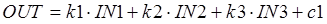

### 6.3.10. Зважена сума SUM_W (сімейство Mathematics).

Функція SUM_W розраховує вихідне значення за формулою (6.36):

               (6.37)

Таблиця 6.21. Параметри блоку SUM_W

| Вхідні  параметри      |            |                      |
| ---------------------- | ---------- | -------------------- |
| IN1                    | REAL       | вхід1                |
| IN2                    | REAL       | вхід2                |
| IN3                    | REAL       | вхід3                |
| PARA                   | Para_SUM_W | Параметри            |
| **Вихідні  параметри** |            |                      |
| OUT                    | REAL       | Результат розрахунку |

Таблиця 6.22. Опис структурного типу Para_SUM_W

| Поле | Тип  | Пояснення  |
| ---- | ---- | ---------- |
| k1   | REAL | коефіцієнт |
| k2   | REAL | коефіцієнт |
| k3   | REAL | коефіцієнт |
| c1   | REAL | коефіцієнт |

 