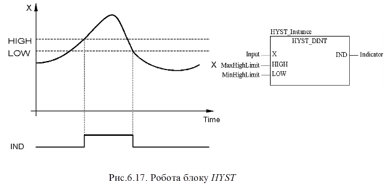

### 6.3.1. Гістерезис HYST (сімейство Measurement)  

Функціональний блок HYST реалізує гістерезис. Приклад виклику блоку та діаграма його роботи показані на рис.6.17 

 

Таблиця 6.12. Параметри функціонального блока HYST.

| Вхідні  параметри      |                              |                                     |
| ---------------------- | ---------------------------- | ----------------------------------- |
| X                      | INT, DINT, UINT, UDINT, REAL | вхідне значення                     |
| HIGH                   | INT, DINT, UINT, UDINT, REAL | нижня межа                          |
| LOW                    | INT, DINT, UINT, UDINT, REAL | верхня межа                         |
| **Вихідні  параметри** |                              |                                     |
| IND                    | BOOL                         | індикатор досяжності  верхньої межі |

 