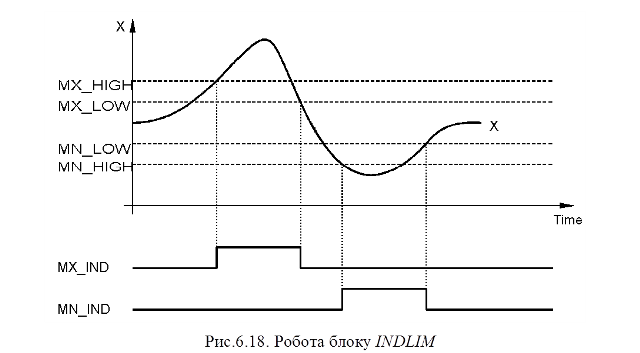
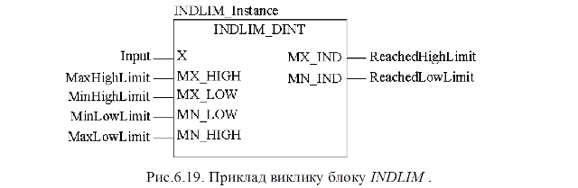

### 6.3.2. Індикатор меж INDLIM (сімейство Measurement) 

Функціональний блок INDLIM призначений для відслідковування переходу вхідного значення через визначені межі. На рис.6.18 показана діаграма роботи блоку, а на рис.6.19 – приклад виклику.

Таблиця 6.13. Параметри функціонального блока INDLIM.

| Вхідні параметри      |                               |                                        |
| --------------------- | ----------------------------- | -------------------------------------- |
| X                     | INT, DINT, UINT,  UDINT, REAL | Вхідна  змінна                         |
| MX_HIGH               | INT, DINT, UINT,  UDINT, REAL | Максимальна  верхня межа               |
| MX_LOW                | INT, DINT, UINT,  UDINT, REAL | Максимальна  нижня межа                |
| MN_LOW                | INT, DINT, UINT,  UDINT, REAL | Мінімальна  нижня межа                 |
| MN_HIGH               | INT, DINT, UINT,  UDINT, REAL | Мінімальна  верхня межа                |
| **Вихідні параметри** |                               |                                        |
| MX_IND                | BOOL                          | Відображення  досягнення верхньої межі |
| MN_IND                | BOOL                          | Відображення  досягнення нижньої межі  |

 