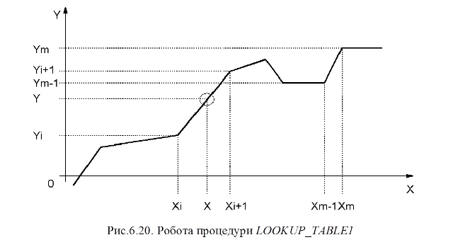

### 6.3.3. Кусочно-лінійна інтерполяція LOOKUP_TABLE1 (сімейство Measurement) 

Процедура LOOKUP_TABLE1 використовується для кусочно-лінійної інтерполяції. У залежності від входу X та заданої вузловими точками залежності XiYi (2 значення на кожну точку) формується вихід Y. Кількість вузлових точок варіюється до 15, кожна задається парою значень XiYij: перша для X (непарні номера j), друга для Y(парні номера j). Таким чином процедура може мати до 30+1 входів. 

Аналітична залежність X від Y та заданих вузлових точок показана в (6.25)

​                      (6.25)

Приклад програми з використанням LOOKUP_TABLE1 наведений в параграфі 6.8.2 

 

Таблиця 6.14. Параметри процедури LOOKUP_TABLE1.

| Вхідні  параметри      |      |                             |
| ---------------------- | ---- | --------------------------- |
| X                      | REAL | Вхідна змінна               |
| XiYi1                  | REAL | координата  X1.             |
| XiYi2                  | REAL | координата  Y1.             |
| XiYi(n-1)              | REAL | координата  X n/2; n=max 30 |
| XiYi(n)                | REAL | координата  Y n/2; n=max 30 |
| **Вихідні  параметри** |      |                             |
| Y                      | REAL | Вихідна змінна              |
| QXHI                   | BOOL | Індикація  X > Xm           |
| QXLO                   | BOOL | Індикація  X < X1           |

