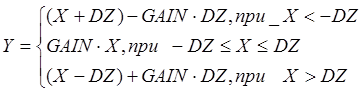
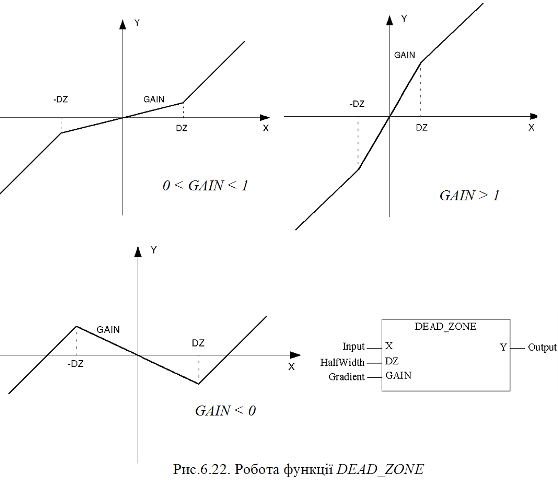

### 6.3.4. Зона нечутливості DEAD_ZONE (сімейство Measurement) 

Функція DEAD_ZONE забезпечує послаблення сигналу з коефіцієнтом GAIN в межах зони нечутливості, заданої діпазоном [-DZ;DZ] (рис.6.22).

 (6.26)

 

Таблиця 6.15. Параметри функції DEAD_ZONE.

| Вхідні  параметри      |      |                                         |
| ---------------------- | ---- | --------------------------------------- |
| X                      | REAL | Вхідна змінна                           |
| DZ                     | REAL | Половинне значення зони  нечутливості   |
| GAIN                   | REAL | Коефіцієнт послаблення  значення в зоні |
| **Вихідні  параметри** |      |                                         |
| Y                      | REAL | Вихідна змінна                          |

