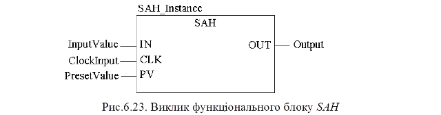

### 6.3.5. Запис змінної SAH (сімейство Measurement)

Функціональний блок SAH по передньому фронті CLK запам’ятовує на виході OUT значення входу IN. При першому виклику блоку OUT=PV. 

Таблиця 6.16. Параметри блоку SAH.

| Вхідні  параметри      |      |                         |
| ---------------------- | ---- | ----------------------- |
| IN                     | ANY  | Вхідне значення         |
| CLK                    | BOOL | Вхід тактового сигналу  |
| PV                     | ANY  | Задане значення уставки |
| **Вихідні  параметри** |      |                         |
| OUT                    | ANY  | Вихідне значення        |

