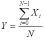
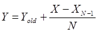
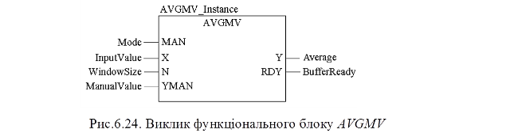

### 6.3.6. Фільтр ковзного середнього AVGMV (сімейство Measurement)

Функціональний блок AVGMV реалізовує алгоритм розрахунку фільтру ковзного середнього по формулі (6.27). 

​               або                     (6.27)

де N – кількість значень в буфері (ширина вікна), X – вхідне не фільтроване значення, Y – середнє вихідне (фільтроване) значення, Yold - значення виходу на попередньому виклику.  

 

Таблиця 6.17. Параметри блоку AVGMV.

| Вхідні  параметри      |      |                                                              |
| ---------------------- | ---- | ------------------------------------------------------------ |
| MAN                    | BOOL | 0 = Автоматичний режим;    1 = Ручний режим                  |
| X                      | REAL | Вхід                                                         |
| N                      | INT  | Ширина вікна (кількість значень в буфері; максимум 50)       |
| YMAN                   | REAL | Ручне значення                                               |
| **Вихідні  параметри** |      |                                                              |
| Y                      | REAL | Середнє значення                                             |
| RDY                    | BOOL | 1 = буфер заповнений (готовий);  0 = буфер не заповнений (не готовий) |

При ініціалізації функціонального блоку буфер скидується. З кожним викликом буфер наповнюється новими значеннями. Поки кількість значень в буфері не буде рівним N, буфер не буде готовий  (RDY=FALSE) і фільтр працює з неповним буфером. Коли буфер заповниться (RDY=TRUE) блок буде видавати коректне відфільтроване значення.   
