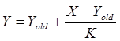
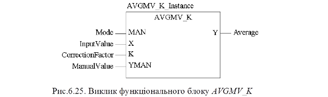

### 6.3.7. Фільтр ковзного середнього з коректором AVGMV_K (сімейство Measurement) 

Функціональний блок AVGMV_K реалізовує алгоритм розрахунку фільтру ковзного середнього з коректором К по формулі (6.28).

​                                        (6.28)

де X – вхідне не фільтроване значення, Y – середнє вихідне (фільтроване) значення, Yold - значення виходу на попередньому виклику, K - коректор. 

Таблиця 6.18. Параметри блоку AVGMV_K.

| Вхідні  параметри      |      |                                            |
| ---------------------- | ---- | ------------------------------------------ |
| MAN                    | BOOL | 0 = Автоматичний режим;   1 = Ручний режим |
| X                      | REAL | Вхід                                       |
| K                      | INT  | Коректор (макс 10000)                      |
| YMAN                   | REAL | Ручне значення                             |
| **Вихідні  параметри** |      |                                            |
| Y                      | REAL | Середнє значення                           |
