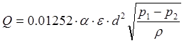
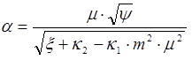
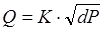
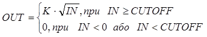
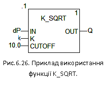
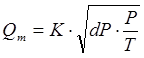
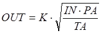
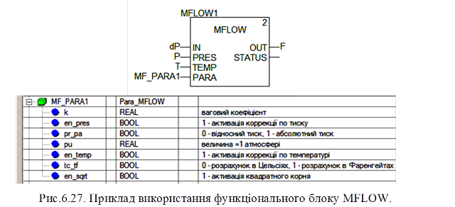

### 6.3.8. Розрахунок витрати по перепаду тиску K_SQRT (сімейство Mathematics) та MFLOW (сімейство Conditioning) 

Об’ємна витрата може бути розрахована за наступними залежностями:

​                                    (6.29)

де Q-об’ємна витрата (м3/год), d – діаметр отвору (мм), p -густина (кг/м3), (p1-p2) – перепад тиску на звужуючому пристрої (кгс/м2), Е – коефіцієнт розширення (для рідин=1), a- коефіцієнт витрати який розраховується за формулою

                 (6.30)

Коефіцієнти розраховуються (підбираються) в залежності від середовища та типу звужуючого пристрою. Таким чином формулу для розрахунку можна записати:

​                                              (6.31)

де dP=P1-P2, К – ваговий коефіцієнт. Ваговий коефіцієнт К можна розрахувати або підібрати при відомих витратах на етапі налагодження. 

У UNITY PRO для реалізації розрахункової формули 6.31 можна скористатися функцією SQRT (вилучення квадратного кореню), однак для цієї цілі зручніше використовувати спеціалізовану функцію K_SQRT або функціональний блок MFLOW. 

Функція K_SQRT знаходиться в бібліотеці Control Library сімейства Mathematics. Приклад використання функції показаний на рис.6.26. Функція повертає: 

          (6.32)

Таким чином, крім вагового коефіцієнта К, функція враховує нижню межу вхідного значення CUTOFF. Тобто, якщо перепад тиску на вході є від’ємним або менше нижньої межі, то функція повертає 0, в той час як SQRT повернув би -1.#NAN, а це в свою чергу спрощує використання цієї функції для даної задачі.

Густина газів залежить від температури та тиску. Для врахування цих параметрів, треба їх ввести в розрахункову формулу для масової витрати:

​                                            (6.33) 

Функціональний блок MFLOW сімейства Conditioning, призначений для розрахунку масової витрати газів з урахуванням їх температури та тиску згідно формули (6.34):

​                                           (6.34)

 де PA-абсолютний тиск газу, TA – абсолютна температура в градусах Кельвіна.

Приклад використання функціонального блоку MFLOW показаний на рис.6.27. Вхід IN, вихід OUT та коефіцієнт К мають той же зміст, що і в попередньому варіанті. Параметри роботи блоку задаються на вході PARA. 

Вхід PRES – це тиск, який може задаватися як в абсолютних одиницях так і відносно атмосферного. У випадку відносного тиску (PARA.pr_pa=FALSE), абсолютний тиск розраховується за формулою 

​                             PA=PRES+pu                          (6.35)

де pu задається в тій же структурі PARA.

Вхід TEMP, це температура, яка може задаватися в градусах Цельсія (PARA.tc_tf=FALSE) або Фаренгейта (PARA.tc_tf=TRUE). У блоці розраховується абсолютна температура TA в градусах Кельвіна.

Корекція по тиску активується параметром PARA.en_pres=TRUE, по температурі - PARA.en_temp=TRUE. Якщо PARA.en_sqrt=FALSE то добуток буде розраховуватись без квадратного кореня.

