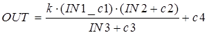

### 6.3.9.  Зважене множення/ділення MULDIV_W (сімейство Mathematics)

Функція MULDIV_W розраховує вихідне значення за формулою (6.36):

                        (6.36)

Таблиця 6.19. Параметри блоку MULDIV_W

| Вхідні  параметри      |                |                      |
| ---------------------- | -------------- | -------------------- |
| IN1                    | REAL           | вхід1                |
| IN2                    | REAL           | вхід2                |
| IN3                    | REAL           | вхід3                |
| PARA                   | Para_MULDIV_W] | Параметри            |
| **Вихідні  параметри** |                |                      |
| OUT                    | REAL           | Результат розрахунку |

Таблиця 6.20. Опис структурного типу Para_MULDIV_W

| Поле | Тип  | Пояснення  |
| ---- | ---- | ---------- |
| k    | REAL | коефіцієнт |
| c1   | REAL | коефіцієнт |
| c2   | REAL | коефіцієнт |
| c3   | REAL | коефіцієнт |
| c4   | REAL | коефіцієнт |
