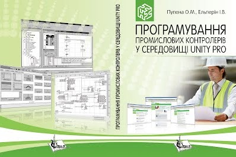

# Програмування промислових контролерів в середовищі UNITY PRO (вибрані розділи посібника)

[Купити у видавництві](http://www.google.com/url?q=http%3A%2F%2Flira-k.com.ua%2Fbooks%2Ftehnichni%2Fprogramuvannja-promyslovyh-kontroleriv-u-seredovyshhi-unity-pro.html&sa=D&sntz=1&usg=AFQjCNFEauCMJ33-og52O2mWvI7pxeJyBA)

Посібник складається з 6-ти розділів. Перший розділ присвячений загальному огляду можливостей UNITY PRO ї виконує функції навігатора по посібнику. У другому розділі розглядаються структура, функціональні можливості і технічні характеристики контролерів Modicon M340 та TSX Premium. У третьому розділі розглядаються принципи створення програми користувача з використанням мов програмування, які відповідають міжнародному стандарту МЕК 61131-3: ST, LD, FBD, SFC. Четвертий розділ присвячений питанням налагоджування прикладного програмного забезпечення з використанням анімаційних засобів UNITY PRO, а також імітатора ПЛК. Для цього розроблені спеціальні імітаційні моделі об’єктів управління. У п’ятому розділі наведені приклади рішення типових задач управління з використанням різних мов програмування. Шостий розділ висвітлює особливості побудови контурів регулювання з використанням бібліотечних елементів UNITY PRO. Особливістю даного посібника є наявність великої кількості прикладів рішення задач, пов’язаних як з вибором апаратних засобів, так і розробкою прикладного програмного забезпечення. Також особливої уваги заслуговують спеціально розроблені імітаційні моделі, які можуть бути використані для перевірки роботи програм користувача. Вбудований у UNITY PRO імітатор ПЛК дає можливість отримати практичні навички налагодження програм користувача без наявного контролера. У електронному вигляді представлений перший розділ посібника з кольоровими рисунками та лабораторний практикум, що включає 7 лабораторних робіт. Ці матеріали доступні на сайті видавництва "Ліра-К". Навчальний посібник може бути використаний при вивченні курсів циклу професійної і практичної підготовки рівня бакалавра та спеціаліста, а також при виконанні курсового і дипломного проектування для студентів напряму «Автоматизація та комп’ютерно-інтегровані технології». Посібник також буде корисний для спеціалістів, що працюють в галузі промислової автоматизації. 

## [1. Основи роботи з UNITY PRO](1.md)

Загальні поняття. Функціональна структура ПЛК. Операційні режими роботи ПЛК. Області пам’яті ПЛК та адресація каналів вводу/виводу. Розробка, компіляція та завантаження проекту UNITY PRO. Конфігурування апаратної частини ПЛК. Створення змінних та екземплярів функціональних блоків. Створення програми користувача. Мови програмування. Налагодження програми користувача. Приклад створення проекту з використанням ПЛК М340 та мови LD. Приклад створення проекту з використанням ПЛК TSX Premium та мови FBD. Приклад використання мови ST. Приклад використання мови SFC. Питання до розділу.

## 2. Апаратне забезпечення контролерів Modicon

[2.1. Апаратне забезпечення контролерів Modicon M340](2.md). Фізична структура Modicon М340. Процесорні модулі. Структура пам’яті. Модулі дискретних входів/виходів.Модулі аналогових входів/виходів.Вибір модулів живлення.Приклад компонування контролера М340.

2.2.Апаратне забезпечення контролерів TSX Premium. Фізична структура TSX Premium. Принципи розміщення й адресації модулів у контролері. Процесорні модулі. Структура пам’яті. Модулі дискретних входів/виходів. Модулі аналогових входів/виходів. Модулі живлення.Контрольні запитання до розділу

## 3. Програмування контролерів Modicon у середовищі UNITY PRO

3.1.Середовище UNITY PRO.

3.2.Проект UNITY PRO.

3.3.Програма користувача. Задачі. Секції. Підпрограми.

3.4. Робота з даними. Типи даних. Змінні. Структурні типи даних користувача. Області внутрішніх даних (%M та %MW) і констант (%KW). Області системних даних (%S та %SW). Дані каналів вводу/виводу та змінні IODDT.

3.5.Функції, процедури та функціональні блоки.Використання FFB. Створення функціональних блоків користувача (DFB).

3.6. Стандартна бібліотека FFB. Огляд бібліотеки. Математичні функції. Функції порівняння. Логічні блоки. Статистичні функції. Таймери та лічильники. Функції перетворення типів.

3.7.Програмування на мові FBD (Function Block Diagram). Основні правила програм на FBD. Редактор FBD. 3.8.Програмування на мові LD (Ladder Diagram). Основи LD. Елементи дискретного управління. Робота з числовими змінними та FFB. Редактор LD.

3.9.Програмування на мові ST (Structured Text). Основи ST. Організація розгалуження. Організація циклів.  Виклик підпрограм та FFB. Редактор ST.

3.10.Програмування на мові SFC (Sequential Function Charts). Основи SFC. Кроки та дії. Переходи. Відгалуження. Макрокроки. Часові налаштування та контроль за виконанням кроків. Управління виконанням мережі SFC. Редактор SFC. Контрольні запитання до розділу.

## 4.Налагодження програм користувача та діагностика ПЛК

4.1.Операційні режими роботи ПЛК.

4.2. Робота UNITY PRO в режимі онлайн. Налаштування зв’язку. Можливості UNITY PRO в режимі онлайн. Імітатор ПЛК.

4.3.Налагодження програми користувача. Використання анімаційних засобів редакторів. Використання анімаційних таблиць. Використання операторських екранів.

[4.4. Використання імітаційних моделей](4_4_simul.md) Призначення імітаційного моделювання в ПЛК. Варіанти структури програм UNITY PRO з імітацією. Генератор випадкових чисел. Імітаційне моделювання на основі рішення диференційних рівнянь явним методом Ейлера. Імітація рівня. Імітація температури в ємності. Імітація температури у теплообміннику. Реалізація аперіодичної ланки (першого порядку). Реалізація транспортного запізнення. Імітація роботи регулюючого органу з виконавчим механізмом.

4.5.Діагностика роботи ПЛК. Загальні принципи діагностики роботи ПЛК. Апаратні засоби діагностики ПЛК. Діагностичні засоби середовища UNITY PRO. Програмні засоби діагностики. Контрольні запитання до розділу.

## 5. Приклади реалізації алгоритмів управління

5.1. Приклади задач на формування, використання та підрахунок імпульсів.

Генерація імпульсів тривалістю 1 цикл із заданою періодичністю. Генерація імпульсів з заданими періодичністю і тривалістю. Лічильник мотогодин. Аварійна сигналізація.

5.2.Приклади задач на роботу з витратомірами та лічильниками речовини. Інтегрування загального об’єму по показам витратоміра. Інтегрування за сигналом з лічильника. Розрахунок витрати за показами лічильника.

5.3.Приклади роботи з годинником реального часу та зі змінними часових типів.

5.4.Приклади роботи зі структурами, масивами та циклами.

5.5.Приклади роботи з підпрограмами та функціональними блоками користувача.

5.6.Приклади створення та використання кусочно-лінійних функцій.Реалізація кусочно-лінійної функції.Програма розрахунку об’єму рідини в резервуарі неправильної форми за датчиком рівня.Програмний задатчик.

5.7.Приклад імітаційної моделі.

5.8.Приклад використання мови FBD.

5.9.Приклад використання мови SFC.

## 6. Реалізація контурів регулювання в UNITY PRO

6.1. Загальні принципи використання бібліотечних FFB для побудови контурів регулювання. Структура контурів регулювання. Режим слідкування (Tracking). Режими Ручний/Автомат (Manual/Automatic). Періодичність виклику FFB та контроль за помилками.

6.2.Реалізація законів регулювання (сімейство Controller). Огляд блоків сімейства Controller. SAMPLETM. ПІ регулятор PI_B. ПІД регулятор PIDFF. Режими абсолютного та інкрементального розрахунку роботи PI_B/PIDFF. Двохпозиційний регулятор STEP2. Трьохпозиційний регулятор STEP3.

[6.3. Обробка вхідних даних контурів регулювання](6_3_0_inputprocess.md) 

Гістерезис HYST (сімейство Measurement). Індикатор меж INDLIM (сімейство Measurement). Кусочно-лінійна інтерполяція LOOKUP_TABLE1 (сімейство Measurement). Зона нечутливості DEAD_ZONE (сімейство Measurement). Запис змінної SAH (сімейство Measurement). Фільтр ковзного середнього AVGMV (сімейство Measurement). Фільтр ковзного середнього з коректором AVGMV_K (сімейство Measurement). Розрахунок витрати по перепаду тиску K_SQRT (сімейство Mathematics) та MFLOW (сімейство Conditioning). Зважене множення/ділення MULDIV_W (сімейство Mathematics). Зважена сума SUM_W (сімейство Mathematics).

6.4.Обробка вихідних даних контурів регулювання (сімейство Output Processing).Блок управління реверсивним двигуном (SERVO)

Управління виконавчими механізмами з використанням широтно-імпульсного перетворення PWM1. Блок ручного управління MS.

6.5.Організація управління уставками (сімейство Setpoint Management). Перемикач уставок SP_SEL. Зміна уставки з постійною швидкістю (RAMP). Задатчик співвідношення (RATIO).

6.6. Блоки додаткової обробки. SCALING (сімейство Conditioning). Ланка транспортного запізнювання DTIME (сімейство Conditioning). Блок інтегрування INTEGRATOR (сімейство Conditioning). Аперіодична ланка LAG_FILTER (сімейство Conditioning).

6.7.Цілочисельне регулювання (сімейство CLC_INT). Огляд процедур цілочисельного регулювання. Процедура PID_INT. Процедура SERVO_INT. Процедура PWM_INT.

6.8.Приклади. Стабілізаційне регулювання. Каскадне регулювання. Регулювання з використанням виконавчих механізмів типу реверсивний двигун. Контрольні запитання до розділу.